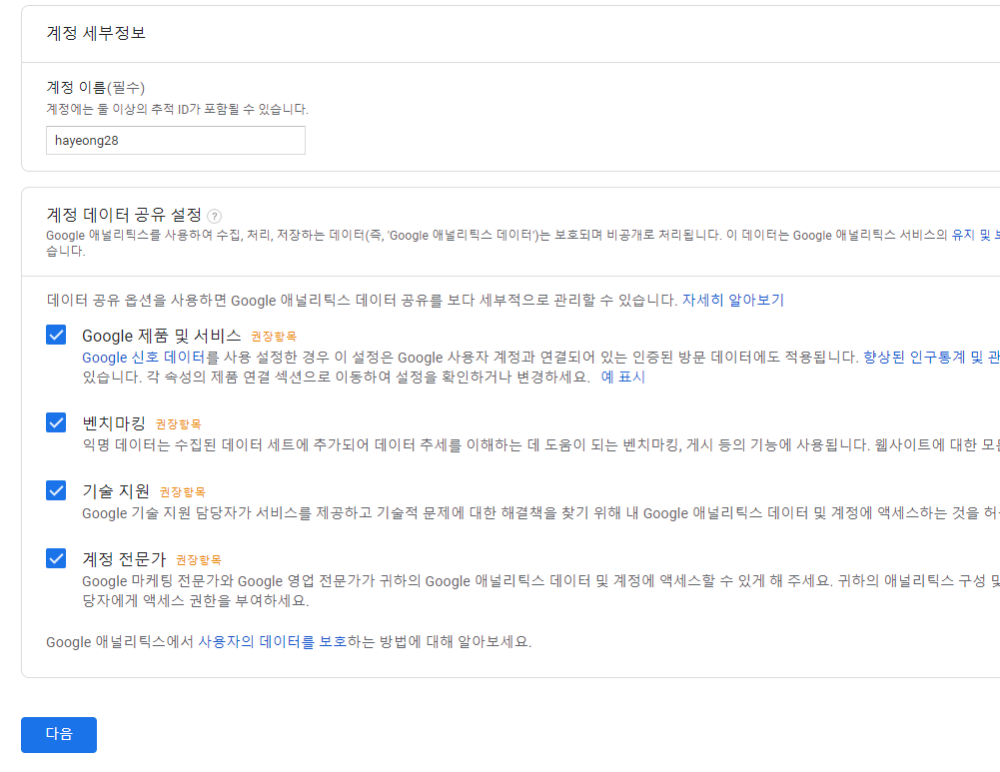
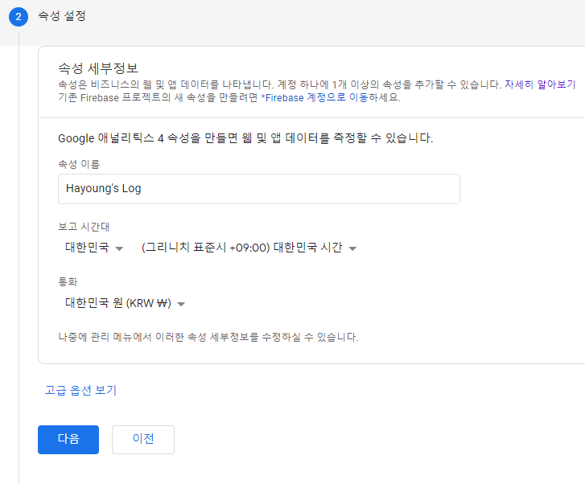
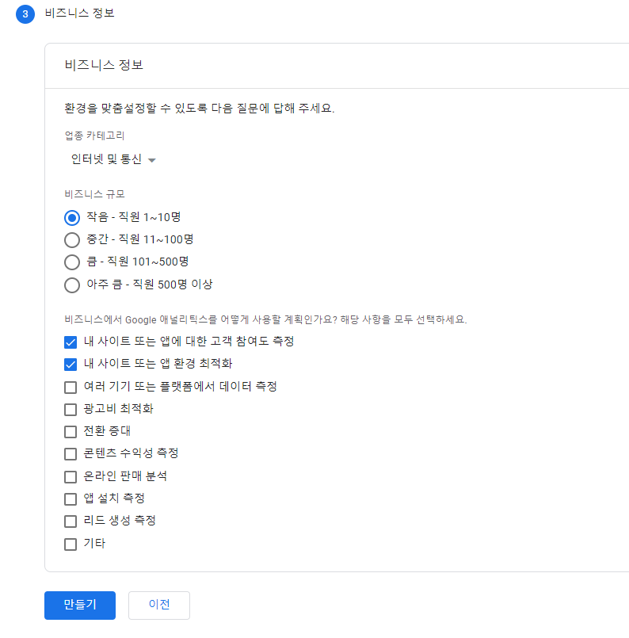
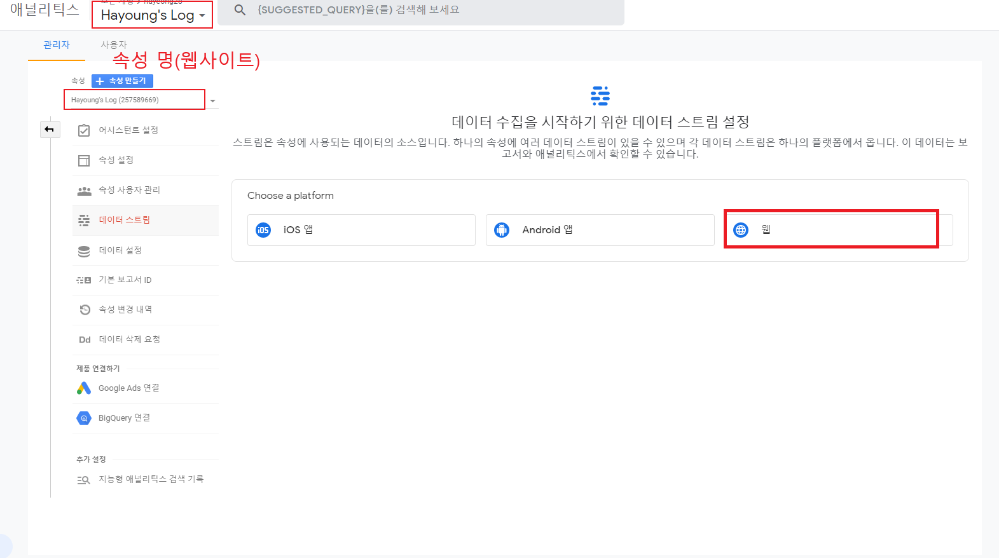
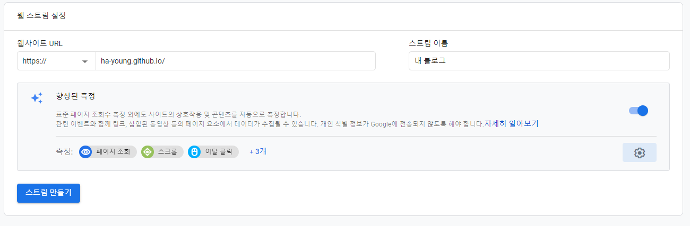
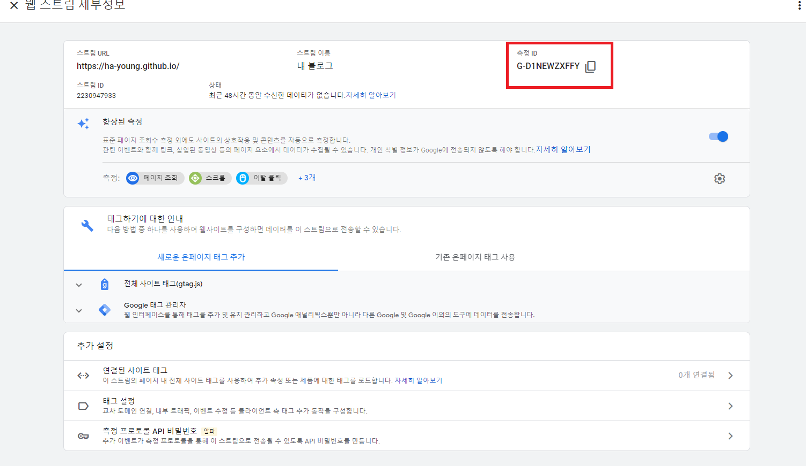
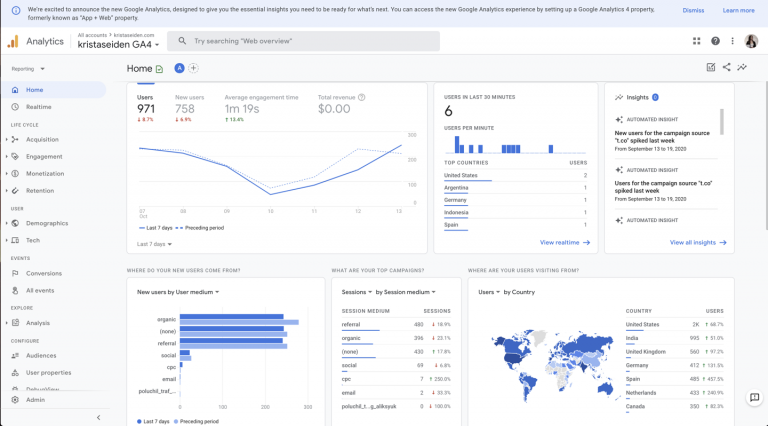

## 블로그에 Google Analytics 를 사용해야 되는 이유?

블로그를 비롯해서 사이트에 Google Analytics를 적용시켜야 되는 이유는 무엇일까?

우리가 사이트를 운영한다면, 운영에 대한 인사이트를 얻어야 앞으로 어떠한 방향으로 운영할것인지, 어떻게 수정해야될 것인지 계획을 세울 수 있다.
특히 검색엔진의 대표명사인 구글을 통해 유입되는 사용자들이 어떻게 우리 사이트를 찾아오는지와 어떤 콘텐츠에 관심이 많은지를 파악한다는건 상당히 큰 인사이트가 될 수 있다.

그런점에서 Google Analytics를 사용한다면 Site운영에 큰 도움이 될 수 있다.

Google Analytics로 할 수 있는 일

- 내 사이트에서 어떤 페이지가 가장 유명한가?
- 내 사이트 방문자들은 언제, 어떻게 유입이 되는가?
- 어떤 키워드로 방문이 되는가?
- 수집된 데이터를 바탕으로 한 데이터 분석기능
- 사이트 환경 최적화 측정 및 인사이트 획득
- ads를 사용한다면 광고 최적화
- 이러한 기능이 월 1000만건 까지는 무료

등등 블로그로 한정한다면,
방문자 수, 방문 경로등의 정보를 토대로 포스팅 계획을 세우거나 최적화에 대한 측정을 통해 보다 나은 웹사이트 개선을 시도할 수 있겠다.

> Google 에드센스로 광고수익을 노릴거라면 Google Analytics와 연계하면 더더욱 좋다. [참조](https://rankro.tistory.com/222)

보다 자세한 사항은 [공식사이트](https://marketingplatform.google.com/intl/ko/about/analytics/)를 참조하자

## 그럼 Gatsby 블로그에도 적용가능?

물론 Gatsby 블로그에도 적용가능하다.

[Gatsby 공식문서](https://www.gatsbyjs.com/docs/how-to/adding-common-features/adding-analytics/#setting-up-google-analytics)를 참조하면 gatsby 사이트에 대하여 `gatsby-plugin-google-gtag` 플러그인을 통해 적용할 수 있다.

> 예전에 만들어진 gatsby-plugin-google-analytics도 있는데 더이상 지원하지 않는 듯 하다.
>
> 대신, gatsby-plugin-google-gtag는 Google Analytics와 더불어 Ads, Marketing까지 한번에 적용가능해보인다.

## Gatsby 사이트에 Google Analytics 적용시키기

### 1. 구글 Analytics 계정 생성, 시작하기

구글 Analytics 계정이 없다면 새로 생성해야하고, 로그인 후에 [애널리틱스 사이트](https://marketingplatform.google.com/about/analytics/)에서 **무료사용 시작하기**로 시작하면 된다.



나는 모든 권장항목에대해서 체크진행하였다.

### 2. Analytics 속성 설정

구글 애널리틱스에서의 속성은 앱이나 **웹사이트**를 의미한다.

그리고 이 속성은 개수재한없이 계정 하나에 1개이상 등록할 수 있고 각 속성마다 과금여부가 결정이되니 개수걱정없이 생성하면 되겠다.

> 앞으로 다른 속성이 생겼을 때 계정과 속성 일대일 관계를 사용하거나 계정 속성 일대다로 구성하는건 시작하기에 앞서 고려해볼 사항이다.

즉, **우리 블로그를 Analytics 속성으로 설정**하면 된다.



보고시간대는 해당 시간을 기준으로 Anaytics 보고서가 작성되고, 아래 통화 설정으로 보고서에서 사용되는 통화를 설정할 수 있다.

> 고급옵션에 유니버설 애널리틱스라고 있는데 이건 옛날버전이므로 특별한 이유가 아니라면 패스하자.

### 3. 비즈니스 정보 설정



다음으로 비즈니스 설정을 하고 만들기 클릭.

약관동의는 대한민국으로, 이메일 커뮤니케이션은 희망하는대로 체크 하면 된다. (나는 모두 체크)

### 4. 데이터 스트림 추가

다음으로 데이터 스트림을 추가해줘야되는데, 데이터 스트림은 고객 터치포인트로 앱이냐 웹이냐 등 데이터 흐름을 설정하는 것이라고 보면 된다.

마찬가지로 한개의 속성에 여러개의 데이터스트림을 등록할 수 있으며(최대 50개), 데이터스트림이 추가되면 분석결과는 최대 24시간 소요될 수 있다. (등록한다고 결과가 바로 나오지 않는다)



등록방법은 **애널리틱스 관리자**에서 우리가 앞서 만든 속성에 대해 **데이터 스트림을 설정**하면되는데 웹사이트이므로 **웹**으로 만들면 된다.



향상된 측정부분에 측정 옵셔닝을 할 수 있는데, 다 해두면 좋을 것 같아서 나는 다 해뒀다.

### 5. 측정 ID 획득



웹 스트림을 생성하면 **측정 ID**라고 나오는데 이 측정 ID가 **우리 Gatsby 블로그에서 설정**해야되므로 따로 복사를 해두자.

이 측정 ID는 `G-`혹은 `UA-`로 시작해야되고, 이 <u>측정 ID를 통해 사이트 트래픽을 체킹하고 트래픽으로 데이터를 식별</u>하게 된다.

### 6. gatsby-plugin-google-gtag 설치

앞에서 획득한 측정 ID를 등록하기위해 `gatsby-plugin-google-gtag`를 설치하자

```bash
npm install gatsby-plugin-google-gtag
```

yarn을 이용했다면 `yarn add`

### 7. gatsby-config.js에 설정

```js{8-9}
module.exports = {
  plugins: [
    // ...
    {
      resolve: `gatsby-plugin-google-gtag`,
      options: {
        // You can add multiple tracking ids and a pageview event will be fired for all of them.
        trackingIds: [
          'G-XXXXXXXXXX', // 설정 Google Analytics / GA
          // "AW-CONVERSION_ID", // Google Ads / Adwords / AW
          // "DC-FLOODIGHT_ID", // Marketing Platform advertising products (Display & Video 360, Search Ads 360, and Campaign Manager)
        ],
      },
    },
  ],
}
```

### 8. 내 Google Anayltics에서 결과 확인하기

보고서에 대한 결과는 우리가 설정했던 [애널리틱스 페이지](https://analytics.google.com/analytics/web)에서 확인할 수 있다.

막상 다음과 같은 설정을 끝내면 바로 결과는 나오지 않는다.

최대 48시간이 지나면 보고서가 작성되어서 대시보드에 표시되니 확인하도록 하자.



> 만약 위의 코드를 `gatsby-config.js`에 추가했는데도 전혀 추적이 되지 않고 있다면 gatsby-plugin-gtag를 플러그인 최상단에 배치하면 된다고 한다. ([참조](https://janeljs.github.io/blog/google-analytics/))

## 참조

https://marketingplatform.google.com/intl/ko/about/analytics/

https://www.gatsbyjs.com/docs/how-to/adding-common-features/adding-analytics/#setting-up-google-analytics

https://janeljs.github.io/blog/google-analytics/

https://www.kristaseiden.com/hello-to-google-analytics-4/
