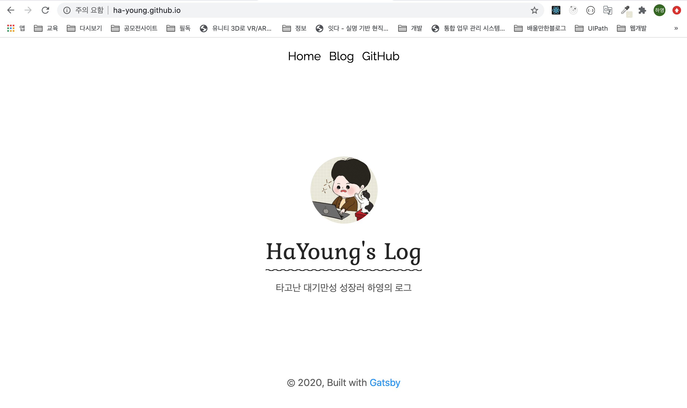
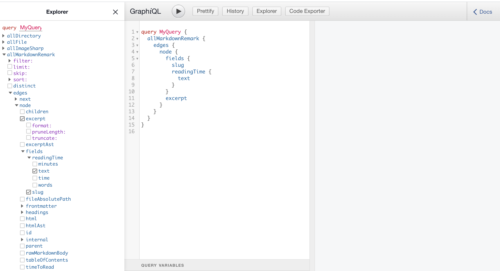

## 이전에 Gatsby로 블로그를 만들었었다.

당시에는 나름 괜찮은 Starter라고 고르고 골라서 만들고 커스터마이징을 했는데
하다보니까 아예 싹 갈아엎고싶은 충동이 밀려왔다.
이유는 커스터마이징을 하는데 구조를 나에게 맞게 바꾸고 싶었고
바꾼다면 내가 더 좋게 만들 수 있을 것 같았다.
그리고 이정도면 나도 나름 Starter 하나 만들어 볼 수 있지 않을까? 하는 생각도 들었다.
(도전해보자!)

거기에 React 연습과 Gatsby에 대해 좀 더 탐구하고 싶었고
여기에 TypeScript를 적용시켜 개발하면 포트폴리오에도 쓸 수 있고
프론트앤드 개발 실력도 늘겠다 싶어서 바로 도전하려고 한다.

### 왜 Gatsby 인가?

사실 내가 처음 블로그를 만들 때 hexo, jekyll, Gatsby 등등 다양하게 블로그를 만드는 방법이 있었는데,
그 때 한창 React를 배우고 있었고 더 배우고 싶었던지라 React 사용성 때문에 Gatsby를 선택했었다.

사실 새로운 스펙을 도입하는데 있어서 해당 스펙이 어떠한 장단점이 있는지, 특징은 무엇인지를 다 고려하고 도입을 하는것이 맞는데 급하게 빨리 블로그를 만들고 싶었던지라 Gatsby를 어떻게 쓰는지에만 초점이 맞춰줬었지
Gatsby의 장단점 즉, 왜 내가 Gatsby를 채택했는지에 대한 심도깊은 고민은 완전히 배제되어 있었다.

그래서 이번에 새로 만들게 된 김에, Gatsby의 장단점은 무엇인지 찾아보았고
내가 블로그로 Gatsby를 채택하게 된 이유는 무엇인지 정리 할 수 있었다.

**1. 일단, React 기반이다.**

​ React를 사용할 수 있다는건 큰 장점이 될 것 같다.
​ 우선, Web-Front-End Framwork에서 제일 유명한 것이 React이고
​ React의 장점을 모두 수용할 수 있기 때문이다.

**2. JAMstack으로 관리하는 콘텐츠**

- `J` : JavaScript

- `A` : API

- `M` : Markup

  또 하나의 큰 장점이 바로 JAMstack인데, JAMstack이 무엇인지에 대해서는 추후 포스팅을 하겠지만
  간단히 설명하자면, 랜더링 할 화면을 미리 만들어 두고 이를 제공하므로 훨씬 속도가 빠르고,
  컨텐츠를 Markup으로 만들어 관리하면서 이 Markup을 통해 만들어진 HTML, CSS 정적 리소스들을
  CDN에 배포하여 서버관리를 최소화 할 수 있다는 장점이 있다.

  그리고 Markdown으로 콘텐츠를 관리하기 때문에 콘텐츠를 만들고 수정하기 쉽다.

  JAMStack에 대해 자세히 알고싶으면 JBee님이 잘 설명해주신 [여기]("https://jbee.io/web/jam-stack/")를 참고하자.

**3. 미리 랜더링 된 마크업 덕분에 SEO가 뛰어나다**

​ Gatsby는 말 그대로 **정적사이트** 생성기이다. 이는 우리가 React를 사용하면서 만드는
​ SPA(Single Page Application)과 많이 다른데, SPA는 JavaScript가 실행되면서
​ 덜 완성된 HTML 페이지안에 내용을 채워 넣는 것이라면,

​ 이 Static Page는 Build 할 때 그 과정에서 내용이 모두 채워진 HTML 페이지가 생성된다.
​ 그렇기 때문에 미리 만들어진 콘텐츠들 덕분에 SEO를 SPA보다 훨씬 더 좋게 가져갈 수 있다.

​ 여기에 더해서 필요에 따라 CSR과 SSR, lazy loading등이란 것들을 사용하면서
​ 단순 Static Page보다 훨씬 큰 이점이 있다고 한다.

**4. GraphQL 사용 가능**

​ GraphQL은 REST API와는 달리 필요한 데이터만을 뽑아올 수 있는 클라이언트를 위한 질의어이다.
​ 자세한 설명은 [여기](https://ha-young.github.io/GraphQL/what) 를 참조하자.

​ Gatsby에서는 서버의 GraphQL API를 사용하는 것이 아니라 Build될 때 만들어지는 데이터 셋에서
​ 참조 해올 수 있으며 만들어진 데이터들은 **Gatsby develop** 이후에
​ **정적사이트경로/\_\_\_graphql**(http://localhost:8000/___graphql) 로
​ **GraphQL in-browser IDE** 를 사용할 수 있다.

​ 

자, 그럼 이제 Gatsby가 무엇인지 알게되었으니
본격적으로 블로그 제작기를 만드는 여행을 떠나보자!
