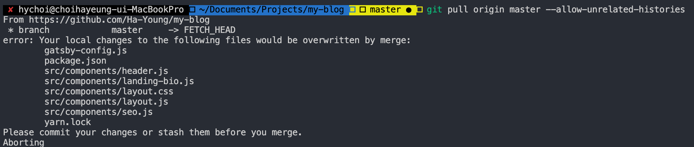

## git pull refusing to merge unrelated

윈도우에서 블로그작업을 하다가 오랜만에 맥북으로 작업을 하려고 꺼내서 동일한 git hub repo remote 저장소에서 git pull을 했다.

예전부터 윈도우 환경과 맥 환경에서 번갈아가면서 블로그 포스팅도 하고 세부적인 기능도 바꿔왔기 때문에 당연히 될 줄 알았는데 이러한 애러가 났었다.

마침 블로그 포스팅을 뭐라도 하려고 왔기 때문에 해당 부분에 대해 포스팅을 하면 좋을 것 같아 포스팅을 한다.


###  refusing to merge unrelated는 왜 나는 걸까?

우선 오류의 전체적인 메세지를 보자

```bash
git pull origin master
```

해당 명령어를 입력했을 때


다음과 같은 문제가 발생한다.

사실 이 refusing to merge unrelated는 push, pull 둘 모두 일 때 발생할 수 있는데,

**local 저장소와 remote 저장소의 history를 비교했을 때 소스코드의 차이가 지나칠 때, merge 문제가 발생 할 수 있어서 오류 메세지를 띄우는 것** 이다.


### 해결방법

이럴 때에는 간단하게 해결 할 수 있는데,

pull option 중에서 **--allow-unrelated-histories**

를 사용하면 된다. (push로 인한 오류라도 마찬가지. pull을 먼저 해야 한다.)

```bash
git pull origin master --allow-unrelated-histories
```

**근데 해당 작업 전에 먼저 원격 저장소의 경로가 올바르게 되어있는지 먼저 확인하자.**


### 문제가 더 있나요?

위 방법으로 진행을 해도 아래와 같이 애러가 날 수 있다.



그렇다면 직접 위에 나온 충돌 파일에 대한 merge처리를 직접 처리해야되는데,
이는 vscode의 SCM 을 이용하면 편리하게 merge처리를 할 수 있다.


나와 같이 아래 나온 메세지 
**Please commit your changes or stash them before you merge**

가 있다면 먼저 commit을 한 후에 위 명령어를 입력하자.

```bash
git add .
git commit -m "your commit message"
```


그러면 


이렇게 merge 상태가 되는데 이제 하나 하나 merge작업을 해주면 된다.

SourceTree나 Github Desktop 을 쓰면 간단하게 할 수 있으니 써보는 것도 방법.
(나는 일일이 파일 보면서하는데 아주 귀찮다.)


### 못하겠거나 귀찮거나 그래도 안된다면?

만약, 작업을 진행중에 pull과정에서 애러가 났다면 **새롭게 clone을 하는 것**이 더 좋은 방법일 수가 있다.

push중 애러라면 새롭게 클론 한 뒤에 작업한 파일들을 복사 붙여넣기나 수정을 해주자.


(나도 그냥 clone했다...)

