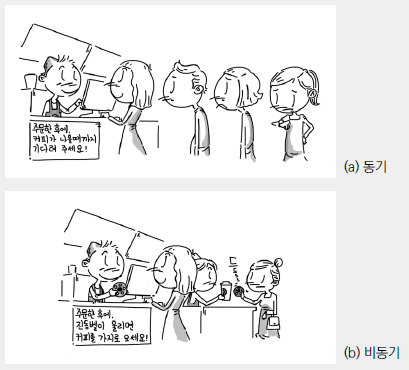
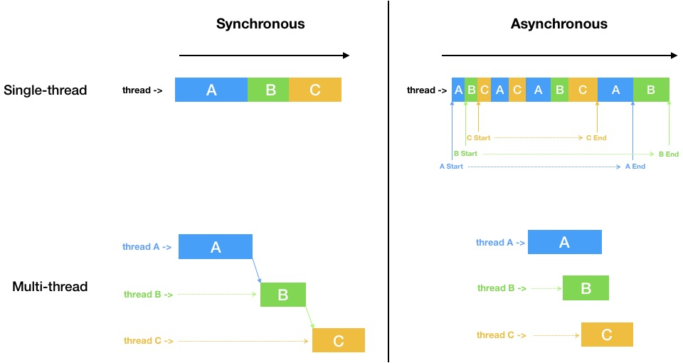

\* 이 글은 [Vanilla Coding](https://www.vanillacoding.co/) - BootCamp 9기 1주차 강의 수강 후 적은 글입니다.

## Asynchronous?

웹 프론트, 백엔드와 더불어 모든 곳에서 Javascript(node.js)를 사용한다면 빼놓을 수 없는 것이 또 비동기 프로그래밍일 것이다.

> 특히, 웹 브라우저와 자바스크립트에 있어서 이 비동기 개념을 이해하는 것이 상당히 중요하다.

Asynchronous(비동기)는 어떤 작업 한번에 하나씩 해결이 될때까지 기다리며 순차적(Synchronous)으로 진행되는 일반적인 프로그램의 코드와는 다르게,
어떤 작업을 별도로 진행시키고 작업이 끝날때까지 기다리지 않고 다음작업을 이어나가면서 비동기적으로 진행시킨 작업 별도로 결과가 나오면 그제서야 처리해주는 방식이다.



위 이미지는 [Poiemaweb-async](https://poiemaweb.com/js-async) 글에서 참조한 그림인데,
동기(Synchronous)와 비동기(Asynchronous)의 개념을 그림하나로 잘 설명하고 있다.

동기는 위 처럼 메뉴를 주문하면 메뉴가 나올 때 까지 기다리고 받아가는 방식이라면,

비동기는 아래 처럼 메뉴를 주문하고 줄(Context)에서 빠져나와 메뉴가 나올 때 까지 기다리고, 메뉴가 나오면(결과가 나오면) 주문한 메뉴를 받아가는(결과를 처리하는) 방식이다.
여기서, 줄에서 빠져나온다라는 개념은 뒤이어 줄 선 사람이 주문(혹은 다른 작업)을 할 수 있게 된다는 뜻이며 마찬가지로 주문이 끝났다면 기다리지않고 주문을 넣고 줄에서 빠져나가 기다리게된다.

> 근데, Javascript 환경의 특성상 줄 (javascript환경에서는 `Context` 혹은 `Call Stack`) 이 모두 비워진 상태에서, 각각 주문(비동기 호출을 한 사람(작업)들에게 메뉴를 전달 할 수 있다.
>
> <br>
>
> > 자바스크립트환경에서는 Call Stack이 비워진 후에 Callback Queue(Event Loop)에 있는 작업을 처리 할 수 있고 비동기 함수들은 Callback Queue(Event Loop)에 들어간다.


## 왜 Javascript는 비동기 프로그래밍을 해야만 하는가?

`Javascript`가 아닌 `C`, `C++`, `Java` 와 같은 OS를 다룰 수 있는 다른 언어들을 보면 **멀티 스레딩**이라는 것을 지원을 하는데, 이 멀티 스레딩에서는 **스레드**라는 것을 이용해서 작업의 주체를 계속해서 늘려서 병렬적으로 작업을 할 수가 있다.

위 상황에 대입해보면, 주문을 하는 사람이 한명씩 주문을 할 때마다 주문을 받고 커피를 제공해주는 사람이 계속해서 생긴다고 생각을 하면 된다.

하지만 `javascript` 가 쓰이는 `browser`, `node.js` 가 **싱글 스레드만을 지원**하기 때문에 하나의 작업주체에서 언제끝날지 모르는 여러가지 작업을 마냥 기다릴 수 만은 없거니와, 동시에 처리하려고 하다 보니 이러한 비동기적 처리를 필수불가결하게 할 수 밖에 없다.

> - 대표적인 browser인 Chrome과 node.js 의 내부엔진은 [V8 엔진](https://v8.dev/)을 사용하는데, 이 V8엔진이 싱글스레드로 작동한다.
>
> - 이제와서는 브라우저에서는 HTML5에 Web Worker를 통한 멀티스레딩을,
>   Node.js에서는 Woker를 통해 멀티스레딩을 구현할 수 있다고한다.
> - 비동기와 멀티스레딩은 엄연한 차이가 있다.
>   아래 그림을 참조하자. ([링크](https://stackoverflow.com/questions/748175/asynchronous-vs-synchronous-execution-what-does-it-really-mean/748235#748235)에 있는 이미지를 직접 그렸다)



## Javascript에서는 비동기 프로그래밍을 어떻게 하는가?

자바스크립트에서는 비동기 프로그래밍은 웹에서는 주로 Web API함수를 이용해서 구현할 수 있다.

- [setTimeout()](https://developer.mozilla.org/ko/docs/Web/API/WindowTimers/setTimeout)
- setInterval()
- [fetch()](https://developer.mozilla.org/ko/docs/Web/API/Fetch_API/Fetch%EC%9D%98_%EC%82%AC%EC%9A%A9%EB%B2%95)
- 등등...

### 타이머로 사용할 때

```js
console.log('start');

setTimeout(function () {
  console.log('비동기 Timer!');
}, 1500);

console.log('end');
```

다음과 같은 상황에서 시간순으로

- 'start' 출력
- 'end' 출력
- 1.5초 뒤에 '비동기 Timer!' 출력

이렇게 작동하게 되는데, 비동기함수는 결과값이 나올 때 까지 기다려주지않고 그 다음 코드인 'end'가 먼저 출력되는 것을 확인 할 수 있다.


### 서버에 데이터를 요청, 전송할 때

웹페이지에서 모든정보를 가지고 있지않는 이상에야 서버에 데이터를 요청하고 받아오는 것은 웹 페이지 개발에 있어서 핵심이라고 할 수 있다.

서버에서 데이터를 가져올 때 또한 비동기적으로 작동하야되기 때문에 (서버에서 언제 요청한 값을 줄지 알 수 없음) 관련 함수들이 Web API로 제공되어진다.

```js
console.log('start');

fetch('https://httpbin.org/get')
	.then(function (response) {
  	return response.json();
	})
	.then(function (resultJson) {
  	console.log('서버에서 데이터를 받음');
  	console.log(JSON.stringify(resultJson));
	});

console.log('end');
```

시간순으로

- 'start' 출력
- 'end' 출력
- 서버에서 응답을 해줬을 때 '서버에서 데이터를 받음' 출력 및 결과출력

로 출력이 되고, 서버에서의 응답은 서버, 네트워크의 상황에따라 다르기때문에 언제 응답을 받을 수 있는지는 알 수가 없다.

## Javascript에서 비동기 프로그래밍을 가능하게 해주는 요소들

Javascript에서 비동기 프로그래밍을 가능하게 해주는 요소는 아래 두가지이다.

- Event Loop
- 고차함수

Event Loop는 비동기 함수


## 초창기 비동기 프로그래밍

#### Callback Function

우리가 비동기프로그래밍을 하는데 있어서, 가장 기본적인 방법은 콜백함수를 이용하는 방법이다.

콜백함수는 비동기 처리가 끝났을 때 실행해서 비동기함수의 결과값을 처리하도록하거나 또는 애러가 났을 때 실행해서 애러처리를 하게끔 할 수 있다.

```js{14,18}
var errFlag = false;

function standardCallback (err, result) {
  if (err) {
    console.log('애러 발생 : ', err); // 애러메세지 출력
    return;
  }
  
  console.log('결과 값 : ', result); // 결과값 출력
}

function asyncFunc (callback) {
  if (errFlag) {
    callback('error'); // callback 함수의 첫번째 인자값은 애러메세지
  }
  
  setTimeout(function () {
    callback(null, 'this is callback function!'); // error가 없으므로 null
  }, 2000);
}

asyncFunc(standardCallback);
```

#### Continuation Passing Style (Callback Hell)

하지만 이렇게 콜백함수를 이용하는 방법에는 큰 문제가 발생하였는데 아래 코드를 보자.

> 소스 출처 : [callbackhell.com](http://callbackhell.com/)

```js
fs.readdir(source, function (err, files) {
  if (err) {
    console.log('Error finding files: ' + err)
  } else {
    files.forEach(function (filename, fileIndex) {
      console.log(filename)
      gm(source + filename).size(function (err, values) {
        if (err) {
          console.log('Error identifying file size: ' + err)
        } else {
          console.log(filename + ' : ' + values)
          aspect = (values.width / values.height)
          widths.forEach(function (width, widthIndex) {
            height = Math.round(width / aspect)
            console.log('resizing ' + filename + 'to ' + height + 'x' + height)
            this.resize(width, height).write(dest + 'w' + width + '_' + filename, function(err) {
              if (err) console.log('Error writing file: ' + err)
            })
          }.bind(this))
        }
      })
    })
  }
});
```

위 소스에서는 다음과 같은 처리를 하고 있다.

- 비동기가 완료 후 실행되는 콜백함수에 또 다시 비동기 작업
- 비동기 완료 후 실행되는 콜백함수에서 애러 핸들링


## 현재의 비동기 프로그래밍

- **Promise**
- **Async / Await** - ES2017(ES8)
- Generators - ES2017(ES8)
- Observers - ES2016(ES7)
- 기타 라이브러리...


## Promise

Promise는 Javascript 비동기 작업을 도와주는 객체로 비동기 작업의 상태와 결과, 애러 핸들링 등을 도와줄 수 있다.

### Promise 사용법


### Promise의 장점


### Promise의 단점


## Async / Await

### Async / Await 사용법

#### Async Functrion

##### Async Function은 Promise 객체를 리턴한다.


### 직렬, 병렬 처리


## 참조

[VanillaCoding - BootCamp 강의 - Asynchronous](https://www.vanillacoding.co/)

[MDN - 일반적인 비동기 프로그래밍 개념](https://developer.mozilla.org/ko/docs/Learn/JavaScript/Asynchronous/Concepts)

[MDN - Promise](https://developer.mozilla.org/ko/docs/Web/JavaScript/Reference/Global_Objects/Promise)

[MDN - Async Function](https://developer.mozilla.org/en-US/docs/Web/JavaScript/Reference/Statements/async_function)

[캡틴판교님의 비동기처리 시리즈](https://joshua1988.github.io/web-development/javascript/javascript-asynchronous-operation/)

[Poimaweb - 비동기](https://poiemaweb.com/js-async)