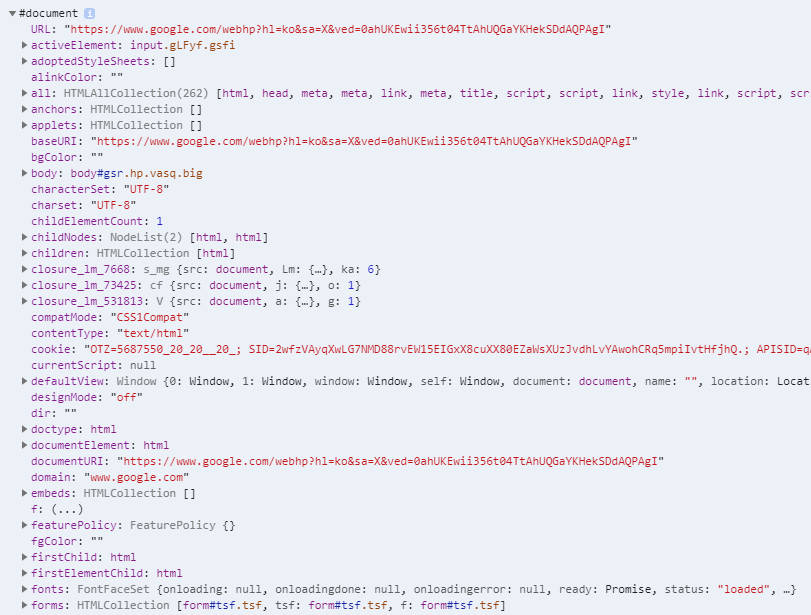

\* 이 글은 [MDN](https://developer.mozilla.org/es/), [Vanilla Coding Prep 강의자료](https://www.vanillacoding.co/), [PoiemaWeb](https://poiemaweb.com/)등 공신력있는 곳들을 참조한 글입니다.

## DOM이란 무엇인가?

MDN에서는 DOM을 이렇게 정의하고 있다.

> 문서 객체 모델(Document Object Model)은 HTML, XML 문서의 **프로그래밍 인터페이스**이다.

이 한 문장으로 DOM이 무엇인지 알 수 있는데, 여기서 프로그래밍 인터페이스라는 것이 내포하고있는 내용이 깊기 때문이다.

그럼 프로그래밍 인터페이스란 무엇일까?

프로그래밍 인터페이스는 우리가 흔히 말하는 API와 같다고 보면 된다.
API는 (Application programming interface)로 소프트웨어 간의 교류를 가능하게 해주는 표면같은 것 이라고 생각하면 되는데, 프로그램에서 어떤 다른 프로그램을 사용하고 싶을 때 이 API를 사용하는 것이라고 보면 된다.

따라서 이 **DOM이라는 인터페이스(API)를 사용하면 HTML 문서를 우리가 조작할 수 있다.**

**아래와 같이 만들어진 html 문서를 DOM을 이용해 조작할 수 있다.**

```html
<!DOCTYPE html>
<html lang="en">
  <head>
    <meta charset="UTF-8" />
    <meta name="viewport" content="width=device-width, initial-scale=1.0" />
    <title>Document</title>
  </head>
  <body>
    <h1>제목</h1>
    <h2>소제목</h2>
    <p>내용</p>
    <ul>
      <li>리스트1</li>
      <li>리스트2</li>
      <li>리스트3</li>
      <li>리스트4</li>
      <li>리스트5</li>
    </ul>
  </body>
</html>
```

**이러한 DOM은 JavaScript 언어의 일부는 아니다.**

우리가 주로 웹 페이지를 다루는데 **JavaScript 프로그래밍 언어를 통해 DOM이라는(HTML 페이지를 조작하는 )API를 사용할 뿐**이지, 파이썬과 같은 다른 프로그래밍 언어로도 DOM을 충분히 사용할 수 있다.

브라우저 자체에 WEB API가 내장되어 있고, 이 WEB API내부에 DOM이 내장되어있다고 보면 된다.

## DOM Node Tree

DOM은 Tree구조로 이루어져있다. 이 Tree 구조를

> Tree구조는 Node들로 구성된다.


Node 객체로부터 각 Node들에 대해 상속으로 이루어져있으며,
자식 Node는 부모 Node들의 특성을 그대로 가지고 있다.

DOM Tree를 구성하는 대표적 Node들은 다음과 같다.

1. Document Node
2. Element Node
3. Attribute Node
4. Text Node

### 1. Document Node

Document Node는 DOM의 가장 최상위 Node로 모든 Node들의 부모를 쭉 따라 올라가면 이 Document Node가 종착지일 것이다.

반대로 모든 Node들은 이 Document Node의 자식.

DOM에 접근하기위해서는 무조건 최상위 Node인 이 Document Node를 통할수 밖에 없다.

HTML 문서 그 자체를 가리킨다고 보면 된다.

브라우저 개발자툴 콘솔에 다음과 같이 입력해보자.

```js
dir(document)
```



### 2. Element Node

Element Node는 HTML의 요소. 즉, HTML의 각 Tag들을 가리킨다고 보면 된다.

HTML 태그들의 구조화된 부모 자식 관계를 그대로 따라간다.

그리고 모든 요소는 **HTMLElement** 객체가 상속되어 있어 **HTMLElement의 특성을 모두 포함**하고 있다.

```js
const bodyElement = document.body // body 태그 선택
const someElement = document.getElementById('js-id') // js-id의 id값을 같는 요소 선택
const divElements = bodyElement.querySelector('div') // css 선택자로 div태그 요소 선택
```

우리는 이 Element Node를 통해 HTML Tag정보를 참조, 수정할 수 있다.

```js
const createdDivElement = document.createNode('div') // div 태그요소 생성
createdDivElement.innerHTML = '<h1>this is title</h1>' // div 태그요소의 html내용 변경
```

### 3. Attribute Node

Attribute Node는 HTML의 Tag가 가지고있는 Attribute와 같다고 보면 된다.

당연히 Attribute Node는 Element Node를 통해 접근가능하며,
우리는 이 Attribute Node를 통해 HTML Tag의 Attribute를 수정할 수 있다.

```js
const createdDivElement = document.createNode('div') // div 태그요소 생성

createdDivElement.className = 'title-area' // class attribute 수정
createdDivElement.style.backgroundColor = 'red' // style attribute 수정
```

### 4. Text Node

Text Node는 HTML의 텍스트를 가리킨다. 텍스트는 HTML내에서도 가장 최하위 요소이고, DOM에서도 마찬가지이다.

```js
const createdDivElement = document.createNode('div')

createdDivElement.textContext = 'Create Div Tag using by DOM'

document.body.appendChild(createdDivElement) // body요소에 생성한 div태그 추가.
```

## DOM Element 선택

DOM Element Node선택은 최상위 Tree Node인 Document Node를 통해 할수도,
같은 DOM Element Node를 통해 할 수도 있다.

물론 자식 Node들에대해서만 선택이 가능하다. 때문에 첫 시작은 document Node가 될 수 밖에 없다.

### 선택 방법

DOM Element를 선택하는 방법은 다음과 같다.

1. document.getElementById('id')
2. document.getElementsByClassName('className')
3. document.getElementsByTagName('tagName')
4. document.querySelector('cssSelector')
5. document.querySelectorAll('cssSelector')

네이밍에서 알 수 있듯이, 1,2,3번은 <u>get element</u>가 들어가있기 때문에 `Element Node`를 가져온다는 명확한 뜻에 더해서 `id`, `class name`, `tag name`으로 가져오냐 마냐의 차이가 있다.

여기서 Elements 와 같이 복수형으로 되어있다면 이건 `Element Node`를 복수 선택 할 수 있다는 것.

4, 5번은 css 선택자를 통해 가져올 수 있는 방법으로, 4번은 하나 5번은 여러개의 `Element Node`를 가져올 수 있다.

참고로 1번을 제외하고 모두 document가 아닌 `Element Node(HTMLElement)`에서도 사용가능하다.
(1번은 id가 페이지내에 단 하나밖에 없기 때문)

```js
// 1개만 가져오는 방법
const elementGottenById = document.getElementById('id name')
const elementQuerySelector = document.querySelector('div.title-area')
const childElementQuerySelector = elementQuerySelector.querySelector('h1.title')

// 1개 이상의 유사배열형태(HTMLCollection)로 가져오는 방법
const elementsGottenByClassName = document.getElementsByClassName('class name')
const childElementsGottenByClassName = elementsGottenByClassName.getElementsByClassName(
  'child class'
)

const elementsGottenByTagName = document.getElementsByTagName('tag name')
const childElementsGottenByTagName = elementsGottenByTagName.getElementsByClassName(
  'child tag'
)

const elementsQuerySelectorAll = document.querySelectorAll('.button')
const childElementsQuerySelectorAll = elementsQuerySelectorAll.querySelectorAll(
  '.name'
)
```

정답은 없으나 **주로 querySelector()와 querySelectorAll()이 쓰인다.**

### 선택 결과 (return value)

`Element Node`를 가져오는 방법에 따라 return되는 값의 형태는 다르다.

당연히 `Element Node` 1개만을 가져오는 방법과 여러개를 가져오는 방법으로 나뉜다.

#### HTMLElement (결과 1개)

`Element Node`를 1개만 가져오는 방법은 다음과 같다.

- document.getElementById()
- document.querySelector()

해당 방법들로 `Element Node` 를 가져왔을 경우에 리턴값은 `HTMLElement`객체(인스턴스)이다.

`HTMLElement`객체의 특성을 그대로 사용할 수 있고 다음과 같이 확인할 수 있다.

```js
const wrapperElement = document.querySelector('div')
const buttonElement = document.getElementById('button')
const listElement = document.getElementById('list')
const anchorElement = document.querySelector('a.anchor')
const inputElement = document.querySelector('input.input-text')

// 각 Element Node들의 상속받은 객체를 알기위해 constructor.name 출력
console.log(wrapperElement.constructor.name) // HTMLDivElement
console.log(buttonElement.constructor.name) // HTMLButtonElement
console.log(listElement.constructor.name) // HTMLLIElement
console.log(anchorElement.constructor.name) // HTMLAnchorElement
console.log(inputElement.constructor.name) // HTMLInputElement
```

부모 객체 출력 결과는 각각 다른데, 그렇다고 모든 `Element Node`들이 다르지는 않다.

바로 각 HTML Tag에 해당되는 내용마다 Tag의 Attribute와 특성 등이 다르기 때문에 가장 기본이 되는 **`HTMLElement`객체를 상속받아 각 Tag의 특성과 Attribute를 속성으로 갖는 객체**를 만든 것.


따라서 모두 `HTMLElement`이고,
상속받는 객체들의 속성들을 모두 사용할 수 있다.

> **EventTarget은 각 Node별로 Event를 처리를 하기위해 만든 최상위 Node**
> addEventListener(), removeEventListener() 등의 메서드가 있다.

##### 가져오지 못한 경우

그리고 해당되는 `Element Node` 가 없다면 결과는 undefined가 아닌 **null**로 떨어진다.

```js
const someElement = document.getElementById('id')
console.log(someElement) // null
```

#### HTMLCollection, NodeList (복수 - 1개이상)

위에서 살펴본 복수개(1개이상)의 `Element Node`를 가져오는 방법에서

- document.getElementsByClassName() -> `HTMLCollection`
- document.getElementsByTagName() -> `HTMLCollection`
- document.querySelectorAll() -> `NodeList`

들과 같은 방법으로 가져올 경우, **유사배열 형태 (Array Like)** 의 값으로 떨어진다.

그 중 `ParentNode` 믹스인 기반인 `querySelectorAll()`을 제외한 getElements계열은
`HTMLCollection` 형태로 값이 떨어지고 `querySelectorAll()`은 `NodeList`의 형태로 떨어지게 된다.

```js
const listElements = document.getElementsByTagName('li')
const activeElements = document.getElementsByClassName('active')
const wrapperElements = document.querySelectorAll('div.wrapper')

// 각 Element Node들의 상속받은 객체를 알기위해 constructor.name 출력
console.log(listElements.constructor.name) // HTMLCollection
console.log(activeElements.constructor.name) // HTMLCollection
console.log(wrapperElements.constructor.name) // NodeList
```

다음과 같이 모두 복수형을 가져오는 결과는 **유사 배열** 형태의 `HTMLCollection` , `NodeList`의 형태로 떨어지는데, 이 **유사 배열** 에 담긴 값들은 전부 앞에서 살펴본 `HTMLElement`이다.

```js
const wrapperElements = document.querySelectorAll('div.wrapper')

console.log(wrapperElements[0].constructor.name) // HTMLDivElement
```

결국 `HTMLCollection` 이나 `NodeList` 이나 가져오는 **유사 배열** 형태의 차이만 있을뿐, 그 속인 내부는 `HTMLElement` 를 담고있는건 똑같다.

##### HTMLCollection VS NodeList

`HTMLCollection`과 `NodeList`의 차이는 **live** 한 특성이냐, **static** 한 특성이냐의 차이가 있다.

- `HTMLCollection` : **live** data
- `NodeList` : **static** data

이러한 특성들이 무엇인지는 소스로 비교해보자.

```html
<body>
  <ul class="list">
    <li class="item">First Item</li>
    <li class="item">Second Item</li>
    <li class="item">Third Item</li>
  </ul>
</body>
```

다음과 같은 html 파일이 있다고 할 때,

```js
const itemElementsHTMLCollection = document.getElementsByClassName('item')
const itemElementsNodeList = document.querySelector('.item')

console.log(itemElementsHTMLCollection)
// HTMLCollection { 0: li.item, 1: li.item, 2: li.item, length: 3 }

console.log(itemElementsNodeList)
// NodeList(3) [ li.item, li.item, li.item ]
```

각 결과는 다음과 같다. 이미 여기서 부터 `HTMLCollection`과 `NodeList`의 차이가 보이는데,

class name에 맞는 요소는 모두 알맞게 가지고 왔지만, **데이터 구조 자체에서 큰 차이**가 보인다.

이렇게 가져온 **두 개의 데이터구조를 그대로 두고**, **새로운 `<li>` 의 `Element Node`를 추가**하고 두 데이터 구조를 출력, 비교해보자.

```js
const list = document.querySelector('ul.list')

// HTMLCollection과 NodeList 데이터를 가져오자.
const itemElementsHTMLCollection = document.getElementsByClassName('item')
const itemElementsNodeList = document.querySelector('.item')

// 여기서 새로운 element node 추가.
list.innerHTML += '<li class="item">Fourth Item</li>'

// 출력해서 비교해보자.
console.log(itemElementsHTMLCollection)
// HTMLCollection { 0: li.item, 1: li.item, 2: li.item, 3: li.item length: 4 }

console.log(itemElementsNodeList)
// NodeList(3) [ li.item, li.item, li.item ]
```

이제 차이가 보이는가? **live**한 특성을 가지고있는 `HTMLCollection`은 수정사항이 동적으로 변경사항을 감지해 자동 업데이트 되는 반면에, **static**한 특성을 가지고있는 `NodeList`는 처음에 가져온 그대로 정적으로 남아있다.

이것이 바로 **live** 데이터구조와 **static** 데이터 구조의 차이.

근데, `element.childNodes`로 가져오는 `NodeList`는 **live** 하니 `childNodes`와 `querySelectorAll()`의 `NodeList` 별 차이를 인지하고 있어야 한다.

##### 배열로 사용하기

그리고 모두 **유사 배열** 형태이기 때문에

```js
const arrayFromHTMLCollection = Array.from(itemElementsHTMLCollection) // HTMLCollection -> 배열 전환
const arrayFromNodeList = Array.from(itemElementsNodeList) // NodeList -> 배열 전환
```

과 같이 `Array.from()` 을 통해 배열로 변환하여 **Array.prototype method**들을 사용할 수 있다.

### 자식, 부모 Node 탐색

`DOM Node`들은 DOM Tree 구조상 모두 `Node` 객체를 상속받는다.

따라서 우리는 `Node` 객체를 상속받는 모든 객체들에 대하여 **`Node` 객체의 Property를 이용할 수 있는데**, 그 중 부모, 자식 `Node`에 대한 Property를 이용하면 **현재 `Node`의 부모 `Node`, 자식 `Node`를 구할 수 있다.**

부모, 자식 `Node`를 구하는 Property는 다음과 같으며 `Node`객체의 프로퍼티는 모두 read-only property이다.

> ParentNode는 Node 객체의 믹스인으로써 모든 Node 인스턴스가 공통으로 가지고있다고 보면 된다. (상속객체 포함)

- Node.parentNode
  - 부모 `Node` 탐색
- Node.childNodes
  - 모든 자식 `Node` 탐색 (`NodeList` 반환 - **static**)
- Node.firstChild
  - 첫 자식 `Node` 탐색
- Node.lastChild
  - 마지막 자식 `Node` 탐색
- ParentNode.children
  - 모든 자식 Node 탐색 (`HTMLCollection` 반환 - **live**)
- Node.hasChildNodes()
  - 현재 노드가 자식을 가지고있는지 확인하는 메서드
- Node.

```js
const someElement = document.querySelector('ul.list')

const parentNode = someElement.parentNode // 부모노드 가져오기
const childNodes = someElement.childNodes // 자식노드 유사배열(NodeList) 가져오기
const firstChild = someElement.firstChild // 첫번째 자식노드 가져오기
const lastChild = someElement.lastChild // 마지막 자식노드 가져오기
const children = someElement.children // 자식노드 유사배열(HTMLCollection) 가져오기

if (someElement.hasChildNodes()) {
  // ToDo...
}
```

#### Node.childNodes VS ParentNode.children

두개의 차이점은 반환 데이터의 데이터구조의 차이로, `NodeList`와 `HTMLCollection`의 차이가 있다.

- Node.childNodes -> `NodeList` (**static**)
- ParentNode.children -> `HTMLCollection` (**live**)

> static data와 live data의 차이는 앞서 설명하였다.

```js
const someElement = document.querySelector('ul.list')

const nodesByChildNodes = someElement.childNodes
const nodesByChildren = someElement.children

console.log(nodesByChildNodes.constructor.name) // NodeList
console.log(nodesByChildren.constructor.name) // HTMLCollection
```

### 형제 Node 탐색

마찬가지로 형제 `Node`들 또한 접근가능하다.

- Node.previousSibling
- Node.nestSibling
- Node.previousElementSibling
- Node.nextElementSibling

## Element 요소 조작 (변경, 생성, 삭제)

우리는 DOM으로 Node를 조작할 때 그 대상은 주로 `Element Node`가 될 것이다.

`Element Node`를 조작하려면 우선 요소를 탐색해서 가져와야 한다.
그리고 주로 조작하게 될 하위 `Node`들은 다음과 같다.

1. **Attribute Node**
2. **Text Node**
3. 내부 HTML 조작

### Attribute Node 조작

`Attribute Node`조작은 쉽다.

앞서, 설명했던 `HTMLElement` 객체로 부터 상속받은 각 HTML Tag에 맞는 `HTMLElement`의 프로퍼티로 Tag에 맞게 Attribute Node가 존재한다. (`Node`객체, `Element` 객체, `HTMLElement`객체로 이어지는 상속구조를 통해 공통 프로퍼티 존재.)

따라서 다음과 같이 작업할 수 있다.

```js
const someElement = document.querySelector('ul.list')

someElement.style.backgroundColor = 'red' // style Attribute Node 조작
someElement.className = 'list c1' // class 구분은 html에서의 작업과 같이 ' ' (space)이다.
someElement.id = 'id' // Element.id 조작
someElement.classList.add('c2') // Element.classList 조작

console.log(someElement.className) //
```

#### classList를 통한 class 조작

html 요소에 class를 조작할때에, className으로 조작도 가능하지만, 이 경우에는 class명마다 `' '`(space)로 split을 해줘야 된다는 단점이 있다.

하지만 classList로 편하게 추가하고 제거하는등의 작업을 할 수 있다.

- add()
- remove()
- item()
- toggle()
- contains()
- replace()

등의 메서드를 제공한다.

### Text Node 조작

`Text Node`는 다양한 방법이 있지만,

`TextContent`를 통한 수정을 주로 한다.

1. Node.**textContent**
2. HTMLElement.**innerText**

```js
const h1Element = document.querySelector('h1')

h1Element.textContent = 'Hello World'
h1Element.innerText = 'Hello World'
```

#### textContent VS innerText

둘 다 요소의 Text를 가져오고 수정한다는 것은 똑같으나 차이점이 있다면
가져올 때 **모든 부분을 가져오느냐, 특정부분만 가져오느냐**와
수정할 때 **있는 그대로 표현하느냐 , 별도의 어떤 처리가 들어가느냐**라고 할 수 있다.

우선 소스코드를 통해 비교해보자

```html
<div id="wrapper">
  <div>hello, ha-young</div>
  <div style="visibility:hidden">nice to meet you</div>
</div>
```

다음과 같은 상황일때,

```js
const wrapperDivElement = document.querySelector('.wrapper')

console.log(wrapperDivElement.innerText) // ?
console.log(wrapperDivElement.textContent) // ?
```

다음과 같이 출력하면 어떻게 결과가 나올까?

- Line 3 : `hello, ha-young`

- Line 4 : `Hello, \nha-young nice to meet you` 와 같이 나온다.

다음을 보면 알 수 있듯이 `innerText`는 가져온 결과를 체크하고 수정하는 등 별도 처리과정이 존재한다.

반면에, `textContent`는 rawData 라고 봐도 무방하다.

`innerText`에 대해 좀 더 자세히 말하자면, 브라우저에 탑재되어있는 css스타일 처리와 위치를 파악하는 등의 작업을 하는 **auto layout 과 상호작용**하기 때문에 이러한 결과가 나오는 것.

**그렇기 때문에 textContext보다 현격히 느릴 수 밖에 없고,** **브라우저의 성능을 떨어뜨리고 예상치 못하게 작동할 우려가 있기 때문에 사용을 권장하지 않는다.**

더 디테일한 내용은 [다음 사이트](https://kellegous.com/j/2013/02/27/innertext-vs-textcontent/)를 참조하자.

### 내부 HTML 조작

HTML을 조작하려면 DOM을 통해서 조작하는 방법도 있지만,
다음과 같은 방법을 통해 **요소 내부의 HTML을 가져오거나 조작**할 수 있다.

- Element.**innerHTML**

HTML Mark Up으로 이루어진 문자열을 통해 조작 가능하며 이러한 문자열을 DOM 문자열 이라고도 한다.

```js
const listElement = document.querySelector('ul.list')
const className = 'item'

listElement.innerHTML = `
	<li class=${item}>first</li>
	<li class=${item}>second</li>
	<li class=${item}>third</li>
	<li class=${item}>fourth</li>
`

console.log(listElement.innerHTML)
// <li class=${item}>first</li><li class=${item}>second</li><li class=${item}>third</li><li class=${item}>fourth</li>
```

#### innerHTML VS DOM 조작

우선 둘의 장단점은 명확한데,

- innerHTML은 DOM 조작보다 빠르고 간편하지만, 보안의 위험이 있고(XSS),
- DOM 조작은 innerHTML에 비해 javascript로 DOM요소의 속성들을 사용(classList와 같은)할 수 있다는 점이 있지만, innerHTML보다 느리고 많은 코드가 필요하다.

innerHTML은 기존에 있던 HTML요소를 없애고 다시 등록하는 것이므로, 내용은 많은데 변하는 내용이 적다면 오히려 더 비효율 적일 수가 있다. (기존의 내용을 다시 생성)

HTML 내용에 많은 변화가 필요하다면 innerHTML을 사용하고, (보안고려)
특정 노드에 대해서 처리를 하려면 DOM 조작이 적합하다.

**하지만 이미 MarkUp되어있는 환경에서 요소만 조작이 필요할 경우가 많으므로 보안이 취약한 innerHTML보다 DOM 조작을 우선순위로 사용하여야 한다.**

### Element 요소 생성

Element 요소를 생성하는 방법은

- document.createElement()

가 있다.

```js
const createdDIVElement = document.createElement('div') // div tag의 Element 생성(HTMLDivElement)
const createdInputElement = document.createElement('input') // input tag의 Element 생성(HTMLInputElement)
const createListElement = document.createElement('ul') // ul tag의 Element 생성(HTMLUlElement)
```

와 같이 생성가능하며, 생성된 요소는 `HTMLElement`를 상속받는 객체이다. (`HTMLDivElement`과 같은)

이와 같이 생성된 HTML 요소는 위에서 다루었던 AttributeNode 수정 등의 작업들을 거친뒤에 부모 Node에 추가되면서 HTML 페이지에 추가할 수 있다.

### Element 요소 추가

Element 요소를 추가하는 방법은

- Node.appendChild()

를 이용한다.

`Node.appendChild(Node객체)` 와 같이 **Node 객체를 인자값으로** 넘긴다.

```js
const parentElement = document.querySelector('.wrapper')

const createdListElement = document.createElement('ul') // ul tag의 Element 생성(HTMLUlElement)

parentElement.appendChild(createdListElement) // 생성한 ul Element를 자식요소로 추가
```

### Element 요소 제거

Element 요소를 제거하는 방법은

- Node.removeChild()

를 이용한다.

`Node.removeChild(Node객체)` 와 같이 **Node 객체를 인자값으로** 넘긴다.

```js
const parentElement = document.querySelector('.wrapper')
const removeElement = parentElement.querySelector('ul')

parentElement.removeChild(removeElement) // ul Element를 제거
parentElement.removeChild(parentElement.lastChild) // 마지막 자식 Node를 제거한다
document.removeChild(parentElemet) // document도 Node 객체이므로 사용가능하다
```

### Element Event 추가

기본적으로 `Node`객체는 `EventTarget`을 상속받고 있기때문에 Event 추가와 삭제가 가능하다.

이러한 `Node`객체 혹은 `HTMLElement`들에 이벤트를 추가하면, 해당 이벤트가 발생되었을 때 우리가 설정한 작업을 발생기킬 수 있다.

- EventTarget.**addEventListener()**

```js
const buttonElement = document.querySelector('button')

buttonElement.addEventListener('click', function onButtonClick() {
  console.log('Hello World')
})
```

이벤트를 추가시킬 수 있는 [addEventListener](https://developer.mozilla.org/en-US/docs/Web/API/EventTarget/addEventListener)는 기본적으로 두개의 인자가 필요하다.

- event type : 이벤트의 종류 ([여기 참조](https://developer.mozilla.org/en-US/docs/Web/Events))
- event listener : 이벤트 발생시 실행되는 함수

## DOM의 메모리 누수 문제

흔히 Javascript 메모리 누수문제로 나타나는 문제 중 하나가 바로 DOM을 다루면서 생기게 된다.

설명하자면 DOM 요소에 대한 참조를 어느한곳에서라도 가지고 있다면 DOM 트리에서 해당 DOM을 제거하여도 참조값이 남아있기 때문에 Garbage Collector가 제대로 작동하지 않는다.

무슨말인지 모르겠다면 아래 코드를 보자.

```js
var domElements = {
    button: document.querySelector('.button');
    image: document.querySelector('.image');
	text: document.querySelector('.text');
}

function manipulateDOM (elements) {
    elements.image.src = 'haha';
    elements.button.style.backgroundColor = 'black';
    elements.text.textContext = 'processing...';
    // ...
}

function removeElements (elements) {
    for (const element in elements) {
        if (elements.hasOwnProperty(element) {
            element.parrentNode.removeChild(element);
    	}
    }
}

manipulateDOM(domElements);
// ...
removeElements(domElements);
```

위 과정에서 `removeElements()`를 통해 얼핏보면 메모리 관리를 해주고 있는 것 처럼 보인다. 하지만 **제대로 처리되고 있지 않다.**

그 이유는 `removeElements()` 함수의 역할은 **DOM 트리**에 **존재하는 요소들을 제거**하는 일을 할 뿐 해당 **DOM 요소를 메모리에서 제거하는 일은 하지 않는다**.

즉, DOM 트리에서 해당 요소를 제거해 추후 Garbage Collector를 통해 메모리 해제가 된다는 말이다. 그럼 여기서 어느 한곳에서라도 해당 DOM요소를 참조하고 있다면 DOM 트리에서 삭제되더라도 그 참조값 때문에 Garbage Collector는 해당 DOM 요소를 수집하지 않게 된다.

따라서 위의 코드는 `domElements`라는 객체에서 dom 요소들을 계속해서 참조하고 있으므로 이후 `removeElements()` 함수를 통해 DOM 트리에서 해당 요소들을 없애도 메모리에서는 해제가 되지 않는다.

제대로 된 코드를 작성하려면 다음과 같이 작성을 해야 된다.

```js
const domElements = {
  button: document.querySelector('button'),
  image: document.querySelector('image'),
  text: document.querySelector('text'),
  div: document.querySelector('div'),
}

function manipulateDOM(elements) {
  elements.image && (elements.image.src = 'haha')
  elements.button && (elements.button.style.backgroundColor = 'black')
  elements.text && (elements.text.textContext = 'processing...')
  elements.div && (elements.div.style.backgroundColor = 'green')
  // ...
}

function removeElements(elements) {
  for (const element in elements) {
    if (elements.hasOwnProperty(element)) {
      element.parrentNode?.removeChild(element)
      console.log(element)
      delete elements[element] // Dom 요소를 참조하는 domElements 내부 property 제거
    }
  }
}

manipulateDOM(domElements)
// ...
removeElements(domElements)
```

다음과 같이 참조값들을 모두 제거해줘야 GC가 제대로 작동을 하게 되어 메모리가 성공적으로 해제될 수 있다.
