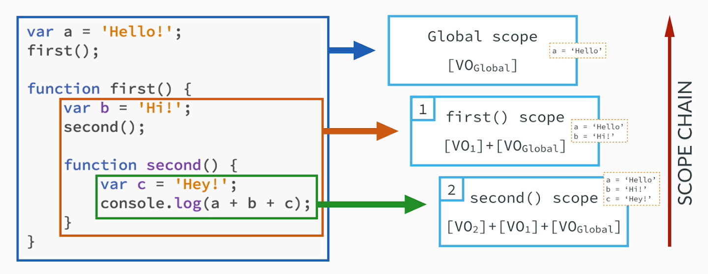

\* 이 글은 [MDN](https://developer.mozilla.org/es/), [Vanilla Coding Prep 강의자료](https://www.vanillacoding.co/), [PoiemaWeb](https://poiemaweb.com/)등 공신력있는 곳들을 참조한 글입니다.

## Scope?

[위키백과](https://ko.wikipedia.org/wiki/%EB%B3%80%EC%88%98_%EC%98%81%EC%97%AD)에 따르면 프로그래밍에 있어서 Scope는 변수가 유효성을 갖는 영역을 가리킨다고 한다.

이 말인 즉슨, 각 식별자 즉, 변수는 선언시 사용할 수 있는 영역이 생기게 되는데, 이 영역에서만 변수를 사용할 수 있고 영역 밖이면 사용할 수 없다는 말이다.

흔히 우리가 프로그래밍을 하면서 전역변수, 지역변수와 같은 말을 자주 듣게되는데, 전역 혹은 지역과 같은 말이 스코프에 해당되는 내용이라고 볼 수 있다.

아래 상황을 보자.

```js
var identifier = 'global'

function scopeTest() {
  var identifier = 'function'

  console.log(identifier)
}

scopeTest()
console.log(identifier)
```

다음과 같은 상황에서 `console.log(identifier)` identifier 변수의 값은 각각 어떻게 나올까? 그리고 Javascript에서는 어떻게 변수가 식별되는 것일까?

이 답은 Scope에 있다.

Scope를 알면 코드내에서 어떤 변수가 어떻게 적용되고 사용되는지 알 수 있는 대상 식별자를 찾아내는 규칙을 알 수 있게 된다.

즉, **Scope는 변수가 유효성을 갖는 영역이기도 하지만, 참조 대상 식별자를 찾아가는 규칙이라고도 할 수 있다.**

> 참조 대상 식별자 : 대상을 식별할 수 있는 유일한 이름. 대표적으로 변수, 함수명 등이 있다.

모든 Scope는 **기본적으로 상위 Scope로 연결되어있다면 식별자 접근이 가능**하나,
연결되어있지않은 상위 스코프나 (chaining 되어있지 않다면) 하위스코프에는 접근할 수 없다.

```js
var global = 1

function func1() {
  var localFunc1 = 2

  function func2() {
    var localFunc2 = 3
    console.log(global) // 상위 스코프 접근
    console.log(localFunc1) // 상위 스코프 접근
    console.log(localFunc2) // 동일 스코프 접근
  }

  console.log(global) // 상위 스코프 접근
  console.log(localFunc1) // 동일 스코프 접근
  console.log(localFunc2) // Error. 하위 스코프 접근 불가

  func2()
}

func1()
```

만약 이와같은 Scope가 없다면 대상을 식별할 수 있는 유일한 이름인 식별자가 중복으로 충돌을 일으켜 전체 코드 내에서 식별자를 하나밖에 쓸 수 없는 상황이 오게 될 것이다. 그럼 이전의 식별자가 없어지고 새로운 식별자로 덮어지는 등 코드 내부적으로 불편성과 심각한 오류를 야기할 수 있다.

## Javascript Scope?

### 스코프 단위 : 함수 스코프

Javascript Scope에 대해서 알고가려면 이 함수 스코프를 빼놓을 수 없다.

일반적으로 프로그래밍에서는 블럭단위로 스코프가 결정되어 지지만,
Javascript에서는 기본적으로 변수 선언방식 `var`키워드로 선언된 변수들은 모두 함수스코프가 적용된다.

#### 함수 스코프 VS 블록 스코프

함수 스코프란 함수레벨로 변수가 선언되는 것이다.

```js
var global = 1

function func() {
  var localFuncional = 2

  if (true) {
    localFuncional = 3
    var localBlocked = 4
  }

  console.log(localFuncional) // 함수스코프 : 3 <-> 블록스코프 : 2
  console.log(localBlocked) // 함수스코프 : 4 <-> 블록스코프 : Error
}
```

위 코드를 보면 함수스코프와 블록스코프를 적용시키는 차이점을 알 수 있다.

함수 스코프는 함수 내부적으로 스코프가 적용되기 때문에 `if`문 내부에서도 블록의 영향을 받지않고 `localFunctional` 변수에 접근 가능하다. 또 변수가 블록 내부에 선언되어있더라도 같은 함수 내부이기 때문에 블록이 끝나도 그 변수는 계속 유지되어 사용 할 수 있다.

### 스코프 결정 방식 : Lexical Scope (렉시컬 스코프)

프로그래밍 언어는 스코프를 결정짓는 방식이 2가지 존재하는데, 렉시컬 스코프와 동적 스코프 이 두가지가 있다.
자바스크립트는 렉시컬 스코프방식으로 스코프가 결정된다.

렉시컬 스코프는 **함수가 선언된 곳으로부터 변수 스코프영역(상위 스코프)가 결정되는 것이다.**

함수를 생성, 선언한 곳으로부터 스코프가 결정되기 때문에 클로저와도 관련이 깊다.

```js
var variable = 1

function func1() {
  var variable = 2
  func2()
}

function func2() {
  console.log(variable)
}

func1() // 1
func2() // 1
```

`func1()` 함수가 실행되었을때 내부의 `func2()`함수는 선언된 곳이 `func1()` 내부가 아니기 때문에 `func1()`함수의 내부의 `variable`변수에 접근하지 않는다. `func2()`함수가 선언된 곳에서 그 상위 스코프인 전역의 `variable`을 참조하게된다.

이것이 바로 Lexical scope 방식이다.

### 스코프 영역 구분

Javascript에서는 스코프로 결정지어지는 영역이 크게 2가지로 나눌 수 있다.

모두 어디에서 선언되었느냐가 기준이고, 선언된 영역에 따라 전역변수, 지역변수로 나눌 수 있다.

지역스코프, 변수는 함수스코프 단위로 생성되었을때를 기준으로 한다.

- **전역 스코프** : 코드 <u>어느 지점에서나 접근가능</u>
  - **전역 변수** : 전역 스코프에 선언된 변수이며 <u>어디에서나 접근 가능</u>
- **지역 스코프** : 함수를 통해 생성된 스코프. <u>해당함수 자신 또는 하위함수에서만 접근 가능</u>
  - **지역 변수** : 함수 내에서 선언된 변수이며 <u>해당 함수 내부(동일 스코프)와 하위 스코프에서만 접근</u>할 수 있다.

### var vs let, const

Javascript의 변수선언방식의 근본인 var 키워드 이후에
ES2015에서 도임된 **let, const를 사용하면 기존의 함수스코프 방식에서 블록스코프 방식으로** 바꿀 수 있다.

이외에 let, const는 호이스팅의 문제와 재선언의 문제도 해결되었다.

## 전역 스코프 (Global Scope)

### 전역객체 (Global Object)

전역스코프에 대해서는 추가적으로 얘기를 더 해야되는데,
그 이유는 바로 `전역객체(Global Object)` 와 관계가 있기 때문이다.

> Node.js 상에서는 Global Object이지만, Web에서는 Window 객체이다.

어떤 관계가 있냐면, 전역스코프로 선언되는 변수들은 모두 전역객체의 `Property`로, 함수들은 `Method`로 들어가게 된다. (`var` 키워드 기준)

```js
var global = 100

function func() {
  var local = 1
  console.log('this is func, local value : ', local)
}

console.log(window.global === 100) // true
window.func && window.func() // 'this is func, local value : 1'
```

이를 통해 `전역 변수`와 `전역 함수`는 모두 `전역객체`의 속성이 된다는 것을 알 수 있다.

> let, const로 선언하면 전역객체에 속하지 않는다.

하지만 전역 변수와 전역 함수는 전역객체의 속성이지만 `delete` 연산자로 삭제할 수 없다.

```js
var global = 100

function hi() {
  console.log('hi')
}

delete window.global // false
delete window.hi // false
```

### 암묵적 전역 (Implicit global)

만약 변수 선언 키워드를 붙이지않고 선언되지않은 식별자에 값을 할당한다면 어떻게 될까?

```js
global = 0
;(function func() {
  local = 1

  innerFunc = function() {
    console.log('innerFunc', global, local)
  }
})() // 즉시실행함수(IIFE) 로 실행

console.log(window.global === 0) // true
console.log(window.local === 1) // true
window.innerFunc && window.innerFunc() // 'innerFunc 0 1'
```

이렇게 변수 선언 키워드 없이 선언된 변수들을 **`암묵적 전역 변수`**라고 한다.

어디에서 선언되었든 모두 `전역객체`의 `Property`로 들어가게 된다.

하지만 `var` 키워드로 선언된 `전역변수`와 `전역함수`의 경우 `delete`로 제거할 수 없었지만
이 `암묵적 전역변수`는 `delete` 연산자로 제거가 가능하다.

```js
global = 0
;(function func() {
  local = 1

  innerFunc = function() {
    console.log('innerFunc', global, local)
  }
})() // 즉시실행함수(IIFE) 로 실행

delete window.global // true
delete window.local // true
delete window.innerFunc // true
```

### 사용을 자제, 권장되는 방식

전역변수를 과도하게 생성할 경우, 변수 이름이 중복될 수 있고, 의도치 않게 재할당되어서 예측할 수 없는 오류를 야기시킬 수 있다.

때문에 전역변수를 선언하는건 지양해야 한다.

그래도 어쩔 수 없이 전역변수를 선언해야 되는 경우가 있는데,
아래와 같은 방법으로 전역변수 객체를 선언하는방법이 있다.
(네이밍은 자유)

```js
let GLOBAL = {}

GLOBAL.hello = 'hello, world'

function print() {
  console.log(GLOBAL.hello)
}

print() // hello, world
```

## Scope Chain



위 사진을 보면, Scope가 어떻게 형성되는지 알 수 있다. 결과는 `'Hello!Hi!Hey!'`

앞서 말해왔던 상위, 하위 스코프라는 계념은 위 처럼 계층적으로 작동되는 것이라고 생각하면 되는데,
가장 최상위에 `Global Scope`가 존재하고, 그 `Local Scope`인 `first() 함수 Scope`가, 또 그 아래 `second() 함수 Scope`가 존재하게 된다.

**[상위]** `Global scope` - `first() scope` - `second() scope` **[하위]**

당연히 `second()` 함수 내부에서는 상위 스코프들의 모든 변수들에 접근이 가능하고,
`first()`함수에서는 상위인 `Global scope`에만 접근, 하위인 `second() scope`에는 접근 불가능하다.

**오직 하위에서 상위의 스코프에 접근이 가능하고 상위에서 하위스코프에 접근은 불가능하다**

그리고 이 `Scope Chain`은 변수를 찾을 때 상위 스코프로 순차적으로 탐색을 진행하게 된다.

```js
var a = 'Hello!'
first()

function first() {
  var a = 'Bye!'
  var b = 'Hi!'

  second()

  function second() {
    var c = 'Hey!'
    console.log(a + b + c)
  }
}
```

위 이미지와 다르게 `first()` 함수에 `var a`을 선언 하였다. 이럴경우에는 `second()` 함수가 실행되고 `a` 식별자를 찾을 때 상위스코프로 순차적으로 접근하므로 그 다음 상위스코프인 first()에 a 식별자를 출력하게 된다.

**현재 스코프에 해당되는 식별자가 없을경우, 상위 스코프로 탐색을 시작하고 순차적으로 탐색을 진행, 발견하면 탐색을 멈춘다.**
