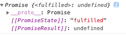
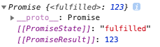

\* 이 글은 [Vanilla Coding](https://www.vanillacoding.co/) - BootCamp 9기 1주차 강의 수강 후 적은 글입니다.

## Asynchronous?

웹 프론트, 백엔드와 더불어 모든 곳에서 Javascript(node.js)를 사용한다면 빼놓을 수 없는 것이 또 비동기 프로그래밍일 것이다.

> 특히, 웹 브라우저와 자바스크립트에 있어서 이 비동기 개념을 이해하는 것이 상당히 중요하다.

Asynchronous(비동기)는 어떤 작업 한번에 하나씩 해결이 될때까지 기다리며 순차적(Synchronous)으로 진행되는 일반적인 프로그램의 코드와는 다르게,
어떤 작업을 별도로 진행시키고 작업이 끝날때까지 기다리지 않고 다음작업을 이어나가면서 비동기적으로 진행시킨 작업 별도로 결과가 나오면 그제서야 처리해주는 방식이다.


위 이미지는 [Poiemaweb-async](https://poiemaweb.com/js-async) 글에서 참조한 그림인데,
동기(Synchronous)와 비동기(Asynchronous)의 개념을 그림하나로 잘 설명하고 있다.

동기는 위 처럼 메뉴를 주문하면 메뉴가 나올 때 까지 기다리고 받아가는 방식이라면,

비동기는 아래 처럼 메뉴를 주문하고 줄(Context)에서 빠져나와 메뉴가 나올 때 까지 기다리고, 메뉴가 나오면(결과가 나오면) 주문한 메뉴를 받아가는(결과를 처리하는) 방식이다.
여기서, 줄에서 빠져나온다라는 개념은 뒤이어 줄 선 사람이 주문(혹은 다른 작업)을 할 수 있게 된다는 뜻이며 마찬가지로 주문이 끝났다면 기다리지않고 주문을 넣고 줄에서 빠져나가 기다리게된다.

> 근데, Javascript 환경의 특성상 줄 (javascript환경에서는 `Context` 혹은 `Call Stack`) 이 모두 비워진 상태에서, 각각 주문(비동기 호출을 한 사람(작업)들에게 메뉴를 전달 할 수 있다.
>
> <br>
>
> > 자바스크립트환경에서는 Call Stack이 비워진 후에 [Callback Queue(Event Loop)](./#javascript에서-비동기-프로그래밍을-가능하게-해주는-요소들)에 있는 작업을 처리 할 수 있고 비동기 함수들은 Callback Queue(Event Loop)에 들어간다.


## 왜 Javascript는 비동기 프로그래밍을 해야만 하는가?

`Javascript`가 아닌 `C`, `C++`, `Java` 와 같은 OS를 다룰 수 있는 다른 언어들을 보면 **멀티 스레딩**이라는 것을 지원을 하는데, 이 멀티 스레딩에서는 **스레드**라는 것을 이용해서 작업의 주체를 계속해서 늘려서 병렬적으로 작업을 할 수가 있다.

위 상황에 대입해보면, 주문을 하는 사람이 한명씩 주문을 할 때마다 주문을 받고 커피를 제공해주는 사람이 계속해서 생긴다고 생각을 하면 된다.

하지만 `javascript` 가 쓰이는 `browser`, `node.js` 가 **싱글 스레드만을 지원**하기 때문에 하나의 작업주체에서 언제끝날지 모르는 여러가지 작업을 마냥 기다릴 수 만은 없거니와, 동시에 처리하려고 하다 보니 이러한 비동기적 처리를 필수불가결하게 할 수 밖에 없다.

> - 대표적인 browser인 Chrome과 node.js 의 내부엔진은 [V8 엔진](https://v8.dev/)을 사용하는데, 이 V8엔진이 싱글스레드로 작동한다.
>
> - 이제와서는 브라우저에서는 HTML5에 Web Worker를 통한 멀티스레딩을,
>   Node.js에서는 Woker를 통해 멀티스레딩을 구현할 수 있다고한다.
> - 비동기와 멀티스레딩은 엄연한 차이가 있다.
>   아래 그림을 참조하자. ([링크](https://stackoverflow.com/questions/748175/asynchronous-vs-synchronous-execution-what-does-it-really-mean/748235#748235)에 있는 이미지를 직접 그렸다)


## Javascript에서는 비동기 프로그래밍을 어떻게 하는가?

자바스크립트에서는 비동기 프로그래밍은 웹에서는 주로 Web API함수를 이용해서 구현할 수 있다.

- [setTimeout()](https://developer.mozilla.org/ko/docs/Web/API/WindowTimers/setTimeout)
- setInterval()
- [fetch()](https://developer.mozilla.org/ko/docs/Web/API/Fetch_API/Fetch%EC%9D%98_%EC%82%AC%EC%9A%A9%EB%B2%95)
- 등등...

### 타이머로 사용할 때

```js
console.log('start');

setTimeout(function () {
  console.log('비동기 Timer!');
}, 1500);

console.log('end');
```

다음과 같은 상황에서 시간순으로

- 'start' 출력
- 'end' 출력
- 1.5초 뒤에 '비동기 Timer!' 출력

이렇게 작동하게 되는데, 비동기함수는 결과값이 나올 때 까지 기다려주지않고 그 다음 코드인 'end'가 먼저 출력되는 것을 확인 할 수 있다.


### 서버에 데이터를 요청, 전송할 때 (Ajax)

웹페이지에서 모든정보를 가지고 있지않는 이상에야 서버에 데이터를 요청하고 받아오는 것은 웹 페이지 개발에 있어서 핵심이라고 할 수 있다.

서버에서 데이터를 가져올 때 또한 비동기적으로 작동하야되기 때문에 (서버에서 언제 요청한 값을 줄지 알 수 없음) 관련 함수들이 Web API로 제공되어진다.

```js
console.log('start');

fetch('https://httpbin.org/get')
	.then(function (response) {
  	return response.json();
	})
	.then(function (resultJson) {
  	console.log('서버에서 데이터를 받음');
  	console.log(JSON.stringify(resultJson));
	});

console.log('end');
```

시간순으로

- 'start' 출력
- 'end' 출력
- 서버에서 응답을 해줬을 때 '서버에서 데이터를 받음' 출력 및 결과출력

로 출력이 되고, 서버에서의 응답은 서버, 네트워크의 상황에따라 다르기때문에 언제 응답을 받을 수 있는지는 알 수가 없다.

## Javascript에서 비동기 프로그래밍을 가능하게 해주는 요소들

Javascript에서 비동기 프로그래밍을 가능하게 해주는 요소는 아래 두가지이다.

- Event Loop
- 고차함수 ( `callback` 함수의 존재 )

모든 javascript 엔진에서 동일하게 실행되는 **Event Loop**는 javascript 비동기 작동을 이해하는데 대단히 중요한 근본 원리라 할 수 있다.

> 이 **Event Loop는 Call Stack이 비워지면 실행**된다.

모든 비동기 함수에서 받아서 실행 할 callback 함수들은 비동기 함수 실행 완료 후 `Callback Queue` 에 들어가게 되는데 이 `Callback Queue` 는 `Call Stack`이 비워진 이후에 하나씩 `Callback Queue`에 있는 함수들을 꺼내 실행시키게 된다. 즉, 이 말은 비동기 함수가 이미 종료된 시점에서 `Call Stack`이 비워진 상태가 아니라면 종료 후 호출하는 `Callback` 함수가 곧바로 실행되지 않을 수도 있다는 말이다. 즉, **`Callback` 함수의 실행 시점을 보장 할 수 없다**는 말.

어쨌든 우리가 사용하는 Callback함수는 `Call Stack`이 비워져야만 실행된다는 사실을 알아두자.

> 비동기 Callback 함수에서 다시 비동기 요청(콜백중첩)을 할 경우에는 Event Loop내에서 실행되었다고 할 수 있다.

```js
// 3초뒤 출력하는 비동기작업 시작.
window.setTimeout(function () {
  console.log('call back!');
}, 3000);

function infinityFunc () {
	while(true) {
  	// ...
	}  
}

infinityFunc();
```

극단적으로 위의 예제처럼 `infinity()`함수의 무한루프로인해 `Call Stack` 이 비워지지않아서 3초뒤에 우리가 원하는 출력값을 얻을 수 없는걸 확인 할 수 있다.


이미지 출처 : [VanillaCoding - Prep강의](https://www.vanillacoding.co/)

### 혹시 비동기 함수를 강제로 종료시킬 수 있을까?

**이미 예약(실행)된 비동기 함수는 우리가 강제로 종료시킬 수 없다.**

`setTimeout`이나 `setInterval`은 리턴 받은 id로 `clearInterval`혹은 `clearTimeout`로 종료시킬수는 있지만 다른 Ajax요청등과 같은 비동기함수들은 강제로 종료시킬 방법이 없다. 

만약 비동기 함수들끼리 로직이 연결되어있다면 차선책으로 아래와 같은 방법을 사용할 수 있다.

```js{2,18-20,26}
let successCount = 0;
let isErrorOccurred = false;
const asyncFuncList = [asyncFunc, asyncFunc, asyncFunc_Err, asyncFunc, asyncFunc]; // 병렬로 한꺼번에 실행시킬 비동기함수들

function asyncFunc (callback) {
  window.setTimeout(() => {
    callback();
  }, 3000);
}

function asyncFunc_Err (callback) {
  window.setTimeout(() => {
    callback('err'); // 강제로 애러 발생
  }, 3000)
}

function commonCallbackFunc (isErr) {
  if (isErrorOccurred) {
    return;
  }
  
  if (isErr) {
    // 애러처리
    console.log('애러발생!');
    console.log('지금까지 수행한 비동기함수 : ', successCount);
    isErrorOccurred = true;
    return;
  }
  
  successCount += 1; // 작업 성공이면 카운트 증가
  
  if (successCount === asyncFuncList.length) {
    console.log('작업 완료!');
    console.log('지금까지 수행한 비동기함수 : ', successCount);
  }
}

for (const asyncFunc of asyncFuncList) {
  asyncFunc(commonCallbackFunc); // 비동기 함수 실행
}
```

소스는 병렬로 한꺼번에 비동기 함수를 실행시키고 만약 애러가 발생했다면 나머지 작업완료가 되지않은 비동기함수들의 작업을 중단시키고자 할 때의 예제이다.

작업 중단을 하고싶지만 그렇게 할 수 없기에 차선책으로 `isErrorOccurred`이란 Flag를 두어 비동기 함수의 콜백함수가 실행은 되지만 이러한 Flag를 통해 이후 작업을 막을 수 있다.

위 소스는 비동기 작업이기 때문에 `successCount`결과는 장담할 수 없지만 아마 3초뒤에

```console
애러발생!
지금까지 수행한 비동기함수 : 2
```

 가 나올 것이다.


## 초창기 비동기 프로그래밍

#### Callback Function

우리가 비동기프로그래밍을 하는데 있어서, 가장 기본적인 방법은 콜백함수를 이용하는 방법이다.

콜백함수는 비동기 처리가 끝났을 때 실행해서 비동기함수의 결과값을 처리하도록하거나 또는 애러가 났을 때 실행해서 애러처리를 하게끔 할 수 있다.

```js{14,18}
var errFlag = false;

function standardCallback (err, result) {
  if (err) {
    console.log('애러 발생 : ', err); // 애러메세지 출력
    return;
  }
  
  console.log('결과 값 : ', result); // 결과값 출력
}

function asyncFunc (callback) {
  if (errFlag) {
    callback('error'); // callback 함수의 첫번째 인자값은 애러메세지
  }
  
  setTimeout(function () {
    callback(null, 'this is callback function!'); // error가 없으므로 null
  }, 2000);
}

asyncFunc(standardCallback);
```

#### Continuation Passing Style (Callback Hell)

하지만 이렇게 콜백함수를 이용하는 방법에는 큰 문제가 발생하였는데 아래 코드를 보자.

> 소스 출처 : [callbackhell.com](http://callbackhell.com/)

```js
fs.readdir(source, function (err, files) {
  if (err) {
    console.log('Error finding files: ' + err)
  } else {
    files.forEach(function (filename, fileIndex) {
      console.log(filename)
      gm(source + filename).size(function (err, values) {
        if (err) {
          console.log('Error identifying file size: ' + err)
        } else {
          console.log(filename + ' : ' + values)
          aspect = (values.width / values.height)
          widths.forEach(function (width, widthIndex) {
            height = Math.round(width / aspect)
            console.log('resizing ' + filename + 'to ' + height + 'x' + height)
            this.resize(width, height).write(dest + 'w' + width + '_' + filename, function(err) {
              if (err) console.log('Error writing file: ' + err)
            })
          }.bind(this))
        }
      })
    })
  }
});
```

위 소스에서는 다음과 같은 처리를 하고 있다.

- 비동기 작업 완료 후 실행되는 콜백함수에 또 다시 비동기 작업 (비동기 직렬)
- 비동기 작업 완료 후 실행되는 각각의 콜백함수에서 애러 핸들링

만약, 비동기 함수에 이러한 작업을 계속해서 할 경우(콜백함수가 중첩될 경우) **가독성이 매우 떨어지게 된다.**

이러한 현상을 가리켜 **콜백 지옥** 이라고 한다.


## 현재의 비동기 프로그래밍

위에서 봤던 가독성이나 애러핸들링 등과 같은 초창기 비동기 프로그래밍의 흐름을 어떻게하면 효율적으로 풀어나갈지에 대한 고민은 지금까지도 계속되고 있으며, 많은 시도들이 진행되었다.

- **Promise**
- **Async / Await** - ES2017(ES8)
- Generators - ES2017(ES8)
- Observers - ES2016(ES7)
- 기타 라이브러리...

이와 같은 방법들이 있는데,

**`Promise` 와 `Async / Await`가 가장 대표적인 방법**이라 할 수 있을 것 같다.

> Async / Await 는 Promise를 우선적으로 이해해야 한다.


그래서 우선, `Promise`와 `Async / Await`에 대해서만 **간단하게** 알아보고 자세한 사항이나 나머지는 따로 찾아볼 수 있도록 하자.


## Promise

**Promise**는 Javascript 비동기 작업을 도와주는 객체로 비동기 작업의 상태와 결과, 애러 핸들링 등을 도와줄 수 있다.

사실 많은 사람들이 **Promise**를 콜백지옥의 해결책이라고 생각하는데, 이는 잘못되었다.<br>
Promise 또한 Promise의 결과에 또 Promise를 중첩해서 사용하면 콜백지옥과 다를 바 없다.

> Promise는 비동기 프로그래밍에 있어서 비동기 작업의 상태확인, 애러핸들링과 가독성향상에 대해 이점을 가지고 있지 콜백지옥을 근본적으로 해결하는 해결책이라고 보기에는 무리가 있다. 

### Promise 사용법

#### 1. Promise객체 생성(비동기 작업 수행) - Pending

```js
const promise = new Promise(function (resolve, reject) {
  // 작업 수행시 resolve() 호출
  // 애러시 reject() 호출
}) 
```

다음과 같이 프로미스 객체를 생성 할 수 있으며 **프로미스 객체를 생성하면 <u>곧바로</u> 인자로 전달 한 비동기 함수가 실행**된다.

이 곧바로 호출되는 비동기 함수는 `resolve`와 `reject` 이라는 함수를 인자로 받아야되고 사용법은 아래에서 설명한다.

그리고 이 상태에서는 대기상태인 **Pending**이 된다.


#### 2. resolve() 호출 - Fulfilled

```js{3,7}
const promise = new Promise(function (resolve, reject) {
  setTimeout(() => {
    resolve(20);
  }, 3000);
});

promise.then((result) => {
  console.log(result);
});

// 3초 뒤 20 출력
```

이처럼 비동기 작업을 완료 후에 `resolve(결과값)` 으로 호출 하면 Promise객체의 상태는 **Fullfilled** 가 된다.

그리고 아래와 같이 `then()` 을 통해 위 Promise객체 생성시 인자로 넣은 비동기함수에서 호출한 `resolve(결과값)` 를 콜백함수처럼 사용 할 수 있다.

```js 
Promise.then(function calledResolve(result) {
  // resolve(결과값)으로 실행되는 콜백함수
})
```

그리고 이 `then()` 메서드를 호출하고 나면 새로운 프로미스 객체가 반환된다.

> return 값은 다음 then 메서드 콜백함수의 결과로 전달

이를 통해 4번과 같은 Promise Chaining이 가능해진다.


#### 3. reject() 호출 - Rejected

```js{3,13}
const promise = new Promise(function (resolve, reject) {
  setTimeout(() => {
    reject(new Error('reject호출'));
  }, 1000);
  
  setTimeout(() => {
    resolve(20);
  }, 3000);
});

promise.then((result) => {
  console.log(result);
}).catch((err) => {
  console.log(err);
});

// 1초 뒤 Error: reject호출 출력
```

위와 같이 `reject(애러)` 로 호출하면 Promise 객체의 상태는 **Rejected**가 된다.

그리고 아래와 같이 `catch`를 통해 위 Promise객체 생성시 인자로 넣은 비동기함수에서 호출한 `reject(애러)`를 콜백함수처럼 사용 할 수 있다.

```js
Promise.catch(function calledReject(err) {
  // reject(err)으로 실행되는 콜백함수
})
```


#### 4. Promise Chaining

프로미스의 특징은 여러개의 프로미스를 연결해서 사용 할 수 있다.

위에서 `then()`을 호출하면 새로운 Promise객체가 호출된다고 하였다.

이를 통해 `then()`의 콜백함수에서 또 다시 비동기 호출을 할 수 있으며 return 값은 다음 `then()` 메서드 콜백함수의 결과로 전달된다.

```js
new Promise(function(resolve, reject){
  setTimeout(function() {
    resolve(1);
  }, 2000);
})
.then(function(result) {
  console.log(result); // 1
  return result + 10;
})
.then(function(result) {
  console.log(result); // 11
  return result + 20;
})
.then(function(result) {
  console.log(result); // 31
});
```

예제 출처 : [캡틴판교님의 Promise](https://joshua1988.github.io/web-development/javascript/promise-for-beginners/)


이미지 출처 : [MDN - Promise](https://developer.mozilla.org/ko/docs/Web/JavaScript/Reference/Global_Objects/Promise)


#### 5. Promise의 예외처리

3번에서 살펴봤던  `catch`는 기존의 문제점이었던 각각 콜백함수 개별에서 애러처리하던 것을 획기적으로 해결 해 주었다.

> 마치 try-catch문과 같은 애러처리가 비동기 프로그래밍에도 가능해졌다.


만약 비동기 처리중에 알 수 없는 애러처리가 발생해서 `reject`도 못쓰는 경우가 발생하면 어떻게 될까?

```js
const promise = new Promise(function (resolve, reject) {
  setTimeout(() => {
    resolve(20);
  }, 3000);
});
                            
getData().then(function(result) {
  console.log(result); // 3초 뒤 20 출력
  throw new Error("첫번째 then에서 알 수 없는 애러 발생!"); // 첫번째 then에서 애러 발생
}).catch(function(err) {
  console.log(err); //Error: 첫번째 then에서 알 수 없는 애러 발생! 출력
});
```

이 처럼 `catch()`를 이용하면 비동기 처리 중에 알 수 없는 애러처리가 발생하더라도 애러 핸들링을 할 수 있다.

또 4번에서 봤던 Promise Chaining으로 이루어진 비동기 처리라하더라도 `catch()` 만 쓴다면 어떤 `then()` 에서 `reject()` 나 알 수 없는 애러가 발생하더라도 모두 `catch()`가 가능해지는 우아한 비동기 애러 핸들링이 가능해진다.

이는 이전에 초창기 비동기 프로그래밍방식이던

```js
function callback(err, result) {
  if (err) {
    console.log(err);
    return;
  }
  
  console.log(result);
}
```

와 같던 각각 개별 콜백함수에서 처리하던 애러핸들링을 획기적으로 줄일 수 있게 하였다. 👍

그래서 **Promise객체를 사용 할 때 `catch()`는 항상 사용** 하는 것이 보다 secure programming하게 작성하는 것이라 할 수 있다.


#### 6. Promise 객체를 인자로 전달

Promise객체는 Javascript에서 `Object` 타입으로 [1급 시민](../../../../2020/javascript/하옹의-자바스크립트-식사---Closure/하옹의-자바스크립트-식사---Closure/#🤵1급-시민-first-class-citizen) 즉, **1급 객체** 이다.

이 말인 즉슨 함수의 인자값으로 전달 가능하다는 말이다.

```js{17}
const promise = new Promise((resolve, reject) => {
  setTimeout(() => {
    resolve(30);
  }, 3000);
});

function func (promiseProp) {
  let value = 100;
  promiseProp.then((result) => {
    console.log(result);
    console.log(100);
  }).catch((err) => {
    console.log(err);
  });
}

func(promise); // promise 객체를 인자로 전달
```

이 처럼 프로미스객체를 다른 함수로 전달하여 그 함수의 함수스코프를 이용한 콜백처리가 가능해진다.

3초후 결과 출력

```js
30
100
```


### Promise의 장점 👍

프로미스의 장점은 위의 사용법에서 알 수 있듯이

- 비동기 프로세싱의 가독성의 향상
- 획기적인 애러 핸들링
- 비동기 실행의 상태 확인
- Promise객체를 함수 인자로 넘길 수 있음 (1급 객체)


## Async / Await

Async / Await 는 Promise보다 더 좋은 가독성으로 비동기 프로그래밍을 할 수 있다.

**마치 동기적으로 작성한 코드처럼** 가독성이 매우 좋아진다.

하지만 사용함에 있어서 Promise를 이해하고 사용하도록하자.


### Async / Await 사용법

#### Async Functrion

Async / Await를 사용하려면 Async Function을 생성해야 한다.

Async Function은 함수 선언시 앞에 `async` 키워드를 붙이면 되고,
이 Async Function 내부에서는 `await`키워드 사용이 가능하다.

> 추후 await 키워드는 굳이 async function이 아니어도 사용 할 수 있게 된다고 한다.

```js
async function asyncFunc () {
  // await 사용 가능
}
```

##### Async Function은 Promise 객체를 반환한다.

이 Async Function은 한가지 특이점이 있다면 ❗️**자동적으로 리턴값이 Promise객체**❗️라는 것이다.

위 함수의 결과값은 출력해보면 다음과 같다.

```js
console.log(asyncFunc());
```




아무것도 리턴하지 않았지만 자동적으로 Promise객체가 리턴되었으며 **fulfilled**상태의 `undefined`값을 담고있는 것을 확인할 수 있다.

> 이 말은 resolve() 처럼 아무 인자도 없이 resolve() 함수를 호출한 상태와 같다.

만약 async function에서 <u>값을 **return** 해준다면</u> 어떻게 될까?

```js
async function asyncFunc () {
  return 123;
}

console.log(asyncFunc());
```

결과는 아래와 같다.



바로 Promise 객체의 결과값으로 받아오는 것을 알 수 있다.

이는 `resolve(123);` 한 것과 결과가 같은데, 이는 이 리턴된 Promise객체를 `then()`메소드를 적용시키면 이 리턴받은 값을 가져올 수 있다는 것과 같다.

```js
async function asyncFunc () {
  return 123;
}

asyncFunc().then((result) => {
  console.log(result); // 123 출력
})
```

그럼 이제 여기서 어떻게 비동기 프로그래밍을 할 수 있을까? 

#### await 키워드

바로 `await`키워드를 사용하여야 되는데, await`키워드는 **Promise객체**가 **Fulfilled** 상태가 될 때 까지 **기다려주는** 역할을 한다.

> Fulfilled 상태가 된다는건, resolve() 되었다는 의미.

```js{11}
function resolveAfter2Seconds(x) {
  return new Promise((resolve) => {
    setTimeout(() => {
      resolve(x);
    }, 2000);
  });
}

async function add1(x) {
  console.log("start");
  const a = await resolveAfter2Seconds(20);
  console.log("a", a);
  return x + a;
}

add1(10).then((v) => {
  console.log(v);
});

console.log("finish");
```

예제 참조 : [vanilla coding - bootCamp 9 1주차 수업](https://www.vanillacoding.co/)

다음과 같이 async function 내부에서 `await`키워드를 사용하였고, 이는 `resolveAfter2Seconds(20)`으로 리턴받는 Promise객체가 **Fullfilled** 상태가 될 때까지 기다렸다가 다음 코드로 넘어가게 된다.

그래서 출력 순서는 아래와 같다.

- 16라인 `add1(10)` 함수 호출
  - `.then()`은 async 함수의 리턴값이 프로미스 객체이기 때문에 가능
  - 결국, async 함수가 return되어야 `then()`의 콜백함수가 수행됨

- **start 출력**
- await 키워드로인해 프로미스 객체 resolve 될 때 까지 대기 
  - 다음으로 넘어감 (async 함수의 콘텍스트를 벗어남)
- **finish 출력**
- 2초 후 pending 상태이던 프로미스 객체 resolve 되어 해당 시점에서 다시 진행
  - a에 최종 값 20 할당
- **a 20 출력**
- add1 함수 `x + a` 값인 30 리턴
- **10 출력**
  - add1함수가 리턴되었기 때문에 `.then()`의 콜백함수 수행

##### `await 프로미스객체` 는 완료된 값을 반환한다

❗️여기서 알 수 있는 특이사항은 **`await 프로미스객체` 로 받는 값은** 프로미스객체가 최종적으로 **Fullfilled 된 값**이다.

**\* 그냥 값이지 Promise 객체가 아님!** (async function과 혼동하지 말자)

> 이 말은 우리가 Promise에서 결과를 얻으려면 then() 메소드의 콜백함수를 넘겨야했던 것을 하지 않아도 된다는 말.

### 직렬, 병렬 처리

이 async / await 에서 내가 가장 좋겠다고 생각한 점은 비동기 프로그래밍을 동기 프로그래밍과 같은 가독성을 가질 수 있다는 점도 있지만,

async function 내부에서 비동기 프로그래밍 직렬, 병렬 수행을 쉽고 원하는대로 할 수 있다는 점인 것 같다.


#### 직렬 수행

다음과 같이 직렬 수행을 할 수도 있고

```js
function resolveAfter2Seconds(x) {
  return new Promise((resolve) => {
    setTimeout(() => {
      resolve(x);
    }, 2000);
  });
}

async function add1(x) {
  const a = await resolveAfter2Seconds(20);
  console.log("a", a); // 2초 뒤 a 20 출력
  const b = await resolveAfter2Seconds(30);
  console.log("b", b); // 4초 뒤 a 30 출력
  return x + a + b;
}

add1(10).then((v) => {
  console.log(v); // 50 출력
});

console.log("finish");
```

예제 참조 : [vanilla coding - bootCamp 9 1주차 수업](https://www.vanillacoding.co/)


```js
function bar () {
  return new Promise(function (resolve, reject) {
    setTimeout(function () {
      resolve(666);
    }, 1000);
  });
}

function foo () {
  return new Promise(function (resolve, reject) {
    setTimeout(function () {
      resolve(777);
    }, 1000);
  });
}

async function process2() {
  return (await foo()) + (await bar()); // 666 + 777
}

process2();
```

예제 참조 : [vanilla coding - bootCamp 9 1주차 수업](https://www.vanillacoding.co/)


다음과 같이 직렬 처리를 할 수 있다.


#### 병렬처리

병렬처리는 `await`키워드를 호출하기 전에 Promise객체를 생성해서 미리 비동기 작업을 pending시켜놓고 이 pending상태의 프로미스객체를 `await` 하면 병렬적으로 처리할 수 있다.

```js{11-12}
function resolveAfter2Seconds(x) {
  return new Promise(function foo (resolve) {
    setTimeout(() => {
      resolve(x);
    }, 2000);
  });
}

// Async/Await Example #3
async function add2(x) {
  const a = resolveAfter2Seconds(20);
  const b = resolveAfter2Seconds(30);
  return x + (await a) + (await b);
}

add2(10).then((v) => {
  console.log(v);
});
```


## 참조

[VanillaCoding - BootCamp 강의 - Asynchronous](https://www.vanillacoding.co/)

[MDN - 일반적인 비동기 프로그래밍 개념](https://developer.mozilla.org/ko/docs/Learn/JavaScript/Asynchronous/Concepts)

[MDN - Promise](https://developer.mozilla.org/ko/docs/Web/JavaScript/Reference/Global_Objects/Promise)

[MDN - Async Function](https://developer.mozilla.org/en-US/docs/Web/JavaScript/Reference/Statements/async_function)

[캡틴판교님의 비동기처리](https://joshua1988.github.io/web-development/javascript/javascript-asynchronous-operation/)

[캡틴판교님의 Promise](https://joshua1988.github.io/web-development/javascript/promise-for-beginners/)

[캡틴판교님의 Async/Await](https://joshua1988.github.io/web-development/javascript/js-async-await/)

[Poimaweb - 비동기](https://poiemaweb.com/js-async)

