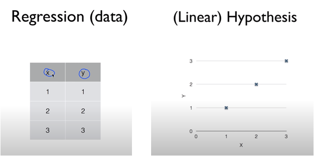
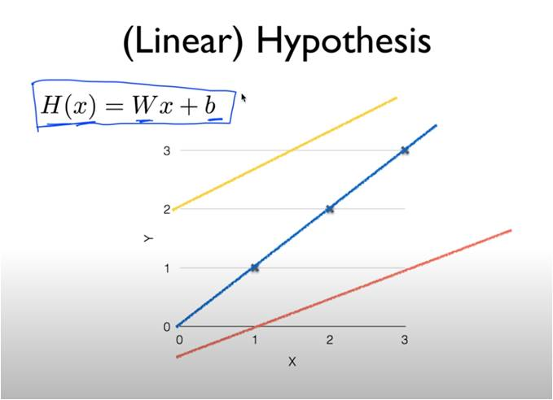
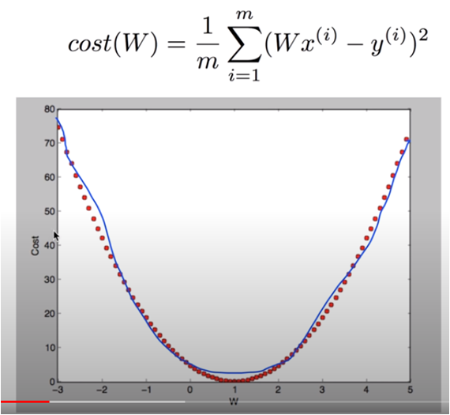

## 머신러닝에서의 Linear Regression

우리가 Supervised learning을 한다고 가정해보자

우리가 가지고 있는 데이터는 다음과 같다.

- 공부한 시간
- 점수 (0~100)

여기서, 우리가 공부한 시간에 대하여 점수를 예측하고 싶다고 하자.

(내가 10시간 공부했으면 점수가 얼마나 나오는지 예측)

바로 여기서 점수가 0~100점인데, 이러한 선형적인 값을 예측하는 것이 바로

머신러닝의 supervised learning의 **Regression** type이다.

그리고, 이러한 Linear Regression 학습으로 나온 Model이 Regression Model이 된다.

그러면, 이러한 머신러닝의 Regression Model은 어떻게 만들어지는 것일까?

### 1. 가설 (Hypothesis) 세우기

> 우리가 데이터셋을 보고 **가설**을 세울 수가 있는데,
> 공부한 시간이 많을수록 점수가 잘나온다던지,
> 집의 크기가 클 수록 가격이 올라간다던지 등등
>
> 이러한 데이터들을 통해 결과값이 Linear한(선형적인)선이 나올 수 있는데
> 이러한 Linear한 선을 예측하는 것이 **Linear Regression 학습**

그리고 우리가 세운 가설(Hypothesis)은 H(x) = Wx + b 와 같다.

이렇게 H(x)의 가설이 1차방정식이 될 것이다 라고 하는게 LinearRegression의 첫번째 단계

### 2. Cost Function

그러면 이제는, 이 가설이 맞는지 증명해야하는데

이 가설을 증명하고 채택하기 위해서 사용하는 방법이 바로 **Cost Function**

> **이 Cost Function과 학습데이터를 통해 얼마나 선형회귀 가설에 근접하는가를 본다.**

$$
H(x) - y
$$

처럼 단순차이만 보는 것이 아니라

$$
(H(x) - y)^2
$$

과 같이 차이의 제곱을 본다.

이 제곱을 하는 이유는

1. 차이를 양수로 비교하기 위해(절대값)
2. **차이가 크면 클수록 페널티를 부과하기 위해**

이것이 Cost Function이라고는 할 수는 없고(이건 한 부분에 대한 Cost확인)

Cost Function은 위 수식을 모든데이터에 대하여 평균을 구한 것이다.

$$
cost(W, b) = \frac{1}{m} \sum_{i=1}^m (H(x_i) -y_i)^2
$$

$$
H(x) = Wx + b
$$

위 수식이 바로 Cost Function.

> **그리고 여기서 Hypothesis의 W와 b를 가장 적게 가지는 cost function을 찾는 것이 Linear Regression의 학습**

어떻게 가장 적은 const function을 찾을 수 있을까?

### 3. Minimize cost(W,b) : Gradient descent algorithm

> cost function을 최소화 하기 위해서는 최저값을 구하는 알고리즘 중 하나인 **Gradient descent algorithm**을 쓰면 되는데, 왜 Gradient descent algorithm을 쓰는건지 알아보자.

우선, 우리가 앞서 구한 cost function의 그래프를 그려보자.

기본적으로 제곱이 들어가있는 2차함수이기 때문에 다음과 같은 형태가 될 것이다.

그렇다면 cost가 가장 적은 지점이 어디일까?

당연히 그래프상에서의 최저점 w = 1 인 지점일 것이다.

이때문에 Gradient descent algorithm이 cost function에 가장 잘 어울린다고 하는데,

이유가 바로 Gradient descent algorithm의 아이디어가 기울기가 가장 완만해지는 것을 찾는 것이기 때문.

#### Gradient descent algorithm

- 주어진 cost function을 minize하는데 많이 사용
- 경사 하강 알고리즘
- cost function 이외에도 최소화 해야되는 많은 문제들에 사용됨
- w, b가 아니더라도 w1, w2 .. 등 찾을 수 있다
- 경사도(기울기)를 따라 완만해지는 곳을 찾는다 -> <u>미분을 이용</u>

자 그러면 Gradient descent algorithm이 어떻게 동작하는지 살펴보자

1. 초기 가설로 시작 (0,0) - 혹은 다른값

2. 초기 가설의 기울기(미분)을 구한다 (아래 수식 참조)

   $$
   \frac{\partial}{\partial W}cost(W)
   $$

3) 구한 기울기 만큼 기존 W에서 뺀다

$$
   W = W - \frac{\partial}{\partial W}cost(W)
$$

4. 계속해서 W를 줄여나간다

$$
   W:= W - \frac{\partial}{\partial W}cost(W)
$$

실제로는 여기에서 미분값에 learning rate라고 α 값을 곱해준다.
나중에 배우겠지만 이 α 값 설정이 중요하다.

따라서 Gradient descent algorithm의 수식은 위 식에 미분을 풀고 α을 곱해서

$$
W: W - α\frac{1}{m} \sum_{i=1}^m (Wx_i - y_i)x_i
$$

가 된다.

이렇게 구한 w값을 가지고 b를 구한 후

Hypothesis에 적용시키면 현재 데이터들로 학습한 최적의 값을 구하는 Linear Regression을 구할 수 있다.
