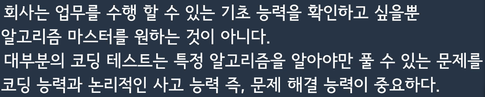

## 1주차 세션


> About 리더
> ​

- 이름 : 이선협
- Cobalt. Inc 수석 개발자
- 꼭 알고리즘이 아니더라도 다양한 질문을 해주면 좋겠음.
- 깃헙을 참고하면 간단한 이력서가 있으니 참고 바람.
  ​
  > 세션 진행은 어떻게?
  > ​
- 리더가 전하고 싶은 팁 공유
- 해당 세션 전에 있었던 이슈 공유
- 특정 문제에 대한 라이브코딩 진행
- 그 외에는 질문 TIME
- 최소 한 시간에서 최대 두 시간.
- 세션에 포함했으면 하는 내용이 있다면 자유롭게 얘기!
  ​
  > 오늘 하고 싶은 이야기
  > ​
- 알고리즘은 왜 중요한가?
  : 보통 개발자에게 알고리즘이 크게 중요치 않다고 생각함.
  : 다양한 라이브러리를 이용하여 제품을 만드는 것에
  : 알고리즘은 **문제 해결 능력의 핵심**
- 실무에서 중요하다고 생각하는 3가지
  1. 기초 코딩 능력 : 알고리즘 등
  2. 전문 분야 지식 : 특정 분야에 대한 지식 깊이, 최신 기술 스택 등..
  3. 기본 CS 지식 (면접을 넘어..)
     ​
- 알고리즘 != 코딩 테스트
  : 코딩테스트는 응용력이 핵심이다.
  : 단적인 예로, 카카오 블라인드 코테는 특정 알고리즘에 대한 문제보다는
  문제 해결력, 구현력에 대한 문제들이 많이 나온다.
  ​
- 알고리즘을 잘 공부하는 법
  ​
  
  1. 항상 여러가지 풀이 방법이 있을 수 있다는 것을 염두하자.
  2. 항상 예외가 있을 수 있다는 것을 기억하자.
  3. 내가 풀어낸 답이 베스트인지 의심하자.
  4. 문제를 풀었다면 시행착오를 모두 기록하자.
     : 블로그, 개인 메모장 -> 굉장히 큰 자산이 될 것이다!
  5. 다른 사람의 코드를 많이보자. 생각하지 못했던 방법을 발견할 수 있다.
     : 세션 때가 아니더라도 다양한 사람들의 코드를 보며 다양한 아이디어를 얻자.
  6. 쉽게 포기하지 말자. 하지만 도저히 모르겠다면 답을 보는 것도 좋은 방법
     : 못해도 3~4시간 정도 고민해보는 것을 추천.
  7. 알고리즘 마스터가 될 필요는 없다.
     
  8. 어디까지 공부할지 정하는 것이 중요하다.
     : 어떤 직군과 회사를 목표로 하는지를 정하면 어떤 수준까지 공부를 해야하는지 감이 온다.
     ​
- TIP
  ​
  1. 자신의 성향을 파악하자.
     ​ > - 먼저 내가 어떤 사람인지 알아야 한다. > case1. 미리 생각하고 의사 코드를 작성해야 더 잘 풀리는 사람. > case2. 코드를 먼저 작성하면서 과정을 진행해야 더 잘 풀리는 사람
     ​
  2. 가급적이면 메모를 많이 하자.
     ​ > - 풀다가 내가 뭘하려 했는지 까먹을 수 있다. > 코드에 주석을 달거나 노트에 메모하면서 풀자 > > - 알고리즘은 논리적인 언어. 순서도를 그리면서 큰 그림을 그리자.
     ​
  3. 디버깅은 필수
     ​ > - 내가 예상한대로 동작이 안되는 것 같다면 꼭 디버깅을 하자
     ​
  4. 익숙해지기
     ​ > - 문제를 잘 읽는 것에 익숙해야 한다. > : 여러 조건에 대한 캐치 능력 > - 시간복잡도를 계산하는데 익숙해야 한다. > : 자잘자잘한 성능보다 시간복잡도가 훨씬 중요하다. > : 시간복잡도를 잘 아면 베스트 풀이가 어떤 건지 알 수 있다. > : 잘 모르겠다면 리더님에게 질문해보자. > - 항상 예외를 생각하는 것에 익숙해야 한다. > - 파이썬으로 테스트 본다면 파이썬에 익숙해야 한다. > 1. 파이썬스럽게 잘 짜는 방법. > 2. 파이썬 표준 라이브러리를 적극 사용하자. > 3. bigint를 내부적으로 제공 -> bigint를 사용하는 문제면 이득!
     ​
- 간결하고 가독성 좋은 코드
  ​
  
  1. 변수, 함수의 이름을 잘 정했는가?
  2. 중복 코드를 제거했는가?
  3. 함수형 프로그래밍도 좋은 방법
     ​
- 가지치기를 했는가?
  ​
  
  1. 흔히 가지치기는 백트래킹과 같은 알고리즘 기법에서 사용되는 말이지만
     그 외 알고리즘에서도 중요하다.
  2. 성능이 크게 개선되진 않지만 개발자로써 좋은 코드를 작성하기 위해서는 중요하다.
     ​
- 파이썬스럽게 작성했는가?
  ​
  
  1. 파이썬의 장점을 잘 이용해야 좋은 코드
     -> List Comprehension (리스트 내포, 리스트 표현식, 지능형 리스트)
     -> 파이썬만의 오퍼레이터 (\*\*, // 등)
     -> 파이썬 표준 라이브러리 적극 사용
     ​
- 일관성을 유지하자.
  ​
  
  1. 잘 짰더라도 일관성 없는 코드보다는 조금 더럽지만 일관성있는 코드가 더 좋다.
  2. 제출 전에 코드 스타일이나 변수명, 함수명을 꼭 확인하자.
     (but, 코드를 안보는 회사도 있다. 문제 점수만 보고 넘어가는 회사도 있음.
     회사에 따라 전략을 세우는 것이 중요하다.)
     ​
     ​
     ​

### 라이브 코딩


> 프로그래머스 - 완주하지 못한 선수
>
> - 총 3가지 풀이
>   1. 단순한 List 반복 풀이
>   2. 정렬을 이용한 풀이
>   3. 해시를 이용한 풀이 (파이썬 표준 라이브러리 이용)
>      ​

```python
# 단순 반복으로 푸는 방법
# 최종 시간복잡도 : O(n^3)
​
def solution(participant, completion):
    for c in completion: # O(n)
        if c in participant: # O(1) -> O(n) (in 연산으로 인해) : 매직의 함정
            participant.remove(c) # O(n)
    return str(participant[0])
```


```python
# 정렬을 이용한 풀이
# 최종 시간복잡도 : O(n log n)
​
def solution(participant, completion):

    # 정렬은 보통 O(n log n)의 시간복잡도를 가진다.
    # O(2(n log n) + n)
    # 시간 복잡도는 (계수는 무시) 최고차항만 고려한다.
    # 최종 시간복잡도 : O(n log n)

	participant.sort()
    completion.sort()
​
    # zip? 두 리스트를 한 묶음으로 묶어주는 역할
	# zip(['a','b'], ['d', 'e']) => [('a'.'d'), ('b', 'e')]
    # input ['a','b'], ['d', 'e']
    # output [('a'.'d'), ('b', 'e')]
   	# zip의 시간 복잡도는 O(n)
    # for문에서 zip을 1번 사용하므로, O(2n)의 시간복잡도를 갖는다.
    for p, c in zip(participant, completion):
        if p != c: # 두 값 내용이 다르다면
            return p # 그대로 리턴
    return participant[-1] # 마지막 값을 리턴
​
```


```python
# 해시(Counter)를 이용한 풀이
# 최종 시간복잡도 : O(n)
​
from collections import Counter
​
def solution(participant, completion):
    p_counter = Counter(participant)
    c_counter = Counter(completion)

    # Counter에 대한 설명
    # lst = ['a', 'b', 'c', 'b']
    # Counter(lst)
    # output : {'a': 1, 'b': 2, 'c': 1}

    return list((p_counter - c_counter).keys())[0]
```


```python
import time
​
start = time.process_time()
​
# 코드
​
end = time.process_time()
​
print(end - start)
​
# 이런 식으로 시간이 얼마나 걸리는지 직접 구해볼 수 있다.
```

## 
