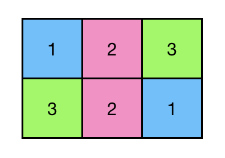
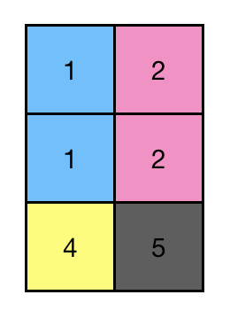
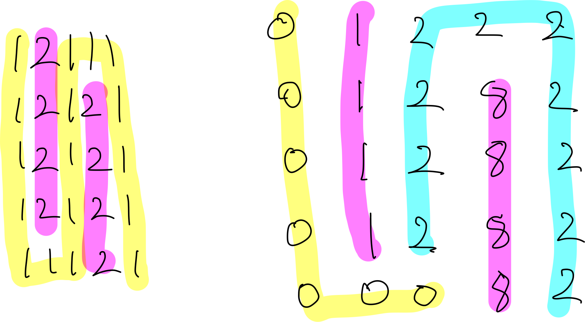

## 문제 설명

n x m 크기 도화지에 그려진 그림의 색깔이 2차원 리스트로 주어집니다. 같은 색깔은 같은 숫자로 나타난다고 할 때, 그림에 있는 영역은 총 몇 개인지 알아내려 합니다. 영역이란 상하좌우로 연결된 같은 색상의 공간을 말합니다.

예를 들어, [[1,2,3], [3,2,1]] 같은 리스트는 다음과 같이 표현할 수 있습니다.



이때, 이 그림에는 총 5개 영역이 있습니다.

도화지의 크기 n과 m, 도화지에 칠한 색깔 image가 주어질 때, 그림에서 영역이 몇 개 있는지 리턴하는 solution 함수를 작성해주세요.


## 제한 사항

- n과 m은 1 이상 250 이하인 정수입니다.
- 그림의 색깔은 1 이상 30000 미만인 정수로만 주어집니다.


## 입출력 예

| n   | m   | images                   | 정답 |
| --- | --- | ------------------------ | ---- |
| 2   | 3   | [[1, 2, 3], [3, 2, 1]]   | 5    |
| 3   | 2   | [[1, 2], [1, 2], [4, 5]] | 4    |

입출력 예 #1

앞서 설명한 예와 같습니다.

입출력 예 #2

주어진 이미지는 다음과 같이 표현할 수 있습니다.



따라서 이 이미지에는 4개 영역이 있습니다.


## 나의 풀이

### 첫 번째 풀이

#### 소스

```python
from collections import Counter

def get_parent(area_number, same_area_check):
    if same_area_check[area_number] == area_number:
        return area_number
    same_area_check[area_number] = get_parent(
        same_area_check[area_number], same_area_check)
    return same_area_check[area_number]

def union_parent(area_number1, area_number2, same_area_check):
    area_number1 = get_parent(area_number1, same_area_check)
    area_number2 = get_parent(area_number2, same_area_check)
    if area_number1 < area_number2:
        same_area_check[area_number2] = area_number1
    else:
        same_area_check[area_number1] = area_number2

def union_area(row, col, image, same_area_check):
    column_length = len(image[0])
    area_number = row * column_length + col

    # 위쪽 체크
    if row > 0 and image[row][col] == image[row - 1][col]:
        up_area_number = (row - 1) * column_length + col
        union_parent(area_number, up_area_number, same_area_check)

    # 왼쪽 체크
    if col > 0 and image[row][col] == image[row][col - 1]:
        left_area_number = (row) * column_length + (col - 1)
        union_parent(area_number, left_area_number, same_area_check)

    # 아래쪽 체크
    if row < len(image) - 1 and image[row][col] == image[row + 1][col]:
        down_area_number = (row + 1) * column_length + col
        union_parent(area_number, down_area_number, same_area_check)

    # 오른쪽 체크
    if col < column_length - 1 and image[row][col] == image[row][col + 1]:
        right_area_number = (row) * column_length + (col + 1)
        union_parent(area_number, right_area_number, same_area_check)

def solution(n, m, image):
    answer = 0
    same_area_check = []
    count = 0

    for row in range(n):
        for col in range(m):
            same_area_check.append(count)
            count += 1
    
    for row in range(n):
        for col in range(m):
            union_area(row, col, image, same_area_check)
    
    return len(Counter(same_area_check).keys())
```

#### 설명

이 문제는 처음 봤을 때 어떻게 해결해야 될지 감이 잘 안왔다.

그렇게 한 2시간 빈둥대며 고민하다가 예전에 한번 봤던 Union-Find 알고리즘이 생각났는데, 이를 적용하면 되겠다 싶어서
image에 각 픽셀에 대해 for문으로 돌면서 위, 왼쪽, 오른쪽, 아래쪽을 보면서 값이 같으면 same_area_check List에 Union 하는 방식이다. 

union은 서로 해당 픽셀에 대해 same_area_check List에 getParent()해서 부모값을 가져오고, 그 부모 값중 작은 값으로 모두 설정해주는 방식. 그냥 Union-Find의 Union방식과도 같다.

그냥 이부분은 어떤걸 Union할거냐만 다르다고 보면 된다.

어쨋든 이렇게 풀고 Test문제를 풀었더니 두개맞고 다 틀렸다 ㅎㅎㅎ

리뷰나 받아야지....ㅠㅠㅠ

#### 결과

완전 틀렸다.... 7개 중 2개 맞춤...ㅠㅠ

#### 리뷰

> 코드를 봤을때 `5, 5, [[1, 2, 1, 1, 1], [1, 2, 1, 2, 1], [1, 2, 1, 2, 1], [1, 2, 1, 2, 1], [1, 1, 1, 2, 1]]`와 같은 꼬불꼬불한 케이스가 있는 경우 예외가 있습니다. 왼쪽과 위쪽을 보고 판단하기 때문에 아래에서 올라오는 경우를 파악 못한 것으로 보입니다. :)
> 보통 FloodFill과 같이 영역을 채우는 문제, 혹은 길을 찾아야하는 문제의 경우 BFS와 DFS를 많이 사용합니다. 길찾기 문제의 경우 문제에 따라 더 빠른 방법도 있기 때문에 가장 많이 쓰는 부분은 FloodFill과 같은 문제입니다.
>
> 반면 유니온 파인드의 경우 각 부분 집합이 서로 연결되어있는지 판단하는 알고리즘입니다. 보통 트리 구조에서 많이 사용되기 때문에 부모 자식 관계가 뚜렷하지 않은 경우 사용하기에 적합하지 않습니다. :)
>
> 이 문제의 경우 색상별로 BFS를 이용해 **전부 채워나간다**라고 생각하시면 조금 더 이해가 쉽습니다. 한 번 도전해보세요!


그리고 위 `5, 5, [[1, 2, 1, 1, 1], [1, 2, 1, 2, 1], [1, 2, 1, 2, 1], [1, 2, 1, 2, 1], [1, 1, 1, 2, 1]]` 대로 구불구불한 영역에 대해 노트필기로 알고리즘을 따라가 결과를 봤는데 아래 왼쪽과 같이 2개의 영역이 나와야 되는데,
오른쪽 처럼 마지막에 이어지지 못하고 끊겨버리는 현상이 있었다.

아무래도 쭉 이어서 탐색하는것이 아니다 보니까 이런 예외가 있는것이 당연한 것 같다..ㅎㅎㅎ




다음에 BFS, DFS로 적용해봐야겠다.


### 두번째 풀이

#### 소스

```python
def find_linked_area_dfs(row, col, image, visited):
    row_max_idx = len(image) - 1
    col_max_idx = len(image[0]) - 1

    stack_dfs = [(row, col)]

    while len(stack_dfs) > 0:
        (row, col) = stack_dfs.pop()
        visited[row][col] = True

        # 왼쪽을 본다
        if row > 0 and image[row][col] == image[row - 1][col] and not visited[row - 1][col]:
            stack_dfs.append((row - 1, col))

        # 오른쪽을 본다
        if row < row_max_idx and image[row][col] == image[row + 1][col] and not visited[row + 1][col]:
            stack_dfs.append((row + 1, col))

        # 위쪽을 본다
        if col > 0 and image[row][col] == image[row][col - 1] and not visited[row][col - 1]:
            stack_dfs.append((row, col - 1))

        # 아래쪽을 본다
        if col < col_max_idx and image[row][col] == image[row][col + 1] and not visited[row][col + 1]:
            stack_dfs.append((row, col + 1))


def solution(n, m, image):
    area_number = 0
    visited = [[False]*m for _ in range(n)]

    for row in range(n):
        for col in range(m):
            if not visited[row][col]:
                find_linked_area_dfs(row, col, image, visited)
                area_number += 1

    return area_number
```

#### 설명

피드백으로 BFS, DFS를 이용하면 된다고 해서 DFS 적용시켜보았다.

먼저, 이미지 영역에 대해 체크(방문)했다는 표식을 위한 visited list를 만들고,
이미지 영역 각 픽셀을 전부 순회하면서 방문하지 않았으면 인접 영역에 같은 값으로 연결된 영역이 있는지 DFS를 통해 확인을 한다.(DFS로 연결이 확인된 영역은 모두 방문처리가 되어 있을 것이다.)

확실히, Union-Find 보다는 훨씬 간단하게 표현되는 것 같다.

#### 결과

통과.

### 두 번째 풀이

#### 소스

```python
def find_linked_area_dfs(row, col, image, visited):
    row_max_idx = len(image) - 1
    col_max_idx = len(image[0]) - 1

    stack_dfs = [(row, col)]

    while len(stack_dfs) > 0:
        (row, col) = stack_dfs.pop()
        visited[row][col] = True

        # 왼쪽을 본다
        if row > 0 and image[row][col] == image[row - 1][col] and not visited[row - 1][col]:
            stack_dfs.append((row - 1, col))

        # 오른쪽을 본다
        if row < row_max_idx and image[row][col] == image[row + 1][col] and not visited[row + 1][col]:
            stack_dfs.append((row + 1, col))

        # 위쪽을 본다
        if col > 0 and image[row][col] == image[row][col - 1] and not visited[row][col - 1]:
            stack_dfs.append((row, col - 1))

        # 아래쪽을 본다
        if col < col_max_idx and image[row][col] == image[row][col + 1] and not visited[row][col + 1]:
            stack_dfs.append((row, col + 1))


def solution(n, m, image):
    area_number = 0
    visited = [[False]*m for _ in range(n)]

    for row in range(n):
        for col in range(m):
            if not visited[row][col]:
                find_linked_area_dfs(row, col, image, visited)
                area_number += 1

    return area_number
```

#### 설명

이전 리뷰를 참고해서 이번에는 DFS를 적용시켰다.
확실히 DFS로 풀이하면서 알고리즘이 간단해지고 잘 풀리는? 느낌을 받았다.

#### 결과

통과.

#### 리뷰

2주차 세션에서 리더님이 보여주셨는데, DFS 부분에서 왼쪽, 오른쪽, 위, 아래 부분을 볼 때 for 문을 이용해서 줄일 수 있다고 한다.

### 세번째 풀이

#### 소스

```python
# BFS 혹은 DFS를 이용하는 문제다.
# DFS = 깊이 우선 탐색 -> 재귀 호출을 많이 사용
# 파이썬에서 재귀 호출은 느리기 때문에 가급적 BFS를 쓰는 것이 좋다
from collections import deque


def solution(n, m, image):
    answer = 0
    directions = [(0, 1), (0, -1), (1, 0), (-1, 0)] # 이처럼 표현하면 반복되는 if문을 줄일 수 있다.

    for sy in range(n):
        for sx in range(m):
            if image[sy][sx] == -1:
                continue

            target_color = image[sy][sx]
            deq = deque([(sy, sx)])

            while deq:
                y, x = deq.popleft() #deque의 popleft는 O(n)
									 #list의 pop(0)은 O(n)
                for dy, dx in directions:
                    py = y + dy
                    px = x + dx
                    if px >= m or px < 0 or py >= n or py < 0:
                        continue
                    if image[py][px] == target_color:
                        image[py][px] = -1
                        deq.append((py, px))

            answer += 1

    return answer
```

#### 설명

세션에서 보여주신 리더님의 소스이다.

보면 directions로 반복되는 if문을 줄였고,
image 방문 체크를 image의 값을 -1로 설정하여 방문체크를 하였다. 그래서 따로 배열 생성 X

또 deque를 써서 pop(0)에 걸리는 O(n)의 시간을 O(1)로 줄여주었다.

#### 결과

당연히 통과. (빠른속도로)

#### 시간복잡도

시작지점을 n*m만큼 순회하고 BFS, DFS로 모든 부분을 한번 더 순회하기 때문에
O( (n * m)^2 ) 가 된다.