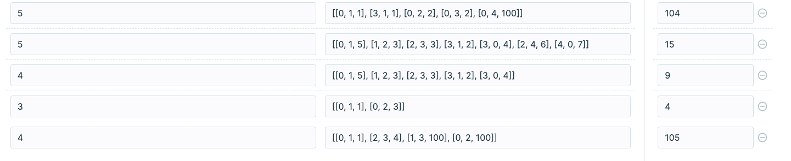

## 문제 설명

n개의 섬 사이에 다리를 건설하는 비용(costs)이 주어질 때, 최소의 비용으로 모든 섬이 서로 통행 가능하도록 만들 때 필요한 최소 비용을 return 하도록 solution을 완성하세요.

다리를 여러 번 건너더라도, 도달할 수만 있으면 통행 가능하다고 봅니다. 예를 들어 A 섬과 B 섬 사이에 다리가 있고, B 섬과 C 섬 사이에 다리가 있으면 A 섬과 C 섬은 서로 통행 가능합니다.

### **제한사항**

- 섬의 개수 n은 1 이상 100 이하입니다.
- costs의 길이는 `((n-1) * n) / 2`이하입니다.
- 임의의 i에 대해, costs[i][0] 와 costs[i][1]에는 다리가 연결되는 두 섬의 번호가 들어있고, costs[i][2]에는 이 두 섬을 연결하는 다리를 건설할 때 드는 비용입니다.
- 같은 연결은 두 번 주어지지 않습니다. 또한 순서가 바뀌더라도 같은 연결로 봅니다. 즉 0과 1 사이를 연결하는 비용이 주어졌을 때, 1과 0의 비용이 주어지지 않습니다.
- 모든 섬 사이의 다리 건설 비용이 주어지지 않습니다. 이 경우, 두 섬 사이의 건설이 불가능한 것으로 봅니다.
- 연결할 수 없는 섬은 주어지지 않습니다.

### **입출력 예**

| n   | costs                                     | return |
| --- | ----------------------------------------- | ------ |
| 4   | [[0,1,1],[0,2,2],[1,2,5],[1,3,1],[2,3,8]] | 4      |

### **입출력 예 설명**

costs를 그림으로 표현하면 다음과 같으며, 이때 초록색 경로로 연결하는 것이 가장 적은 비용으로 모두를 통행할 수 있도록 만드는 방법입니다.


## 추가 할만한 테스트케이스

알다시피 이 문제의 테스트 케이스는 부족하다.

추천할만한 테스트케이스 몇가지를 소개한다.



## 나의 풀이

### 코드

```js
function union(nodeA, nodeB, list) {
  const result = [...list]

  const linkA = find(nodeA, list)
  const linkB = find(nodeB, list)

  linkA <= linkB ? (result[linkB] = linkA) : (result[linkA] = linkB)

  return result
}

function find(node, list) {
  if (node === list[node]) {
    return node
  }

  list[node] = find(list[node], list)
  return list[node]
}

function isLinked(nodeA, nodeB, list) {
  return find(nodeA, list) === find(nodeB, list)
}

function checkAllLink(list) {
  if (list.length === 1) {
    return true
  }

  for (let i = 0; i < list.length - 1; i++) {
    if (find(i, list) !== find(i + 1, list)) {
      return false
    }
  }

  return true
}

function solution(n, costs) {
  const sortedCosts = [...costs]
  let islandLink = []
  let result = 0

  for (let i = 0; i < n; i++) {
    islandLink[i] = i
  }

  sortedCosts.sort((costA, costB) => {
    return costA[2] - costB[2]
  })

  for (const [islandA, islandB, cost] of sortedCosts) {
    if (isLinked(islandA, islandB, islandLink)) {
      continue
    }

    result += cost
    islandLink = union(islandA, islandB, islandLink)

    if (checkAllLink(islandLink)) {
      break
    }
  }

  return result
}
```

### 설명

가장 작은 cost를 가진 섬들끼리 묶어가면서 모두 연결되었다면 이 때 까지 합산한 cost의 값을 구하면 되는 간단한 풀이이지만,

모든 섬들이 연결되었는지 체크하는 부분이 좀 까다로운 문제일 것 같다.

나는 모든 섬들이 연결되었는지를 union-find를 통해 해결하였다.

<br>

알고리즘 이론으로 접근한다면 이 문제는 최소신장트리를 만들면 끝나는 문제이다.

최소신장트리를 만드는 방법은 크루스칼 알고리즘으로 거리에 대한 그리디와 union-find알고리즘을 이용하면 쉽게 풀 수 있다.

## 다른사람의 풀이

```js
function solution(n, costs) {
  costs.sort((a, b) => a[2] - b[2])
  let [from, to, answer] = costs.shift()
  let connected = new Set([from, to])
  while (connected.size < n) {
    let index = costs.findIndex(
      ([from, to]) =>
        (connected.has(from) && !connected.has(to)) ||
        (connected.has(to) && !connected.has(from))
    )
    let [[from, to, cost]] = costs.splice(index, 1)
    answer += cost
    connected.add(from).add(to)
  }
  return answer
}
```

섬들이 연결되어있는지 체크하는 부분을 set에 from, to 값을 넣으면서 해결하였다.

그리고 cost에 해당하는 배열을 가져올 때 from과 to 둘 중 하나만 포함되는 것을 가져오게해서 연결되지않은 섬을 찾을 수 있게 처리하였다.

굉장히 좋은 아이디어라고 생각하였다.
