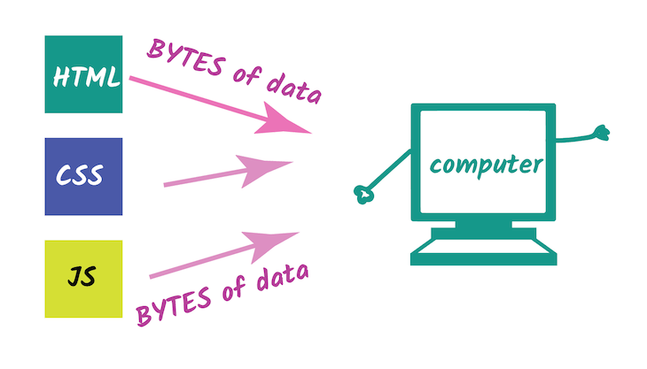
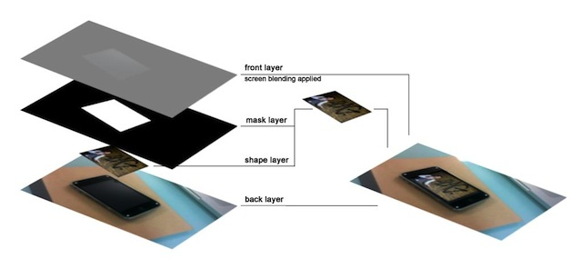
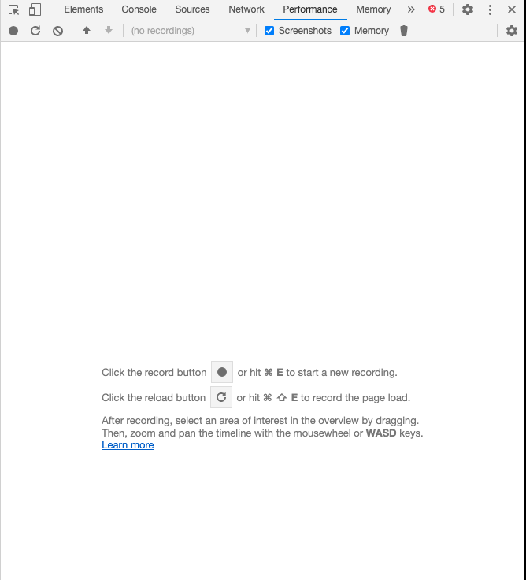

## 브라우저 성능

우리가 웹 프론트앤드 개발을 하는데 있어서 중요하게 볼 수 있는 부분중에 하나가 바로 브라우저의 성능이다.

우리가 브라우저를 바꿀수는 없으니 최대한 브라우저의 동작과정을 잘 이해해서 효율적으로 작동하도록 만들어주는 것이 프론트앤드 개발의 포인트 중 하나이다.

### 브라우저는 웹프론트앤드에서 OS와 같다.

마치 OS상에서 돌아가는 프로그램들 같은 경우는 OS를 잘 알아야 퍼포먼스가 뛰어난 프로그램을 만들 수 있듯이, 브라우저상에서 돌아가는 웹 프론트앤드 환경에서는 브라우저를 잘 알아야 한다.

> 이를 웹 사이트 최적화 혹은 성능 최적화 라고 부른다.

특히 브라우저의 성능을 좌지우지 할 수 있는 부분이라면 크게 3가지를 꼽을 수 있는데,

1. Network (페이지 수신)
2. **Rendering** (화면 구성)
3. Processing (기능 작동 - 로직)

다음이 가장 대표적이라 할 수 있다.

그 중에서 우리가 이번에 알아볼 부분이 바로 Rendering이다.

## Rendering이란?

일반적으로 렌더링(Rendering)이란 영상을 만들어내는 과정을 말한다.

> 컴퓨터에서는 [영상]([https://ko.wikipedia.org/wiki/%EC%98%81%EC%83%81](https://ko.wikipedia.org/wiki/영상))이란 주로 2차원 이미지를 뜻한다.

### 웹 브라우저상의 렌더링

웹 프론트앤드 개발을 하면 프론트앤드 상의 기능구현 즉, 로직만 구현하는 것이 아닌 HTML, CSS, JavaScript를 이용하여 화면 즉, 렌더링까지 구현을 해야 한다.

웹 프론트엔드상의 렌더링이란 HTML 마크업, CSS 스타일, JavaScript의 DOM 작업 등을 통해서 복합적으로 실제 픽셀로 변환해 브라우저 화면 구성을 출력하는 과정이자 동작이다.

> 우리가 웹 페이지 구성을 할 때 HTML, CSS, JavaScript를 이용해 웹 화면을 구성하는데,
> 내부적으로 이를 이용해서 렌더링작업이 일어난다.

그리고 웹 브라우저상의 렌더링을 **Critical Rendering Path**(CRP)라고 부른다.

이미지 출처: [logrocket blog](https://blog.logrocket.com/how-browser-rendering-works-behind-the-scenes-6782b0e8fb10/)

## 브라우저의 렌더링 엔진

이 브라우저에서 화면을 구성하는 렌더링을 담당하는 부분이 바로 렌더링 엔진으로 각 브라우저마다 상이하게 존재하지만 작동과정은 비슷하다.

그리고 각 브라우저마다 렌더링 엔진은 CSS 속성별로 브라우저 엔진의 작동이 조금씩 다를 수가 있으므로 이를 구분하기위해 어떤 브라우저에서 어떤 렌더링 엔진을 사용하는지 알아두면 좋다.

- **크롬** : 블링크 (Blink)
  

 

- **오페라** : 블링크 (Blink)
   

 

- **엣지** : 블링크 (Blink)
  

 

- **사파리** : 웹키트 (Webkit)
  

 

- **파이어폭스** : 게코 (Gecko)
  

 

여기서 크롬, 오페라, 엣지의 블링크는 웹키트의 Fork 버전으로,
블링크와 웹키트의 동작방식은 거의 유사하다고 볼 수 있다.

## 브라우저의 렌더링 과정 (Critical Rendering Path)

자 그럼 이제 브라우저의 랜더링 즉, CRP의 과정을 살펴보자.

가장 대표적인 블링크를 기준으로 설명을 하도록 하겠다. 

> 그 외 렌더링 엔진도 비슷한 작업을 통해 렌더링을 하게 된다.

이미지 출처: [손찬욱님의 브라우저 성능개선작업](https://sculove.github.io/slides/improveBrowserRendering/)

### 1. Dom Tree 생성

먼저 우리가 DOM요소를 배웠다면 익히 알고있는 바로 그 DOM Tree를 먼저 생성하게 된다.
작업은 HTML문서를 파싱해서 DOM Tree를 만들게 된다.

이미지 참조: [Google Developer 문서](https://developers.google.com/web/fundamentals/performance/critical-rendering-path/constructing-the-object-model?hl=ko)

이미지를 보면 HTML의 Bytes 데이터를 인코딩, 파싱처리를 해서 DOM 트리를 만드는 것을 확인 할 수 있다.

> 여기서 만들어진 DOM 트리가 바로 Javascript로 WEB API로 조작할 수 있는 그 DOM 트리이다.

그리고 DOM Tree는 마크업 속성, 관계를 나타낼 뿐 요소가 어떻게 표시될지에 대해서는 서술되어 있지 않다. 이 부분은 아래의 CSSOM이 담당하게 된다.

### 2. Recalculate Style

<u>Recalculate Style은 DevTools에서 나타내는 명칭</u>이고 실제로 렌더링과정에서는 **CSSOM 생성**과 **Render Tree 생성**을 하게 된다.

#### CSSOM (CSS Object Model) 생성

CSSOM은 CSS 스타일 시트를 참조해서 위 DOM Tree를 만드는 과정과 비슷하게 CSS 파싱을 하고 CSS Object Model을 만들게 된다.

그리고 이를 통한 결과는 다음과 같이 DOM Tree와 비슷하지만 다른 트리구조의 형태로 나타나게 된다.

이미지 참조: [Google Developer 문서](https://developers.google.com/web/fundamentals/performance/critical-rendering-path/constructing-the-object-model?hl=ko)

CSS Selector도 잘 작성해야 이 작업에 대한 복잡성을 줄일 수 있다.

[CSS 선택자 복잡성 줄이기](https://developers.google.com/web/fundamentals/performance/rendering/reduce-the-scope-and-complexity-of-style-calculations?hl=ko) 글을 참조하자.

또 미디어 유형과 미디어 쿼리를 이용해 필요한 렌더링 부분만 요청할 수 있게 하여 해당 작업시간을 줄일 수 있다.

[해당 글](https://developers.google.com/web/fundamentals/performance/critical-rendering-path/render-blocking-css?hl=ko)을 참조하자.

#### Render Tree 생성

또 Recalculate Style에서는 Dom Tree와 CSSOM을 합쳐 Render Tree를 형성하게 된다.

그리고 Dom Tree와 CSSOM을 합치는 과정에서 페이지를 렌더링하는 데 필요한 노드만 포함이 되게 된다.

 

렌더 트리는 표시되는 각 요소의 레이아웃을 계산하는데 사용되고 페인트 프로세스에 대한 입력으로 처리된다.

즉, 뒤에 있을 작업인 3번 Layout과 4번 Paint의 기본이 되는 작업으로 Layout(Reflow) Paint(Repaint)에 대한 작업을 결정한다.

이미지 참조: [Google Developer 문서](https://developers.google.com/web/fundamentals/performance/critical-rendering-path/render-tree-construction?hl=ko)

위 이미지를 보면, DOM Tree와 CSSOM을 합쳐 Render Tree가 만들어지는 결과를 보여주고 있다.

여기서 특이사항이라면 CSSOM에 존재했던 `display: none;` 는 레이아웃에서 제외시키는 것이기 때문에 렌더트리에 미포함된다. 즉 `display: none` 는 Layout과 Paint 작업을 하지 않는다.

그리고 위와 같이 **CSSOM, Render Tree 모두 Style에 대한 정보**를 담고 있기 때문에 
DevTools에서 이 과정을 합쳐 **Recalculate Style**이라 부른다.

### 3. Layout  (Reflow)

앞선 과정에서 CSSOM과 Render Tree는 스타일을 계산하는 과정이었고, 기기의 뷰포트 내에서 노드들이 어디에 위치하고 어떠한 크기를 가지는지에 대해 계산을 진행하지는 않았다.

위치와 크기와 같은 레이아웃을 계산하는 부분이 바로 이 Layout 작업에서 담당을 하게 된다.

그리고 경우에 따라 `Reflow(리플로우)` 라 부르기도 한다.

우리가 css에 서술하는 `width: 50%` `height: 30%` 와 같은 작업을 담당하고 상대적인 크기를 나타내는 %, vw, vh와 같은 단위의 계산또한 여기서 이루어진다.

그리고 이 부분이 브라우저가 상대적인 위치와 크기 등을 모두 계산해야되므로 처리해야 될 작업이 가장 많을 수 있는 부분이고 이는 렌더링 시간을 증가시키는 원인이 된다.

따라서 이 부분 Reflow를 줄이는 것이 렌더링 최적화 과정에서 상당히 중요하다.

> Layout 작업은 렌더 트리에 노드들이 어느곳에 위치할지 계산을 하는 작업이다.

### 4. Update Layer Tree

이 부분은 **Blink에서 매번 발생**하는 작업으로 
Layout 계산이후 Render Tree를 변경하고, paint 작업을 위한 텍스처를 예약하는 작업을 담당하게 된다.

### 5. Paint (Repaint)

이제 위치와 스타일 계산이 모두 끝난상태에서 남은 작업인 실제 픽셀로 변환하여 화면에 나타내주는 작업을 담당하는 부분이 바로 Paint이다. 앞선 작업들은 모두 계산의 영역이었다면 **Paint 작업에서 비로소 화면에 픽셀로 실제로 나타나진다**고 볼 수 있다.

이미지에 대한 인코딩, 디코딩 작업또한 여기서 이루어진다.

5번이 시작 될 때 Paint Setup 및 Paint 이벤트가 발생된다.

> Paint 작업은 렌더 트리를 실제 픽셀로 구현한다.

또 각 CSS마다의 속성, 스타일 값에 따라 걸리는 시간은 천차 만별이다.

당연히 간단한 단색 페인트 작업에 비해 그림자 효과와 같은 복잡한 작업이 더 오래 걸린다.

Layout - Reflow작업과 비롯하여 가장 많은 작업시간이 소요되는 부분이기도 하다.

> Layout 작업이 일어났다면 Paint 작업은 무조건 뒤따라 발생한다.

### 6. Composite Layers

생성된 레이어 계층들을 모두 합쳐 완전한 웹 페이지로 보일 수 있게 해주는 작업이다.

5번 Paint가 개별적 Layer에 대한 픽셀구현이라면 Composite Layers 작업에서는 이 레이어를 최종적으로 결합시켜 화면에 보여주는 작업이다.

만약 GPU가 수행되는 Layer라면 GPU로 수행된다.

따라서 앞선 작업은 CPU로 작업되는 부분이라면 이 Composite Layers 작업에선 GPU도 사용될 수 있다.

> GPU Layer를 사용하도록 한다면 빠른 렌더링이 가능해진다.

GPU로 작업을 하는 CSS 속성은 주로 `transform`, `opacity`속성이니 잘 알아두자. 가장 빠른 css 속성이다.

#### Layer?

레이어는 웹페이지를 렌더링하기 위해 필요한 이미지 단위 요소라고 생각하면 된다.

- 레이어들을 배치/합성하여 최종적인 웹페이지를 표현한다.
- 모든 페이지는 root layer를 가진다.
- 레이어의 이미지는 텍스처로서 Paint 작업시, CPU에 의해 Video Memory에 로드된다.
  따라서, 레이어 생성비용이 크고, 추가 Memory가 필요하다.

#### Layer 생성 조건

- 3D 혹은 원근 transform CSS 속성 사용
- accelerated video decoding을 사용한 video element
- 3d context 또는 accelerated 2D context를 사용한 canvas element
- opacity 속성 혹은 transform요소를 이용한 에니메이팅시
- Accelerated css filter를 사용한 element

## 랜더링 성능 측정은 어떻게?

Chrome DevTools의 Performance 패널을 이용하면 된다.

녹화 버튼을 클릭하고 측정하고싶은 구간이나 시간동안 측정 후 성능 측정을 할 수 있다.

## 성능 개선 포인트?

앞서 설명했던 렌더링 과정중 반드시 실행되는 작업을 제외하고 나머지 작업을 최대한 안할 수 있도록 유도해야 한다.

- 반드시 실행되는 작업 : Recalculate Style, Update Layer Tree, Composite Layer
- 때에 따라 발생 : Layout, Paint

따라서 Layout 작업과 Paint 작업을 최대한 피하고 시간을 줄일 수 있도록 하는 것이 성능개선의 주 포인트.

이미지 출처: [손찬욱님의 브라우저 개선 작업](https://sculove.github.io/slides/improveBrowserRendering/#/7)

또한 Layer를 GPU 사용이 가능하도록 하여 성능을 최대로 끌어올릴 수 있다.

### Layout, Paint 비용 줄이기

Layout과 Paint 비용을 줄이기 위해서는 Layout과 Paint를 유발하는 CSS 속성을 사용하지 않으면 된다.

대신에 GPU로 처리하는 변형 (transform, opacity)와 같은 속성을 사용해서 같은 효과를 구현하고 성능을 개선시키면 된다.

### 최적의 Layer 구성하기

대상 DOM 노드가 최대한 주변에 영향을 받지 않도록 (상대적으로 위치가 잡히지 않도록) 구현을 하고, 사용하지 않는 요소는 `display: none` 처리를 반드시 한다.

 

 

종합적으로 상대 Layout에 영향을 주지도 받지도 않는 `display: block` 혹은 `display: inline-block` 으로 지정하고,

`transform: translate` 혹은 `opacity` 를 사용을 하면 최적의 에니메이션 최적화를 이룰 수 있다고 한다.

 

 

또 위와 같은 성능표를 참조해서 상황에 맞게 애니메이션 구현을 해야 되겠다.

## 관련 용어

### 렌더링 종류

- SSR
- CSR
- Rehydration
- Prerendering

### 성능

- TTFB
- FP
- FCP
- TTI

## 참고 할만한 좋은 사이트

[CSS Trigger]()

[Performance monitoring in CSS Animation](https://medium.com/chegg/performance-monitoring-in-css-animations-f11a21d0054f)

[이선영님의 위 글 번역 게시글](https://wit.nts-corp.com/2020/06/05/6134)

## 참조

[Bhooncoding님의 브라우저 렌더링 과정]([https://velog.io/@st2702/%EB%B8%8C%EB%9D%BC%EC%9A%B0%EC%A0%80%EC%9D%98-%EB%A0%8C%EB%8D%94%EB%A7%81-%EA%B3%BC%EC%A0%95](https://velog.io/@st2702/브라우저의-렌더링-과정))

[hongkiat blog - writing better css](https://www.hongkiat.com/blog/writing-better-css/)

[Website Performance Optimization](https://gist.github.com/kkas/919fcf835a58ef610495)

[손찬욱님의 브라우저 성능개선작업](https://sculove.github.io/slides/improveBrowserRendering/)

