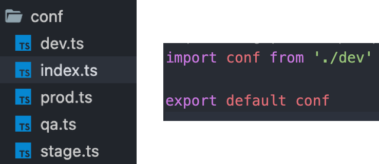

어플리케이션을 운영하려면 개발, 운영 환경을 분리하고 사용해야된다.
당연히 개발환경과 운영환경이 나눠져있어야 테스트, 운영이 가능하고 특히나 로컬에서만 개발한 작업을 개발서버에 올리면 서로 작업한 것들을 합친 결과물을 테스트해볼 수 있는 등 협업도 가능해진다.

일반적인 서버 개발환경은 일반적으로 `Local` - `Develop` - `QA` - `Staging` - `Production`으로 나눠지는 것 같다. 각각의 개발 환경에 따라, 역할과 목적이 다르고, 그에 따라서 시스템의 크기도 다르다.

보통 프론트앤드에서는 AWS등과 같은 클라우드서비스를 이용해서 프론트서버를 구축하는데, 이 클라우드 서비스의 리소스나 가격정책을 각 환경별로 다르게 가져가고 있다. 당연히 실 운영서버가 아니기 때문에 트래픽이 없는 Dev, QA 쪽은 저가격대를 형성하도록 구성하게되고 Stage는 실 서버와 가장 비슷하게 구성을 하도록 하는 것 같다.

## 왜 환경별 설정을 다르게 가져가야 하나?
개발환경이라는 말은 Application이 작동하는 환경이라는 말과 같다. 이 환경은 특히 실 데이터를 담고있는 백엔드 측에서 가장 중요하고 메인이기 때문에 프론트에서는 각 개발 환경과 동일한 백엔드의 환경을 사용, 통신해야 한다.

프론트에서 주로 백엔드의 API를 호출한다면, 현재 환경에 맞는 백엔드 환경의 API를 호출해야 된다.

> 프론트를 develop 환경에서 실행했다면 백엔드에 호출하는 API 또한 development 백엔드 환경의 API를 호출해야한다.

때문에 각 환경별로 API 경로를 가지거나 인증값, access token과 같은 비밀키 정보를 가지는 설정파일이 필요하고, 당연히 각 환경에 맞게 필요한 데이터들이나 설정값들이 달라질 수 밖에 없다.

이러한 설정값들을을 별도 파일로 분리시켜서 관리하게되고 각 환경에 맞게 설정파일을 적용시켜서 사용한다.

## 기존에 방식은 어떻게?
기존의 방식 중 가장 기본적인 방법은 아무래도 프레임워크의 도움을 받는것이다.

프레임워크에서 각 환경설정파일들만 마련해둔다면 실행 환경에 맞게 설정파일을 자동 매칭되도록 설정해주며, 코드상에서는 별도 분기처리없이 하나의 config파일만 보면 되도록 설계가 되어있다.

하지만, 이러한 프레임워크의 도움을 받지 못하는 경우에는 직접 구현해야한다.

기존에 우리회사에서 했던 방식은 두가지가 있었다.

1. Config 싱글톤 클래스를 이용한 코드단에서 가져오는 설정 및 가져오는방식.
2. CI/CD(Jenkins pipeline)단계에서 Config 파일을 현재 환경에 맞게 바꿔치기.

1번 방법은 우선 config 클래스를 싱글톤으로 만들어서 Application의 실행시점에서 싱글톤 인스턴스에 값을 세팅해두고 config 값이 필요할 때 싱글톤 인스턴스를 참조하면서 사용하는 방식이다. <br>
이 방법은 직접 싱글톤을 만들어야되는 단점과, 실행시점에 Config를 매핑하는 리소스가 들어가므로 비효율적이다.

2번 방법은 각 설정파일이 있는 상태에서 Config 파일로 가져올 수 있는 파일(index.ts - 기존 develop 환경으로 세팅)이 존재하고, Jenkins 파이프라인에서 이 index.ts를 각 설정환경에 맞게 바꿔치기 하도록 설정하는 방법이다.



왼쪽 이미지는 파일 구조이고 오른쪽은 실제 Import해서 쓰일 index.ts의 구조이다.

보시다시피 index.ts는 dev환경을 import해서 내보내고있고 실제 코드상에서는 이 index.ts를 import해서 사용하게된다.

```js
import Conf from '@/conf';
...
const productAPI = Conf.apis.product.url;
```

그래서 코드상에서는 dev파일로 사용하게 되는것이지만 Jenkins 파이프라인 단계에서

```jenkins_pipeline{7}
publishAppPipeline meta: meta, timeoutMin: 10, {
  docker.image('node:12').inside('-v /etc/localtime:/etc/localtime:ro') {
    sh """
      echo ${meta.versionLabel} > VERSION \
      && npm ci \
      && cp -f conf/${meta.env}.ts conf/index.ts \
      && SERVICE_ENV=${meta.env} npm run build \
      && npm prune --production \
    """
    
    ...
```

위 처럼 index.ts을 환경에 맞는 파일로 변경시켜서 사용한다.

이 방법은 별도로 Config 싱글톤 클래스를 만들어주지않고 CI/CD 단계에서 실행되는 것이기 때문에 1번처럼 Application의 실행에 있어 관여하지 않는다는 장점이 있지만, Jenkins pipeline을 알아야되고 Jenkins와 같은 CI/CD 툴을 사용하지 않는다면 사용할 수 없다.

## 웹팩을 이용해보자

나는 위 2번 방법을 보면서 웹팩으로 가능할 것 같다는 판단을 내렸고

방법을 찾아봤다.

첫번째로 시도한 방법은 webpack의 [NormalModuleReplacement 플러그인](https://webpack.js.org/plugins/normal-module-replacement-plugin/) 이었다.

```js{6,10-11}
const ENV = process.env.NODE_ENV || 'develop';

module.exports = function (env) {
  return {
    plugins: [
      new webpack.NormalModuleReplacementPlugin(
        /config\index.ts/,
        function (resource) {
          console.log('###before', resource.request);
          resource.request = resource.request.replace(
            'index',
            `${ENV}`
          );
          console.log('###after', resource.request);
        }
      ),
    ],
  };
};
```

console을 찍어봤을때는 resource.request가 올바르게 캐치되어 경로가 변경되는것을 확인했으나, 실제 작동은 변경되지 않았었다.

> stack overflow를 뒤져보니 webpack 버전이 올라가면서 작동이 안된다는 말을듣고 우선 보류.

추가로 찾아보니 [file-replace-loader](https://www.npmjs.com/package/file-replace-loader) 웹팩 로더가 있어서 사용해봤다.

```js
const { resolve } = require('path');

const ENV = process.env.NODE_ENV || 'develop';

module.exports = {
  //...
  module: {
    rules: [{
      test: /config\/index.ts$/,
      loader: 'file-replace-loader',
      options: {
        condition: 'always',
        replacement(resourcePath) {
          console.log('###before', resourcePath);
          console.log('###after', resolve(`./config/${ENV}.ts`));
          return resolve(`./config/${ENV}.ts`);
        },
        async: true,
      }
    }]
  }
}
```

Console 찍어봤을 때 성공적으로 변경되고 실제로 작동도 되는것을 확인했다.

다만, file-replace-loader가 믿을만한 로더인것인가였는데, 주간 1K다운로드를 기록하고있으면서 issue도 1개 거기다 동작오류는 아니었기 때문에 사용해도 괜찮을 것 같다고 판단하였다.


실제 프로젝트에서는 next를 사용하고 있기 때문에 next.config에서 webpack 설정을 하였으며 코드는 아래와 같다.

```js{13-23}
const { resolve } = require('path');

const ENV = process.env.NODE_ENV || 'development';

/** @type {import('next').NextConfig} */
module.exports = {
  reactStrictMode: true,
  ...
  
  webpack(config) {
    ...
    
    config.module.rules.push({
      test: /config\/index.ts$/,
      loader: 'file-replace-loader',
      options: {
        condition: 'always',
        replacement(resourcePath) {
          return resolve(`./config/${ENV}.ts`);
        },
        async: true,
      }
    })
		
    ...
    
    return config;
  }
}
```


이제 각 배포환경에서 환경변수를 적용해두면 되거나,

`NODE_ENV=production`

로컬에서 실행할 때 NODE_ENV를 설정하면 잘 작동한다.

```package.json
"scripts": {
    "dev": "NODE_ENV=develop next dev",
    "qa": "NODE_ENV=qa next dev",
    "stage": "NODE_ENV=stage next dev"
 }
```

