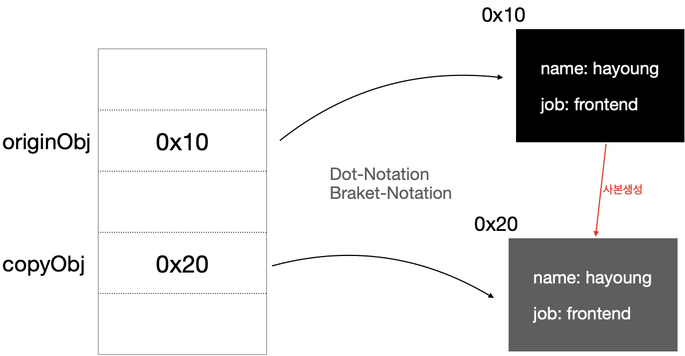

## 객체 복사란?

객체 지향 프로그래밍에서 객체 복사는 **객체의 사본을 생성**하는 것이다.

일반적으로 참조값을 가지고 있는 객체에서 단순한 할당작업을 거칠경우, 객체 자체가 복사되는게 아닌 그 참조값이 할당된다. 이는 객체 복사라고 볼 수 없고 동일 객체를 참조하는 변수가 하나 더 늘어났다고 밖에 볼 수 없다.

```js{8}
const originObj = {
  name: 'hayoung',
  job: 'frontend',
}

const copyObj = originObj;

console.log(originObj); // {name: "hayoung", job: "frontend"}
console.log(copyObj); // {name: "hayoung", job: "frontend"}

console.log(copyObj === originObj); // true
```

마지막줄을 보면 `copyObj` 와 `originObj` 가 같기 때문에 얼핏봐서는 복사가 된 것 처럼 보이지만, 

이는 **참조값만 복사**된 것으로 복사가 되었다고 볼 수 없다.

> 참조값 복사만으로 객체의 사본이 생성되지 않는다.

만일 `copyObj`의 값을 바꾼다면 어떻게 될까?

```js
copyObj.job = 'full stack';

console.log(originObj); // {name: "hayoung", job: "full stack"}
console.log(copyObj); // {name: "hayoung", job: "full stack"}
```

`copyObj` 만이 바뀐 것이 아니라 `originObj` 의 `job` 속성도 함께 변하였다.

이는 계속해서 말했던 **참조값만 복사**되었기 때문에 발생한 일이다.


### 참조값의 함정

아래 그림을 보자.


[참조](../../../../2020/javascript/하옹의-자바스크립트-식사---Type/#7-object)에 대해서 공부를 했다면 위와같은 그림은 익숙하리라 생각한다. 

> 원래라면 변수명 대신에 주소값으로 표현해야되지만 쉬운 식별을 위해 변수명만 적었다.

그림에서 왼쪽은 메모리 상에서 `originObj` 변수와 `copyObj` 변수가 같은 참조값을 가지고 있다는 것을, 오른쪽에는 특정 메모리 주소(0x10)에 위치하는 값을 보여주고있다.

`const copyObj = originObj` 이런 단순 할당만으로는 위와 같은 그림처럼 `originObj`가 가지고 있던 참조값 `0x10` 만이 복사되어 들어가게 된다.

따라서 `originObj` 와 `copyObj` 는 같은 참조값을 가지게 되어서 `Dot-Notation`이나 `Bracket-Notation` 을 이용한 속성값 접근을 할 때 결국 같은 곳에 있는 같은 값에 접근하게 된다.

즉, 이 구문은

```js
const copyObj = originObj;
```

❗️**<u>참조값을 복사</u>한 것이지 진정한 객체복사라 볼 수 없다**.

<br>

### 진정한 객체복사란




와 같이 `originObj`와 `copyObj` 의 참조값이 서로 다르지만 이 참조값이 위치하는 곳에는 서로 동일한 값들로 채워진 객체값이 있어야 한다.

서로 똑같은 객체를 바라보고있는 것이 아닌, **원본 객체 / 사본객체 각각의 참조값**을 가지고 있도록 해야 한다.

따라서 객체복사는 단순 할당이 아닌 다른 참조값을 갖는 새로운 객체 사본을 만들어야 하는게 핵심이다.


## 객체 복사의 필요성

우리가 어떤 언어를 쓰던간에 참조값을 통해 접근하는 객체가 존재하는 언어라면 어느 순간에서 객체 복사를 해야될 일이 생기기 마련이다.

### 특정 속성값만 다른 객체를 만들고자 할 때

우리는 기존에 존재하는 객체의 특정 속성값만 다른 객체가 필요할 경우가 생기면 어떨까?

이 경우에는 생성자 함수를 이용하거나 객체 리터럴로 새롭게 만드는 방법이 있을 것이다.
하지만 생성자 함수가 없는 경우도 있을 수 있고 생성자 함수로 새로운 인스턴스를 생성하기에는 너무 번거로울 수 있다. 아예 새롭게 객체 리터럴로 생성하는 방법은 코드 재사용성적인 측면에서 별로 좋지 않다.

우리는 이 경우에 기존에 있던 객체에서 복사를 한 후 특정 속성값을 바꾸는 방법을 사용 할 수 있다.

예를 한 번 들어보자. 

```js
const imageObject  = {
  src: './images/image1.png',
  width: 100,
  height: 100,
  border: '1px solid black',
  //many property...
}
```

다음과 같은 `imageObject` 가 있을 때, `src` 속성만 다른 `imageObject`가 필요하다고 하자.

그럼 객체를 복사해서 `src` 값만 바꿔주는게 좋은 방법일 수 있다.

```js
const imageObject2 = copyObject(imageObject);
imageObject2.src = './images/image2.png';
```

아니면 `border` 속성이 없는 이미지를 만들고싶을 때도 있다.

```js
const imageObjectNonBorder = copyObject(imageObject);
delete imageObjectNonBorder.border;
```

이 처럼 객체에서 몇몇개의 특성만 바뀐 또 다른 객체가 필요할 경우에 객체 복사는 좋은 방법이 될 수 있다.


### 객체의 불변성을 유지하고싶을 때

[**객체 불변성**]() 이라는 말이 있다.

객체 불변성을 유지한다는 것은 어떤 특정 객체를 수정, 조작하고 싶을 때 그 객체 원본을 건드리기보다는 수정을 가한 새로운 객체 사본을 만들어서 원본이 아닌 수정된 사본을 사용한다.

```js
const originItem = {
  type: 'sword',
  attack: 10,
}

function updateItem(item, atack) {
  const updatedItem = copyObject(item);
  
  updatedItem.isUpdated = true;
  updatedItem.attack += atack;
  
  return updatedItem;
}

const updatedItem = updateItem(originItem, 30); // 새로운 객체 리턴

console.log(originItem); // {type: "sword", attack: 10}
console.log(updateItem); // {type: "sword", attack: 40, isUpdated: true}
```

이와 같이 기존의 객체에 대해 조작을 가하지 않는 객체 불변성을 유지하려면 기존의 객체를 복사하고 사본에 조작을 가한 후 사본을 리턴해야되기 때문에 객체 복사는 필수적인 요소이다.


## Javascript에서 객체 복사

## 얕은 복사

#### Obejct.assign

Object.assign은 첫번째 요소로 들어온 객체에 다음인자로 들어온 객체를 복사해준다.

```js
const originObj = {
  name: 'hayoung',
  job: 'frontend',
};

const copiedObj = Object.assign({}, obj);

copiedObj.b.c = 3

obj === copiedObj // false
obj.b.c === copiedObj.b.c // true
```


### 깊은 복사의 필요성

```js
const hayoung = {
  name: 'hayoung',
  job: 'frontend',
  friends: [
    {
      name: 'youngwoo',
      job: 'firefighter'
    },
    {
      name: 'hyungbin',
      job: 'doctor'
    },
  ],
};
```

위와 같은 object 타입의 값이 중첩된 객체라면 `Object.assign()`을 적용시켜도 제대로 복사되지 않는다.

그 이유는 `Object.assign()`이 객체의 직속 속성에 대해서만 값을 복사하기 때문이다.

이 때문에 friends속성값에 그대로 friends의 참조값이 복사되기 때문에 실제 메모리상의 값은 똑같은 곳을 바라보게 된다.

이는 위에서 맨 처음 살펴봤던 참조복사로 같은곳을 바라보기 때문에 한 곳을 수정하면 다른곳에서도 수정된 값이 적용되는 등 동일한 문제가 일어나게 될 것 이다.

## 깊은 복사

이를 해결하려면 object 타입의 값에대해서는 모두 사본을 만드는 작업을 해야한다.

우리는 객체에 대해 얼마나 많고 깊게 object 타입의 값이 있는줄 모르기 때문에 재귀적으로 파악해가면서 수행해야 한다.

#### 직접 구현

```js
function deepCopy(origin, copy = {}) {  
  for (const key in origin) {
    if (origin.hasOwnProperty(key)) {
      if (typeof origin[key] === 'object') {
        copy[key] = Array.isArray(origin[key]) ? [] : {};
        deepCopy(origin[key], copy[key]);
      } else {
        copy[key] = origin[key];
      }
    }
  }
  return copy;
}
```


#### JSON Serialize를 활용한 Copy

```js
function deepCopy(origin) {
  return JSON.parse(JSON.stringify(origin));
}
```

이 방법은 method나 getter/setter에 대해서 제대로 작동하지 않고 null값으로 들어가게 되니 주의해야한다.

> enumarable한 것도 안된다고 한다.

JSON객체로 변환하는 것이기 때문에 JSON에서 처리 가능한 데이터 타입만 가능.


#### 라이브러리 이용

lodash의 `cloneDeep(obj)`을 이용하면 깊은복사를 할 수 있다.

[링크](https://www.npmjs.com/package/lodash.clonedeep)


## 참조

[MDN - Object assign](https://developer.mozilla.org/ko/docs/Web/JavaScript/Reference/Global_Objects/Object/assign)

[바닐라코딩 부트캠프 2주차 수업](https://www.vanillacoding.co/)

[코어자바스크립트](http://m.yes24.com/goods/detail/78586788)

