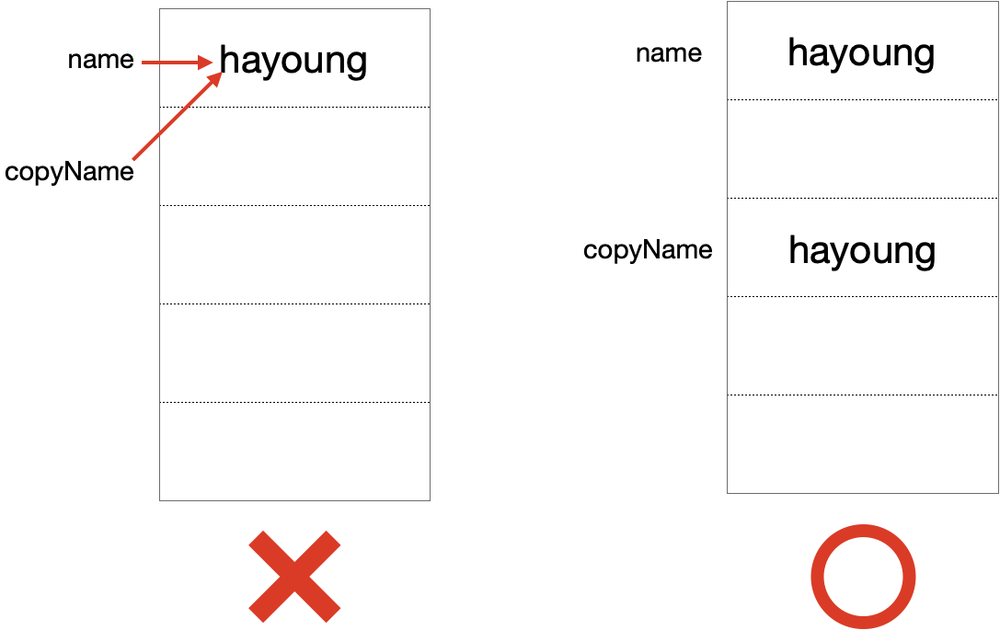
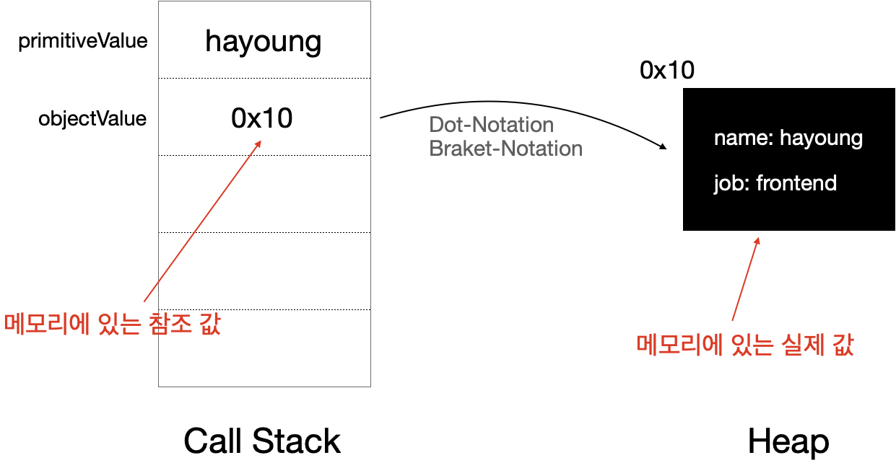

## ❗️ 객체 불변성

**자바스크립트에서 객체 불변성은 특히나 더 중요**시되고 있는데,

이 **객체불변성(Immutability)은 함수형 프로그래밍의 핵심원리** 이다.

따라서 완벽하진않지만 함수형프로그래밍을 할 수 있는 자바스크립트에서 함수형프로그래밍을 하기 위해 사용하고 있으며,
특히나 **리액트**와 같은 프레임워크를 사용하게 되면 VirtualDOM의 작동 특성상 객체 불변성을 유지해야 성능 최적화가 이루어지기 때문에 더더욱 중요한 개념이라 할 수 있다.

### 불변성이 뭐야?

불변성은 영어로 Immutable로, **간단하게 상태를 변경하지 않는 성질** 로 간단하게 정의 할 수 있다.

당연히 불변성을 가져야 된다는 말은 더 간단하게 상태를 변경하지 말아야 한다는 말과 같다.

그럼 상태의 변경이라는 말은 어떤 행위를 의미하는 것일까?

불변성에서 요구하는 상태 변경을 하지않는다는 것은 단순한 변수의 재할당도 포함이겠지만, 더 깊이 나아가서 **메모리에 저장되어있는 값을 변경하지 말아야 한다**는 것이다.

> 코드, 전역데이터를 저장하는 공간을 제외하고 자바스크립트의 메모리는 콜스택, 힙 두가지로 이루어지는데,
>
> 콜스택 영역은 실행중인 코드를 트래킹하는 공간으로 Primitive 값과 Object type에 대한 참조값을 저장하는 공간이고,
>
> 힙 영역은 object 타입 값 생성시 메모리 할당이 일어나는 공간으로 주로 크기가 정형화 되지 않는 Object 타입의 실제 값을 담는 공간이다.

### Immutable value (primitives)

우리가 자바스크립트에서 불변성을 유지하려면 데이터 타입부터 확인해봐야 한다.

흔히 원시타입(Primitives Type)으로 불리는 데이터 타입들은 태생적으로 Immutable한 특성을 가지고 있다.

> 원시타입 (Primitive Value): Number / String / Boolean / null / undefined

이러한 태생적인 Immutable한 특징 덕분에 앞서 설명했던 메모리에 값이 직접적으로 들어가지고, 수정할 경우 새로운 값으로 대체되어 들어가고 다른 변수에 할당을 하더라도 값을 공유하는 것이 아닌, 값 그 자체로 복사가 되어 들어가지기 때문이다.

```js
const name = 'hayoung'
const copyName = name
```

위 처럼 `name` 변수에 'hayoung' 값을 저장하고, `copyName`에 복사를 진행하였다.

그렇다면 아래 그림처럼 진행이 된다.


위 처럼 Primitive Value는 값 그 자체로 메모리에 저장되고, 복사를 할 경우 값 그 자체가 복사되어서 새로운 변수에 할당이 된다.

절대로 아래 그림의 왼쪽 처럼 되지 않는다.



이 말은 각각 변수는 값이 같지만 메모리상에서는 각각 다른곳에 저장되어 있다는 말이고 어느 한 변수를 수정해도 다른 변수는 불변하다.

그렇다면, 위에서 얘기했던 메모리에 저장되어 있는 값을 직접적으로 수정하려면 해당 변수 `copyName` 이나 `name`에 새로운 값을 재할당 하는 방법 밖에 없다.

이 재할당은 우리가 익히 아는 `const` 키워드로 막을 수 있다.

```js
const name = 'hayoung'
const copyName = name
```

그럼 이제 위 두 Primitive Value 값은 불변성을 가지고있다고 말 할 수 있을 것 같다.

### Mutable value

자바스크립트는 원시타입의 값을 제외하고 나머지는 모두 객체타입으로 참조값을 가지게 되고 이 참조값에 속성 접근자를 통해 값을 수정할 수 있다.

다시말하면 객체타입의 값은 원시타입 값과 다르게 기존 값을 새로운 값으로 만들지 않고 변경이 가능하다.

```js
const primitiveValue = 'hayoung'
primitiveValue = 'haong' //err

const objectValue = {
  name: 'hayoung',
  job: 'frontend',
}
objectValue.name = 'haong' // possible

const arr = []
arr.push('value')

console.log(arr) // ['value']
```

이런점을 통해 우리는 객체타입을 Mutable value라 할 수 있다.

> 원시 타입의 값은 Immutable.
>
> 객체 타입의 값은 Mutable.



그림으로 확인해보면 명확하다.

우리는 `objectValue` 에 접근할 때 메모리에 직접적으로 있는 값에 접근하는 것이 아닌 참조값이라는 주소값을 통해 실제 있는 값에 접근을 할 수가 있다.

이 때문에 각각 다른 변수다 하더라도 동일한 값을 바라볼수도 있고 이 참조값을 통해 접근을 하여 수정을 할 수 있다.

### Mutable 값의 문제점

이 Mutable하다라는 특성때문에 문제가 발생할 수 있다.

왜냐하면, 위에서 보여줬던 코드처럼 `const` 로 선언되었다 하더라도 **속성 접근자** 를 이용해서 얼마든지 수정할 수 있기 때문이다.

그리고 이는 `const` 키워드를 통한 변수선언이 어떤의미가 있는지 알고있다면 더욱 와닿을 것이라 생각한다.

> const 변수선언은 첫 할당이후에 재할당을 금지하도록한다. 주로 그 변수의 값이 변하지 않아야 할 때 혹은 상수로 사용해서 예기치 못한 값의 변화를 막아 프로그램의 오류나 프로그래머의 실수를 방지한다.

하지만 객체타입의 값은 참조값에 대해서만 재할당을 금지 할 뿐이지 속성접근자를 통해서 마음껏 수정할 수 있다.

이를 통해 속성값이 우리가 모르는사이에 값이 변화되어 알 수 없는 오류를 야기시킬 수 있다.

그렇기 때문에 **예측가능한 코드를 위해서는 객체 불변성을 유지하는 것이 좋다**.

### 왜 immutable?

#### 함수형 프로그래밍 순수함수의 필수조건!

순수함수는 함수형 프로그래밍을 하기위한 필수 조건중 하나인데,
순수함수는 외부의 무언가에 대해 값을 바꾸면 안된다. 즉, 함수 외부상태에 영향을 주지 말아야 한다.

#### 예측 가능한 코드 가능, 상태 변경을 추적하기 쉽다

불변성이 유지되기 이전에는 어느곳에서 어떻게 속성값이 변경되고 생겼는지에 대해서 추적이 힘들었다면 객체 불변성을 유지하는 코드는 원래 객체의 값을 바꾸지 않고 값이 바뀐 새로운 객체를 생성해 내기 때문에 예측 가능한 상태를 추적할 수 있다.

#### 리액트 Virtual DOM 엔진 최적화를 위해

리액트 Virtual DOM 엔진의 작동 원리를 따져보면 객체 불변성을 유지해야 한다고 한다.

## 자바스크립트에서 객체 불변성을 유지하기 위한 방법

자바스크립트에서 객체 불변성을 유지하기 위해서는 두가지 방법이 있다.

- 객체 동결시키기 - Object Freeze
- 객체 사본만들기 - Object Copy

### 객체 동결시키기 - Object.freeze()

자바스크립트에서 객체의 불변성을 유지하기위한 첫번째 방법은 바로 객체 동결시키기 이다.

동결시킨 객체에 대해서는 어떠한 것도 추가하거나 제거할 수 없으며 만약 그렇게 한다면 아무일도 일어나지 않거나 strict mode라면 `TypeError` 가 발생하게 된다.

모든 객체 프로퍼티에 대한 서술자 값인 **`configurable`**과 **`writable`** 이 `fase` 값으로 변환된다고 보면 된다.

> 프로퍼티에 대한 서술자값은 [Object.defineProperty()](https://developer.mozilla.org/ko/docs/Web/JavaScript/Reference/Global_Objects/Object/defineProperty) 를 참조하자.

즉, 동결된 객체는 속성값에 대해 다음과 같은 작업을 할 수 없다.

- 속성 추가
- 속성 제거
- 속성 재할당

```js
const originObj = {
  name: 'hayoung',
  job: 'frontend',
}

originObj.job = 'backend'

console.log(originObj) // {name: 'hayoung', job: 'backend'}
```

다음 코드는 원본객체인 `originObj` 에 대해서 변경작업이 이루어지고 있다.

여기 `originObj` 를 동결시켜보자.

```js{6}
const originObj = {
  name: 'hayoung',
  job: 'frontend',
}

Object.freeze(originObj)

originObj.job = 'backend'
originObj.phone = '010-xxxx-xxxx'
delete originObj.name

console.log(originObj) // {name: 'hayoung', job: 'frontend'}
```

위 처럼 `Object.freeze(객체)` 로 객체를 동결 시킬 수 있다.

동결된 객체는 아래 콘솔결과처럼 변경작업이 이루어지더라도 원본값 그대로 유지된다.

> 조용히 넘어가거나 애러가 발생한다.
>
> strictmode에서 동결된 객체를 변경시키면 TypeError가 발생한다.

#### 배열 동결

배열 또한 자바스크립트에서 객체타입이기 때문에 동결시킬 수 있다.

```js{7}
const arr = [1, 2, 3, 4]

arr.push(5)

console.log(arr) // [1, 2, 3, 4, 5]

Object.freeze(arr)

arr.push(6) // Error
arr.pop() // Error
```

7번라인에서 `Object.freeze()`로 동결후에 값을 변경하려고 하면 아래와 같은 애러가 난다.

/배열-Freeze-Error.png>)

#### 얕은 동결

동결된 객체는 변경할 수 없지만, 만약 객체 속성에 객체타입의 값이 있다면(nested object property) 얕은 동결이 일어나 해당 객체의 값이 변경될 수 있다.

> Object.freeze()는 직속 속성(1depth)에 대해서만 동결을 시킨다.

```js
const hayoung = {
  name: 'hayoung',
  job: 'frontend',
  friends: [
    {
      name: 'youngwoo',
      job: 'firefighter',
    },
    {
      name: 'hyungbin',
      job: 'doctor',
    },
  ],
}
```

위 처럼 **nested object type**의 값인 `friends` 속성에 대해서는 `Object.freeze()`가 인자로받은 객체의 **직속 속성**(1 depth) 에 대해서만 동결이 적용되어서 **얕은 동결**이 일어난다.

```js
Object.freeze(hayoung)

hayoung.name = 'unknown'

console.log(hayoung.name) // 'hayoung'

hayoung.friends[0].job = 'jobless'
hayoung.friends.pop()

console.log(hayoung.friends) // [ {name: "youngwoo", job: "jobless"}]
```

때문에 2 depth이상의 nested object type의 값들에 대해서는 동결을 적용시킬수가 없다.

#### 깊은 동결

이를 해결하려면 깊은 동결을 해줘야 된다.

> 무작정 깊은 동결을 하려하기보다는 nested object가 존재 할 때 하자.

```js
function deepFreeze(object) {
  const propNames = Object.getOwnPropertyNames(object)

  // nested object에만 적용
  for (const name of propNames) {
    const value = object[name]
    object[name] =
      value && typeof value === 'object' ? deepFreeze(value) : value
  }

  return Object.freeze(object)
}
```

이제 적용시켜 보자.

```js{1}
deepFreeze(hayoung)

hayoung.friends[0].job = 'jobless'

console.log(hayoung.friends[0]) // [ {name: "youngwoo", job: "firefighter"}]

hayoung.friends.push({ name: 'heungmin', job: 'football player' }) // error 추가 불가
hayoung.friends.pop() // error 제거 불가
```

변경사항 또한 적용되지 않고 배열에 대한 추가 제거작업도 애러가 나는걸 확인 할 수 있다.

#### 동결 확인

객체가 동결이 되었는지 확인하려면 `Object.isFrozen()` 을 사용하면 된다.

```js
Object.isFrozen(hayoung) // true
```

그리고 굳이 `Object.freeze()`를 하지 않더라도

확장이 불가하고, 모든 속성에 대해 쓰기 불가, 설정 불가라면 동결이 되었다고 판단한다.

```js
const hayoung = {
  name: 'hayoung',
  job: 'frontend',
}

Object.preventExtensions(hayoung) // 객체 확장 불가 설정
Object.defineProperty(hayoung, 'name', { writable: false, configurable: false }) // 쓰기 불가, 설정 불가
Object.defineProperty(hayoung, 'job', { writable: false, configurable: false }) // 쓰기 불가, 설정 불가

console.log(Object.isFrozen(hayoung)) // true
```

> [Object.defineProperty()](https://developer.mozilla.org/ko/docs/Web/JavaScript/Reference/Global_Objects/Object/defineProperty) 는 속성에 대해 서술자를 설정할 수 있다. (접근가능한지, 할당가능한지 등에 대한 설정 )

### 객체 사본 만들기

위 처럼 객체 동결에는 수정을 가해서도 안되거니와 수정을 가할 수가 없다.

그럼 객체의 속성값이 바뀌거나 조작이 필요하면 어떻게 해야할까?

바로 원본을 건드리지않고, 그 원본에 대한 사본을 만든다음에 사본에 조작을 가하면 된다.

객체 복사에대해서 디테일한 사항은 이전 포스팅에 있으니 해당 포스팅을 참조하고, 현재 이 글에는 간단하게 표기하도록 하겠다.

#### 얕은 복사

객체의 얕은 복사는 `Object.assign()`으로 해결할 수 있다.

```js
const returnedTarget = Object.assign(target, source)
```

#### 깊은 복사

```js
function deepCopy(origin, copy = {}) {
  for (const key in origin) {
    if (origin.hasOwnProperty(key)) {
      if (typeof origin[key] === 'object') {
        copy[key] = Array.isArray(origin[key]) ? [] : {}
        deepCopy(origin[key], copy[key])
      } else {
        copy[key] = origin[key]
      }
    }
  }
  return copy
}
```

깊은 복사는 깊은 동결과 같이 재귀를 통하여 해결 할 수 있다.

## 참조

[나의 자료형에 대한 이전 포스팅](<[https://ha-young.github.io/2020/javascript/%ED%95%98%EC%98%B9%EC%9D%98-%EC%9E%90%EB%B0%94%EC%8A%A4%ED%81%AC%EB%A6%BD%ED%8A%B8-%EC%8B%9D%EC%82%AC---Type/](https://ha-young.github.io/2020/javascript/하옹의-자바스크립트-식사---Type/)>)

[MDN - Object.freeze](https://developer.mozilla.org/ko/docs/Web/JavaScript/Reference/Global_Objects/Object/freeze)

[Evans님의 불변성 포스팅](https://evan-moon.github.io/2020/01/05/what-is-immutable/)
