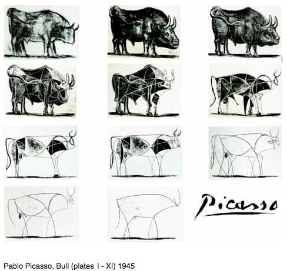
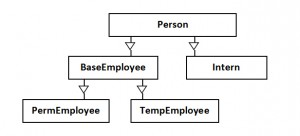
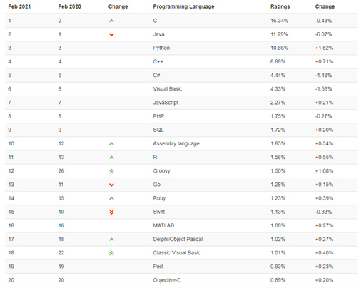
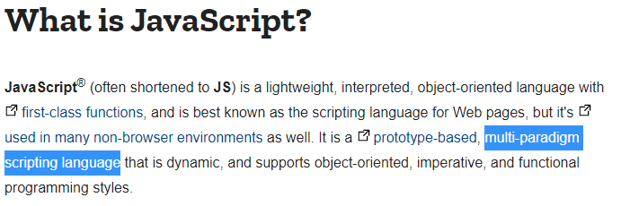
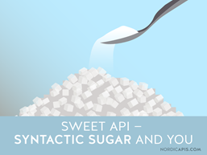
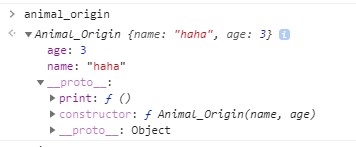
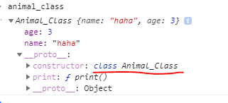
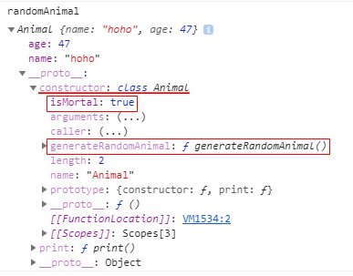

\* 이 글은 [Vanilla Coding](https://www.vanillacoding.co/) - BootCamp 9기 1주차 강의 수강 후 적은 글입니다.

## 객체지향 프로그래밍이란?

객체지향 프로그래밍 (OOP: Object Oriented Programming)이란 프로그래밍을 설계하는 방식중에 하나이다.

우리가 프로그래밍을 하는 것은 결국 본질적으로 컴퓨터, 즉 프로그램에게 어떻게 작동해야되는가에 대한 서술이라고 볼 수 있는데, 기존에 순차적으로 명령하던 방식이던 절차지향 프로그래밍 방법론에서 새로운 패러다임을 가져온 프로그래밍 설계 방식이다.

### 절차지향 VS 객체지향


이미지 출처 : [DEVOPEDIA](https://devopedia.org/object-oriented-programming-concepts)

위 사진을 보면, 절차지향 언어는 오직 데이터와 함수만이 존재하고, 함수를 이용해서 전역데이터, 로컬데이터들을 절차적으로 함수가 데이터에 전역 데이터 상에 의존되어 진행되게 되는 반면에,

> 더 간단히, 절차 지향은 전역구간에 의존된 함수들의 순차적인 진행으로 프로그래밍 된다.

객체 지향은 객체 자체가 자체 데이터에서 작동하고 데이터를 다른 객체에서 허용되는 것들만 받아서 쓰거나 원하는 데이터들만 전달하는 방식이다.

> 주로 시작점인 시작 클래스 (메인클래스)를 통해 다른 클래스(객체)들을 이용하면서 프로그래밍 된다.

### 프로그래밍에서 추상화의 시작

객체지향 프로그래밍은 기본적으로 독립된 단위인 추상화 된 객체(클래스)들을 만들고 이 객체들을 레고블럭과 같이 조립을 해서 프로그래밍을 하는 방식으로, 실제 생활에 존재하는 사물들을 객체로 만들어서 객체들의 상태와 동작을 구현하고 이를 동작시킴으로써 실 생활을 컴퓨터 적으로 해석하면서 프로그래밍을 할 수 있는 패러다임을 가져다주었다.


이미지 출처 : [TechTarget.com](https://searchapparchitecture.techtarget.com/definition/object-oriented-programming-OOP)

위 이미지를 통해 객체지향의 추상화를 알 수 있는데,

#### 추상화란?

[추상화](<https://ko.wikipedia.org/wiki/%EC%B6%94%EC%83%81%ED%99%94_(%EC%BB%B4%ED%93%A8%ED%84%B0_%EA%B3%BC%ED%95%99)>)란, 어떤 한 물체를 그 자체로 나타내는 것이 아니라 특정 개념이자 상위 개념으로 추출하는 것을 뜻한다.
추상화(Abstraction)의 동사는 추출하다(Abstract)이다. 말 그대로 **`특징`, `개념`만을 추출**한 것으로 받아들이면 된다.

그리고 추상적이다 라는 말은 일상속에서도 대체적으로 우리가 **구체적이다 라는 표현에 반대**되는 표현으로 대상을 뭉퉁그려서 구체적이지 않고 뭔가 희미하게 표현한 것이다.

##### 추상에 대한 이해

더 자세히 예를 통해서 한번 말해보자.

우리가 흔히 미술쪽에서 추상화가, [추상](<https://ko.wikipedia.org/wiki/%EC%B6%94%EC%83%81_(%EC%98%88%EC%88%A0)>)화 등의 말을 들어본 적이 있을 것이다.

이는 그림을 그릴 때 특징이나 속성등을 캐치하고, 그 부분을 추려내서 순수한 조형요소로만 표현하는 것을 의미한다.
때문에 <u>사실적, 구체적이지 않고</u> **일정한 형태와 성질없이 `특징`과 `속성`만이 부각**되어져 있다.



위 이미지는 [Evans님의 객체지향 포스팅](https://evan-moon.github.io/2019/08/24/what-is-object-oriented-programming/#%EC%B6%94%EC%83%81%ED%99%94%EC%97%90-%EB%8C%80%ED%95%B4%EC%84%9C-%EC%A1%B0%EA%B8%88-%EB%8D%94-%EA%B9%8A%EC%9D%B4-%EC%83%9D%EA%B0%81%ED%95%B4%EB%B3%B4%EC%9E%90)에서 참조한 자료로, 피카소가 소를 추상화 하는 과정을 그린 그림이라고 한다. 소의 특징과 속성만을 선과 점만을 이용해 그렸다.

위 이미지를 통해 추상화가 무엇인지 좀 더 쉽게 와닿을 수 있을 것이라 생각한다.

#### 프로그래밍에서의 추상화

프로그래밍에서도 추상화 한 대상은 마찬가지로 **구체적이지 않고** 추상이라는 단어의 의미에 맞게 **추출 할 수 있는 것들을 추출**해서 표현한다.

##### 객체지향에서의 추상화

객체지향에서의 추상화 하는 대상은 `객체`로, `객체`에서 추출할 수 있는 `속성`과 `동작(행위)`을 추출한다.

위 처음 이미지를 다시 보자. 객체는 사람이고, 이 사람이란 객체에서 추출할 수 있는 속성으로 이름, 이메일, 주소를, 동작 및 행위로는 확인, 이메일 보내기등을 추출하였다.

- 객체 : 사람
- 속성 : 이름, 이메일, 주소
- 동작 : 확인하기, 이메일 보내기

그리고 이 동작을 주로 함수로 나타내는데, 이런 객체들의 동작을 담당하는 함수들을 `메서드` 라고 부른다.

따라서 객체에는 데이터의 상태를 나타내는 `속성`과 동작을 나타내는 `메서드` 두가지로 이루어진다.

### 클래스는 객체를 추상화 한 것

그리고 위와 같이 사람이란 객체에서 추출된 **속성과 동작만이 기술된 형태를 `클래스`**라고 한다.

그리고 이 객체가 추상화된 **클래스는 `상속`이 가능**하다.

이 때문에 객체지향 프로그래밍에서는 클래스간 계층구조가 나타난다.



> 때에 따라서는 이 클래스에 더 추상화를 한 추상클래스를 만들 수도 있다.

## 왜 객체지향 프로그래밍을 알아야 하나?

### 가장 많이 쓰기 때문에

객체지향은 이미 예전부터 쓰인 프로그래밍 개념이기는 하나, 프로그래밍에 있어서 가장 많이 사용되고 사랑받았던 프로그래밍 설계 패턴이다.

당장 언어를 보더라도 객체지향 언어는 사람들이 가장 많이 쓴다는 C++, JAVA, Python, JavaScript 등이 있다.



위 이미지는 [Tiobe Index](https://www.tiobe.com/tiobe-index/) 2021 2월 기준 프로그래밍 언어 순위이다.

C를 제외하고 2~8위까지 모두 OOP를 지원 및 제공해준다.

### 객체지향의 장점

객체지향 프로그래밍을 하는 또다른 이유는 당연히 객체지향 프로그래밍이 가지는 큰 장점들 때문일 것이다.

그리고 이러한 장점들 덕분에 OOP는 개발에 앞서 철저한 설계를 바탕으로 개발을 진행하게 되고 이는 프로그램에 대해 안정성과 정확성을 보장하게 된다.

객체지향의 장점 중 가장 대표적인 3가지로는

- **캡슐화 (Encapsulation)**
- **추상화 (Abstraction)**
- **상속 (Inheritance)**

가 있고, 그 외로 중요한 장점인

- **다형성 (Polymorphism)**

이 있다.

#### 캡슐화 (Encapsulation)

클래스 내에 정의된 속성과 메서드들은 코드상에서 한 클래스내에 묶여서 작성 및 보관 할 수 있으며, 내부에 어떻게 정의 되어있는지 모르더라도 사용법만 알면 클래스로 생성되는 객체들을 사용할 수 있게 된다. 이렇게 속성과 메서드들은 한 공간에 묶어두고, 내부가 어떻게 이루어져있고, 어떻게 작동하는지에 대해 몰라도 프로그래밍을 할 수 있게하는 기법을 캡슐화 라고 한다.

또 클래스 내에서 사용되는 변수나 메소드 등을 원하는대로 감출 수 있기 때문에 이를 통해 `정보은닉`을 할 수도 있다.

#### 추상화 (Abstraction)

앞서 이미 [추상화](#프로그래밍에서의-추상화)를 설명했듯이, 클래스를 통해 객체의 속성과 행위와 관련 메커니즘만을 표시하여 불필요한 코드를 생성하지 않을 수 있고 이는 유지보수를 하는데 큰 이점을 가져다 준다.

#### 상속 (Inheritance)

객체간의 관계 및 하위 클래스를 만들어 상위 클래스에 해당하는 공통 논리를 재사용 할 수 있다.

#### 다형성 (Polymorphism)

다형성은 상속 구조를 통해 발현되는 특징으로 객체지향은 이 다형성을 통해 어떠한 속성과 메서드가 상황에 따라 다르게 동작하게 할 수 있다.

좀 더 자세히 말해보자면, 상위 클래스로 하위 클래스의 객체들을 받아서 공통된 메서드 명을 통해 각각 다르게 동작하는 하위클래스객체의 동작을 시킬 수 있다.

코드를 포함한 자세한 설명은 [Evans님의 다형성에 대한 설명](https://evan-moon.github.io/2019/08/24/what-is-object-oriented-programming/#%EB%8B%A4%ED%98%95%EC%84%B1)을 보도록 하자.

> 클래스 Type, Interface, 추상클래스의 개념이 없는 Javascript에서는 객체들끼리 동일한 method명만 있다면 쉽게 구현할 수 있다.

```js
const dog = {
    this.speak = function() { console.log('왈왈'); }
}

const cat = {
    this.speak = function() { console.log('야옹'); }
}

const tiger = {
    this.speak = function() { console.log('어흥'); }
}

const animals = [dog, cat, tiger];

for (const animal of animals) {
    animal.speak(); // 공통된 메서드명을 통해 각기 다른 각각 동물(객체)들의 speak 메서드를 사용할 수 있다.
}
```

위와 같이 상속, 인터페이스 등과 같은 번거로운 작업없이 객체안에 동일한 이름의 메서드만 있다면 위 처럼 다형성을 구현 할 수 있다.

> 이는 Javascript의 자유분방함을 이용한 장점이라 할 수 있겠다.

## 객체지향의 단점

### 프로그램의 볼륨이 커진다.

객체지향의 단점은 장점이기도 한 상속에 기반한다.

바로 상속을 통해 재사용을 원했지만, 필요없는 부분들까지 상속받게되며 이런것들이 한 두 개씩 쌓여 프로그램의 전체적인 볼륨의 크기가 증가하게 된다는 것이다.

일반적으로 상속은 자식객체에게 본인이 가지고있는 추상화의 논리를 그대로 계승해주는 것이므로, 원하든 원하지않든 자식 객체는 부모객체의 모든것을 상속받게 된다.

상속의 계층이 쌓이면 쌓일수록 이러한 볼륨의 크기는 증가할 수 밖에 없다.

또 캡슐화로 부터 야기되는 문제도 있다.

### 참조값을 통한 오작동 우려

객체는 기본적으로 참조값을 통해 접근이 가능하다.

이는 참조를 통한 값 접근으로 예상치 못한 문제를 야기시킬 수 있다.

이를테면, 객체에 대해 서로 같은 참조값을 가지게 되었을 경우 한쪽에서 수정을 하게되면 다른한쪽도 수정이 되어버리는 경우가 생긴다. 그리고 이는 예측가능성을 떨어뜨려 안전하지 못한 코드가 된다.

이에 대한 대표적인 문제가 바로 얕은 복사로 일어나는 문제이며 해결방법은 [해당 포스팅](../../../2021/javascript/하옹의-자바스크립트-간식---Object-Copy/)을 참조하자.

## 자바스크립트에서 객체지향 프로그래밍?

### 멀티패러다임 언어인 자바스크립트

자바스크립트는 절차지향일 수도 있고, 객체지향일 수도 있, 함수지향일 수도 있다.

이와 같은 말은 모두 자바스크립트 라는 언어 자체의 자유분방함일 수도 있지만,

자바스크립트가 기본적으로 **멀티패러다임 언어이기 때문**에 가능하다.



위 캡처 이미지는 [MDN의 About JavaScript](https://developer.mozilla.org/en-US/docs/Web/JavaScript/About_JavaScript)의 일부를 캡처한 것으로, 공식문서인 MDN에서 당당히 JavaScript는 `multi-paradigm` 언어라 표현하고 있다.

> JavaScirpt는 원하는 옷을 입고싶으면 입을 수 있는 아주 자유로운 언어이고, 원하면 섞어서 프로그래밍을 할 수도 있지만 대부분 프레임워크를 통해 어떤 패러다임을 지향할 것인지 정해지는 것 같다.

어찌되었든, JavaScript는 객체지향 프로그래밍을 지원하는 언어로 **객체지향 프로그래밍을 할 수 있다**.

> JavaScript는 객체지향언어가 아니라고 하는사람들이 있는데, MDN 공식문서에서 그렇다고 하기 때문에 이건 반박과 논란의 여지가 없다.

### 자바스크립트는 프로토타입 기반

하지만 JavaScript는 다른 클래스기반 객체지향언어와는 다르게 프로토타입 기반의 객체지향 언어이다.

프로토타입기반의 객체지향을 하는 법은 이전 게시글인 [하옹의 Javascript 식사 - Prototype](../../../2021/javascript/하옹의-자바스크립트-식사---Prototype/)을 읽어보자.

> 아래 내용을 이해하려면 필독을 권장한다.

### 자바스크립트에서 클래스

앞선 [자바스크립트의 프로토타입 기반 객체지향 기법](../../../2021/javascript/하옹의-자바스크립트-식사---Prototype/)에서 알 수 있듯이
생성자 함수와 프로토타입 개념을 통해서 객체지향 프로그래밍을 하는 자바스크립트는 대표적인 객체지향 방법인 클래스 기반 객체지향 프로그래밍과 달라 다른 언어로 부터 유입되는 사람들이 익히기가 쉽지 않았다.

이러한 니즈 때문에 자바스크립트에서는 ES2015 (ES6) 에서 Javascript에서도 `Class` 클래스 키워드를 사용할 수 있게 되었다.

그리고 이를 통해 클래스기반언어에서 객체지향을 하는 것 처럼 자바스크립트에서도 객체지향 프로그래밍이 가능해졌다.

#### 자바스크립트에서 Class는 Syntactic Sugar



사실 자바스크립트에서 Class 키워드가 생겼다고 해서 클래스 기반 객체지향을 하게 된 것은 아니다.

문법상으로 `Class`키워드를 통해 객체지향프로그래밍을 구현하지만, 내부적으로는 Prototype 기반으로 작동을 하게 된다. 따라서 자바스크립트에서 제대로 된 객체지향 프로그래밍을 하고싶고 동작원리를 이해하고 싶다면 반드시 Prototype에 대한 개념을 익혀야 한다. [참조](../../../2021/javascript/하옹의-자바스크립트-식사---Prototype/)

## ES2015에서 객체지향프로그래밍 (Javascript Class)

ES5에서는 Prototype에서 익히 한대로 생성자 함수와 프로토타입을 이용한 추상화를 하였고,
캡슐화는 모듈 패턴과 같은 클로저를 이용한 방법, 상속은 객체 복제를 통한 방식으로 구현을 하였다.

이는 상당히 번거로운 작업이었는데, ES2015에서 `Class` 키워드 지원으로 `상속`과 `캡슐화`, `static` 처리를 편리하게 할 수 있게 되었다.

따라서 ES2015 이후부터는 `Class`키워드를 사용한 객체지향 프로그래밍이 일반적인 방법이다.

### Class 키워드

자바스크립트에서 Class 키워드를 통한 객체지향 프로그래밍 방법은 아래와 같다.

#### Class 선언

```js
class Animal {
  // 생성자함수 (속성 선언)
  constructor(name, age) {
    this.name = name
    this.age = age
  }

  // 메서드 선언
  speak() {
    throw new Error('do not use Speak on Animal Object')
  }
}

const animal = new Animal() // 인스턴스 생성
```

> **Class 선언문은** Function 선언문과 다르게 **호이스팅이 일어나지 않는다**.
>
> let, const와 동일하게 TDZ가 적용 되며 사용시 Reference Error가 일어난다.

#### Class 표현식

```js
const Animal = class {
  // 생성자함수 (속성 선언)
  constructor(name, age) {
    this.name = name
    this.age = age
  }

  // 메서드 선언
  speak() {
    throw new Error('do not use Speak on Animal Object')
  }
}

const animal = new Animal() // 인스턴스 생성
```

표현식은 `const` 키워드로 받는게 일반적이고

내부에 있는 `constructor()` 는 반드시 **단 하나만 존재해야하는** `생성자 함수`로, 선언하지 않는다면 **Default Constructor**가 자동적으로 생성된다.

```js
constructor() {}
```

와 같이 아무런 작업을 하지 않는다.

> 상속을 받은 클래스라면 상위 클래스의 생성자함수를 호출하는 작업이 자동적으로 추가된다.
>
> ```js
> constructor(...args) {
>     super(...args); // 상속받은 상위 클래스(부모)는 super라는 키워드로 대체할 수 있다.
> }
> ```

인스턴스 생성은 기존과 마찬가지로 `new` 키워드를 이용해서 생성자 함수를 호출해야 한다.

### 속성과 메서드 선언

#### 속성

자바스크립트 Class에서는 속성 선언을 별도로 할 필요는 없고 `constructor` 생성자 함수를 기존 생성자 함수(Prototype)와 똑같이 사용하면 된다.

#### 메서드

메서드는 별도로 `function` 키워드를 사용하지 않아도 되고 `getter` `setter` 키워드를 통해 속성 접근과 수정을 간편하게 할 수 있다.

```js{24,30-31}
class Animal {
  constructor(name, age) {
    this._name = name
    this._age = age
  }

  get name() {
    return this._name
  }

  set name(value) {
    this._name = value
  }

  get age() {
    return this._age
  }

  set age(value) {
    this._age = value
  }

  print() {
    console.log(`name : ${this.name}, age : ${this.age}`)
  }
}

const animal = new Animal() // Default Constructor으로 인스턴스 생성

animal.name = 'nunu' // setter를 이용
animal.age = 1 // setter를 이용

animal.print()
```

위와 같이 `getter` `setter` 를 이용해서 `()` 괄호로 묶지 않아도 속성과 같이 간편하게 사용할 수 있다.

### Class 키워드로 만든 객체와 기존방식(ES2015이전)으로 만든 객체 비교해보기

이전 방식의 객체생성방법과 비교하기위해 기존방식의 생성자 함수를 이용해서 만들어보자.

```js
function Animal_Origin(name, age) {
  this.name = name
  this.age = age
}

Animal_Origin.prototype.print = function() {
  console.log(this.name, this.age)
}

class Animal_Class {
  constructor(name, age) {
    this.name = name
    this.age = age
  }

  print() {
    console.log(this.name, this.age)
  }
}

const animal_origin = new Animal_Origin('haha', 3)
const animal_class = new Animal_Class('haha', 3)
```

각각 `animal_origin`과 `animal_class`를 출력해보면 아래와 같다.

- 기존방법 :
  
- Class 이용 :
  

보는바와 같이 `Class` 키워드를 이용하더라도 기존 방법과 동일한 Prototype 기반의 결과로 나오는 걸 확인할 수 있다.

다만 차이점이 있다면, `__proto__` 의 `constructor`가 `function` 기반인지 `class`기반인지 구분할 수 있다는 차이점이 있다.

### static 키워드를 이용한 정적 메서드, 속성 만들기

Class 기반 객체지향 언어와 마찬가지로 Javascirpt Class는 `static`키워드를 지원한다.

클래스 내부에서 정적 메서드와, 정적 속성은 인스턴스 생성 후 사용 없이 `Class` 를 통해서 접근 할 수 있고,
전체 인스턴스에서 값을 공유할 수 있다.

```js{11,13,17}
class Animal {
  constructor(name, age) {
    this.name = name
    this.age = age
  }

  print() {
    console.log(this.name, this.age)
  }

  static isMortal = true

  static generateRandomAnimal() {
    const randomName = ['hoho', 'haha', 'nunu', 'amumu', 'ana']
    const randomIndex = Math.floor(Math.random() * 4)
    const randomAge = Math.floor(Math.random() * 100)
    return new Animal(randomName[randomIndex], randomAge)
  }
}

const animal = new Animal('haha', 1)
const randomAnimal = Animal.generateRandomAnimal()

console.log(animal.isMortal) // undefined
console.log(animal.generateRandomAnimal) // undefined
console.log(Animal.isMortal) // true
```

먼저 출력 결과를 보자.

출력 결과를 보면 인스턴스에서는 `static`키워드로 선언된 속성, 메서드에 참조를 못한다는 것을 알 수 있다.

하지만 클래스에서 바로 접근할 수 있고 사용 할 수 있다.

이와 같은 것이 `static` 키워드로 선언한 정적인 속성과 메서드라 할 수 있다.

> 주로 `static`키워드로 선언되는 것은 Util성이 대부분이다.
>
> 위에서 선언한 generateRandomAnimal 또한 랜덤 Animal을 생성하는 Util성의 함수이다.

자 그럼 이제 이 static 메서드는 어떤 식의 결과로 생성되는지 확인해보자.



위 처럼 `Animal`의 `__proto__`의 `constructor`에 속해지는 것을 알 수 있다.

이를 예전 방식처럼 구현한다면

```js
function Animal(name, age) {
  this.name = name
  this.age = age
}

Animal.isMortal = true
Animal.generateRandomAnimal = function() {
  const randomName = ['hoho', 'haha', 'nunu', 'amumu', 'ana']
  const randomIndex = Math.floor(Math.random() * 4)
  const randomAge = Math.floor(Math.random() * 100)
  return new Animal(randomName[randomIndex], randomAge)
}
```

와 같이 생성자함수에 직접 Key, Value로 할당함으로써 만들 수 있다.

### Private 필드 선언

기존 javascript 방식에서 힘들었던 정보은닉 또한 Class에서는 제공을 해준다.

> 아직 완벽히 제공은 아니고 추후 ECMA스크립트에 반영 될 예정인 TC39 stage 3로 등록되어 있다.
>
> 따라서 아직 Babel을 통해서만 사용 할 수 있으니 주의.

자세한 사항은 [MDN](https://developer.mozilla.org/ko/docs/Web/JavaScript/Reference/Classes/Private_class_fields)을 참조하자.

> 기존에는 private 선언을 위해 클로저를 이용한 [다음과 같은 방식](../../../2020/javascript/하옹의-자바스크립트-식사---Closure/#information-hiding-정보-은닉)을 사용하였다.

### Class에서의 상속

`Class` 키워드를 이용한 상속은 Java언어와 동일하게 `extends` 키워드를 사용하게 된다.

> 여기서 JavaScript Class 도입에 Java 개발자들이 많이 관여했다는걸 알 수 있다.

```js
class Animal {
  constructor(name, age) {
    this.name = name
    this.age = age
  }

  speak() {
    throw new Error('do not use Speak on Animal Object')
  }
}

// Animal을 상속받는 Dog
class Dog extends Animal {
  constructor(name) {
    super(name) // super 키워드를 이용해 상위 클래스 생성자 호출
  }

  // speak 메서드 overriding
  speak() {
    console.log(name, '왈왈')
  }
}

class Cat extends Animal {
  constructor(option1, option2, ...args) {
    super(...args) // rest 연산자를 이용한 방법을 통해 상위 클래스 생성자를 호출하는 방법도 있다.
    // 자식 클래스만의 속성 부여
    this.option1 = option1
    this.option2 = option2
  }

  speak() {
    console.log(name, '야옹')
  }

  // 자식 클래스만의 메서드 부여
  doSikPPang() {
    console.log('식빵굽기')
  }
}
```

위 처럼 상속을 구현 할 수 있다.

```js
class KoreanShortHair extends Cat {
  constructor(option1, ...args) {
    super(...args)
  }
}
```

다음과 같이 연속으로 상속한 클래스 상에서 생성자 함수를 호출하면

```js
const koshort = new KoreanShortHair('1', 2, 3, 'navi')
```

`super`키워드를 통해 연쇄적으로 상위 클래스 상의 생성자 함수가 호출되어서 정상적인 상속이 이루어진다.

`KoreanShortHair 생성자` -> `super<Cat>` -> `super<Animal>`

## 객체와 관련된 자바스크립트 디자인 패턴

프로그래밍에서 디자인 패턴은 거의 대다수가 OOP를 통해 만들어졌다고 해도 과언이 아니다.

그 중 Javascript에서 객체를 이용한 대표적인 디자인 패턴을 간단하게 살펴보자.

### 객체 생성

#### 리터럴

리터럴은 객체를 생성하는 가장 기본적인 방법이다.

```js
const obj = {
  prop1: value1,
  prop2: value2,
}
```

#### 생성자함수

생성자 함수를 통해 생성하는 방법은 인스턴스에 대한 코드 재사용성을 위해 주로 사용된다.

> Class키워드를 통한 생성도 이에 포함

```js
function Animal(name) {
  this.name = name
}

const obj = Animal('hoho')
```

#### 팩토리펑션

팩토리 펑션은 생성자 함수가 아닌데 객체를 생성하는 함수를 일컷는다.

```js
function animalFactory(name) {
  return {
    name: name,
  }
}

const obj = animalFactory('hoho')
```

그리고 이 팩토리펑션과 클로저를 통해서 정보은닉을 시도할 수 있다.

```js
function createPhone() {
  let battery = 0
  return {
    rechargeBattery: function() {
      battery = 100
    },
    showRemainBattery: function() {
      return battery
    },
  }
}
```

소스 출처: [CodePlayground](https://im-developer.tistory.com/141)

### 속성 관련

#### 믹스인(Mixins)

자바스크립트에서 상속이 아닌 속성을 확장하는 방법이 있는데, 그것이 바로 믹스인 디자인 패턴이다.

> 주로 단일 상속만 허용되는 자바스크립트에서 **다중 상속**을 해야 될 필요가 있거나 상속을 제외한 **기능 확장**을 재사용성 있게 하고싶을 때 유용하게 사용된다.

```js
// 나는 행위를 담당하는 Mixin
const FlyToMixin = superclass =>
  class extends superclass {
    flyTo(destination) {
      console.log(`${this.name} is flying to the ${destination}`)
    }
  }

// 먹는 행위를 담당하는 Mixin
const EatMixin = superclass =>
  class extends superclass {
    eat(food) {
      console.log(`${this.name} is eating ${food}`)
    }
  }

// 헤엄치는 행위를 담당하는 Mixin
const SwimAtMixin = superclass =>
  class extends superclass {
    swimAt(place) {
      console.log(`${this.name} is swiming at the ${place}`)
    }
  }

// 믹스인을 탑재한 Mouse
class Mouse extends SwimAtMixin(EatMixin(Animal)) {
  /*...*/
}

const mickyMouse = new Mouse('Micky Mouse')
mickyMouse.swimAt('river')
```

코드 참조: [moggy님의 mixin 포스팅](https://velog.io/@moggy/Javascript-%EB%AF%B9%EC%8A%A4%EC%9D%B8-%EA%B8%B0%EB%B2%95Mixin-technique)

```js
function extend(target, source) {
  Object.getOwnPropertyNames(source).forEach(function(key) {
    Object.defineProperty(
      target,
      key,
      Object.getOwnPropertyDescriptor(source, key)
    )
  })

  return target
}
```

아니면 다음과 같은 방식으로 속성을 할당해주는 것 또한 mixin이다.

### 사용 관련

#### 싱글톤

싱글톤은 **한 클래스에서 반드시 하나의 인스턴스만 존재**해야하는 경우에 쓰인다.

만약 다른 곳에서 동일한 클래스를 사용한다면 이전에 생성된 인스턴스가 반환되어야 한다.

```js
export default class Singleton {
  static instance

  constructor() {
    if (instance) {
      return instance
    }
  }
}
```

다음과 같이 `Class`키워드, `static`키워드를 사용해서 쉽게 구현할 수 있다.

> ES5로 구현할 수 있는데 [여기](https://stackoverflow.com/questions/1635800/javascript-best-singleton-pattern)를 참조하자.

#### 모듈패턴

모듈 패턴의 가장 큰 장점은 객체 내부에 존재하는 속성을 감추는 **정보은닉**이다.

```js
var testModule = (function() {
  var counter = 0
  return {
    incrementCounter: function() {
      return counter++
    },
    resetCounter: function() {
      console.log('counter value prior to reset: ' + counter)
      counter = 0
    },
  }
})()

testModule.incrementCounter()
testModule.resetCounter()
```

소스 참조: [Yuby's Lab - Module-Pattern](https://yubylab.tistory.com/entry/%EB%94%94%EC%9E%90%EC%9D%B8-%ED%8C%A8%ED%84%B4-for-javascript-Module-Pattern)

## 출처

[MDN - Class](https://developer.mozilla.org/ko/docs/Web/JavaScript/Reference/Classes)

[Evans님의 OOP 포스트](https://evan-moon.github.io/2019/08/24/what-is-object-oriented-programming/#%EB%8B%A4%ED%98%95%EC%84%B1)

[VanillaCoding - BootCamp 강의 - OOP](https://www.vanillacoding.co/)

[CodePlayground - Design Pattern](https://im-developer.tistory.com/141)
