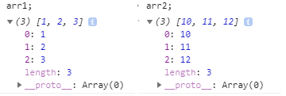
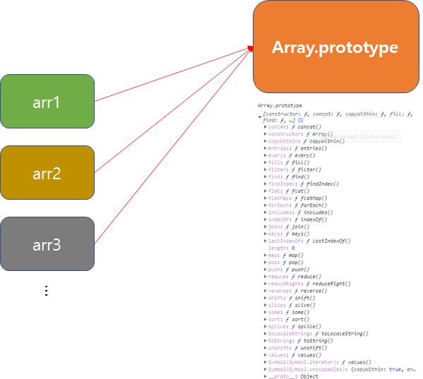
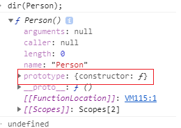

\* 이 글은 [MDN](https://developer.mozilla.org/es/), [Vanilla Coding Prep 강의자료](https://www.vanillacoding.co/), [PoiemaWeb](https://poiemaweb.com/)등 공신력있는 곳들을 참조한 글입니다.

## Prototype?

프로토타입은 자바스크립트를 작동시키는 근간이 되는 개념중 하나이다.
이 프로토타입의 동작 원리를 알아야 MDN에서 `Obejct.hasOwnProperty()` `Array.prototype.splice()`와 같은 <u>표준 내장객체의 prototype 메서드들의 원리</u>와 <u>객체(Object) 상속 원리</u>를 이해할 수 있다.

또 javascript는 이 Prototype 기반의 **객체지향 언어**로, 다른 클래스 기반의 객체지향언어와는 다르다. 하지만 클래스기반 객체지향 프로그래밍의 특징 중 하나인 <u>상속을 복제의 과정</u>을 통해 구현할 수 있으며, **클래스 기반 객체지향보다 좀 더 인스턴스 지향적**이다.

> 가장 핵심적인건 이 Prototype원리를 이용해 객체지향프로그래밍을 할 수 있다는데 있다.

## Javascript Prototype 이해하기

### 객체의 prototype

#### 🕶현재 객체에 속성이 존재하지 않으면 프로토타입을 참조

프로토타입의 동작방식에서 가장 기본적인 원칙은 우리가 가진 객체에서 `Property`를 읽을 때 만약 해당 `Property`가 없다면 자동으로 현재 객체의 `prototype`에서 해당 `Property`를 찾는다는 것이다.

이를 알 수 있는 가장 좋은 예제가 바로 `Object` 내장객체에 포함되어있는 메서드들이 우리가 생성한 객체들로도 쓸 수 있다는 점이다.

```js
const human = {
  name: 'ha-young',
  age: 30,
}

console.log(human.toString()) // toString 속성은 없지만 사용된다.
console.log(human.hasOwnProperty('name')) // hasOwnProperty 속성은 없지만 사용된다.
```

human 객체에서 `toString()` 과 `hasOwnProperty()`메서드를 선언한 적이 없지만 사용 할 수 있다.

어떻게 사용이 되는 것일까? 이 메서드들은 Object.prototype에 있는 메서드들이다.


human 객체를 콘솔에 출력해보면 `__proto__`속성으로 내장객체인 `Object` 를 가지고 있다.

바로 이것이 **프로토타입**으로, 프로토타입의 가장 기본적인 원칙인 프로퍼티를 참조할 때, 현재 객체에 존재하지 않는다면 프로토타입 체인이 연결되어있는 순서대로 타고 올라가면서 프로퍼티를 찾게된다. 바로 그 프로토타입을 확인해볼 수 있는것이 `__proto__` 속성이고 위 human 객체의 프로토타입은 `Object`내장객체 이다.

> 사실 \_\_proto\_\_ 속성을 접근하면 내부적으로 Object.getPrototypeOf 가 호출된다.

> `Object` 내장객체는 가장 근본이 되는 프로토타입으로 모든 객체들의 프로토타입 체인의 마지막은 `Object`이다.

#### 🏐프로토타입에 있는 속성과 메서드는 공유된다.

또 `Array`를 생성했을 때 모든 `Array`들이 다 같은 메서드들을 가지고 있는데, 이 메서드들은 `Array.prototype`에 있는 메서드들로 모든 `Array`마다 각자 가지고있는 메서드들이 아닌 `Array.prototype`에 있는 메서드들을 모든 `Array`객체에서 공유한다. 그리고 이 또한 프로토타입의 원리이다.

```js
const arr1 = [1, 2, 3]
const arr2 = [10, 11, 12]
```

위 처럼 생성된 Array들을 각각 콘솔에 찍어보면 아래와 같다.



그럼 보는바와 같이 각각 `Array`객체 모두 우리가 사용하던 `from()`, `splice()`, `push()` 등과 같은 메서드들을 가지고 있지 않다.

당연히 이 메서드들은 `Array`의 프로토타입인 `Array.prototype` 이 가지고 있는 것이고, `__proto__`을 통해 확인할 수 있다.


```js
console.log(arr1.__proto__ === arr2.__proto__) // true
```

이를 통해 우리가 알 수 있는건, **`Array.prototype` 프로토타입 객체는 딱 하나만 존재**하고 있고, 새롭게 생성되는 `Array`객체들은 이 `Array.prototype` 프로토타입 객체안의 메서드들을 공유하는 개념이다.



### 생성자 함수

#### 🎨생성자 함수란

우리가 `new`키워드와 함께 함수를 사용하면, 이 함수를 **생성자 함수**라고 부르는데, 이 생성자 함수는 새로운 객체를 생성하는 함수이자 일종의 틀이다.

`new`키워드로 호출된 함수는 내부에서 빈 객체를 생성하고, 빈 객체는 함수 내부에서 `this`키워드로 접근 할 수 있다.

```js
// 생성자 함수
function Human(name, age) {
  this.name = name
  this.age = age
}

// 만들어진 생성자 함수로 객체 생성
const hayoung = new Human('ha-young', 30)
const hosam = new Human('hosam', 28)

console.log(hayoung) // Human {name: "ha-young", age: 30}
console.log(hosam) // Human {name: "hosam", age: 28}
```

이 생성자 함수는 return이 명시되어있지 않지만 자동적으로 `return this`를 수행한다.

> 만약 `this`가 아닌 **다른 객체**를 return 하면 `return this`는 수행되지 않는다.

그리고 생성자 함수 내부에서의 `this`는 빈 객체로 자동생성되어져 이후 `this.name = name` 과 같은 코드에 의해 객체에 속성이 할당되는 것.

**생성자 함수의 특징 요약**

- 생성자 함수는 대문자로 시작하는 명사로 네이밍
- `new` 키워드는 빈 객체를 생성하고 함수 내부에서 `this`로 접근 할 수 있다
- 생성자 함수는 별다른 `object`리턴이 없으면 `return this`로 자동반환한다.
- 반환된 객체는 **인스턴스** 라 불린다.

#### 🎭리터럴에 내부적으로 작동하는 생성자 함수

또 우리가 흔히 리터럴로 생성한 객체들은 모두 <u>내부적으로</u> 생성자 함수로 만들어진다.

```js
const obj = {}

const obj = new Object()
```

```js
const arr = []

const arr = new Array()
```

```js
const func = function() {}

const func = new Function()
```

#### ✨🎯생성자 함수의 'prototype' 속성

우리가 함수를 생성하면 자동적으로 이 `property` 속성이 만들어 진다.

> 함수에만 존재하는 prototype 속성이지만 오직 함수가 생성자 함수로 쓰였을 때만 의미가 있다.

```js
function Person() {}
dir(Person)
```



이 **`prototype`속성의 값은 객체로써 오직 함수에만 자동생성되어 존재**하는데,

해당 **함수가 생성자 함수로 쓰였을 때 그 생성자 함수가 생성하는 객체의 프로토타입 즉, `__proto__`로 이 prototype 속성의 객체가 설정**된다.

```js
const hoho = {
  prop1: 'haha',
  prop2: 'hihi',
}

function Person() {}
Person.prototype = hoho

const person1 = new Person()
const person2 = new Person()
console.log(person1.__proto__) // {prop1: "haha", prop2: "hihi"}
console.log(hoho === person1.__proto__) // true
console.log(hoho === person2.__proto__) // true
```

맨 마지막 라인만 봐도 같은것을 알 수 있다.

또 여기서 다시한번 프로토타입 객체는 생성된 객체들과 공유되는 것을 알 수 있다.

> person1, person2 객체 모두 hoho객체를 프로토타입으로 공유한다.

```js
console.log(person1.prop1) // 'haha'
console.log(person2.prop1) // 'haha'
```

당연히 같은 값이 나오게 된다.

## 어떨 때 생성자함수, 어떨 때 프로토타입?

그럼 어떨 때 생성자 함수를 쓰고 어떨 때 프로토타입을 써야할까?

답은 간단하다.

각 객체마다 개별적으로 있어야되고 변동사항이 생길 것 같은 속성은 생성자 함수로,
모든 객체에서 같은값으로 공유해야하는 속성은 프로토타입 객체의 속성으로 설정하면 된다.

- 생성자 함수 : 필드 속성, 초기화
- 프로토타입 : 메서드

```js
function MyArray(name) {
  this.arr_ = [] // 배열 초기화
  this.length = 0 // 각 배열마다 가지고있어야하는 변동사항 - 필드
  this.name = name // 필드
}

// 메서드
MyArray.prototype.push = function(item) {
  this.arr_[length] = item
  this.length++
}

// 메서드
MyArray.prototype.pop = function() {
  const result = this.arr_[length - 1]
  this.length--
  this.arr_.length = this.length // arr_ 배열의 마지막데이터를 없앤다.
  return result
}

//메서드
MyArray.prototype.printName = function() {
  console.log(this.name)
}

const myarr1 = new MyArray('myarr1')
const myarr2 = new MyArray('myarr2')

// 두 객체 모두 똑같은 MyArray.prototype의 printName()이 호출된다.
myarr1.printName() // myarr1
myarr2.printName() // myarr2
console.log(myarr1.printName === myarr2.printName) // true
```

## 프로토타입 체인

### 마스터프로토타입

모든 객체 (function, array 포함)는 `Object.prototype`의 메서드를 가지고 있다.

> hasOwnProperty(), keys(), values() 등등

`Object.prototype`은 **마스터 프로토타입**으로써 프로토타입 체인의 끝에는 항상 `Obejct.prototype`이 있기 때문이다.

```js
Object.prototype.hi_chain = function() {
  console.log('hi, this is prototype chain')
}

const arr = [1, 2, 3]

arr.hi_chain() // hi, this is prototype chain
```


위 사진처럼 `hi_chain()`을 찾아가는 과정처럼 **속성을 찾아 프로토타입을 계속해서 참조해서 나가는 것이 바로 프로토타입 체인**이다.

위 사진은 `객체` - `Array.prototype` - `Object.prototype` 이렇게 프로토타입 체인이 형성되었다고 볼 수 있다.

## prototype VS \_\_proto\_\_

우리가 앞서 설명을 봐 왔다면 `prototype` 속성과 `__proto__`속성을 봤을 것이다.

둘 다 프로토타입 객체에 접근한다는 것 같은데 어떤 차이가 있는 것일까?

### prototype 속성

`prototype`속성은 **오직 함수에만 자동적으로 생성되어 존재하며 값은 프로토타입 객체이다.**

```js
function nonConstructor() {
  console.log("I'm not constructor function")
}

console.log(nonConstructor.prototype)
```


생성자 함수가 아니라도 **함수라면 무조건적으로 자동으로 생성**되며,
자동으로 생성된 `prototype` 객체에 별다른 추가작업을 하지 않는다면 위 처럼 `constructor`와 `__proto__` 두 개의 속성만 존재하게 된다.

```js
const arrowFunc = () => {
  console.log('arrow Func')
}

const expressionFunc = function() {
  console.log('expression function')
}

function ConstructorFunc() {
  this.isConstructor = true
}

console.log(arrowFunc.prototype) // undefined
console.log(expressionFunc.prototype) // {constructor: f}
console.log(ConstructorFunc.prototype) // {constructor: f}
```

그리고 보는바와 같이 **화살표함수는 prototype 속성이 자동으로 생성되지 않는다.**

#### 프로토타입 객체의 default 속성

- constructor : 해당 프로토타입객체를 생성시킨 함수 (생성자함수)
- \_\_proto\_\_ : 생성된 프로토타입 객체의 프로토타입

#### 함수 prototype 속성의 역할

그럼 이 함수에만 생성되는 `prototype` 속성은 어떤 역할을 하는것일까?
이 `prototype` 속성은 단순히 속성으로 존재하기보다는 특별한 역할을 하도록 설계되어있다.

이 `prototype`속성은 함수가 생성자 함수로 쓰였을 때 **생성되는 인스턴스의 prototype** 이 된다.

즉, **생성된 인스턴스의 `__proto__` 가 생성자 함수 prototype 속성의 객체가 된다.**

```js
function Human(name) {
  this.name = name
}

Human.prototype.canSpeak = true
Human.prototype.func1 = function() {
  console.log("prototype's function")
}

const hayoung = new Human('hayoung')

// 생성된 인스턴스의 프로토타입은 생성자함수의 프로토타입 속성의 객체값이다.
console.log(hayoung.__proto__ === Human.prototype)
```

### \_\_proto\_\_ 속성

앞선 수많은 예제들로 `__proto__`가 무엇인지는 잘 알고 있을 것 같다.

이와 같은 \_\_proto\_\_를 dunder-proto(던더프로토)라고 부르는데,
이 던더프로토는 객체에 존재하는 속성으로 **해당 객체의 프로토타입**을 가리킨다.

사실 이 `__proto__`는 사용을 지양해야하고 `Object.prototype`의

- Object.prototype.getPrototypeOf()
- Object.prototype.setPrototypeOf()

를 사용해야 한다.

> `__proto__` 속성을 통해 [[Prototype]] 을 가져오고 설정하면 내부적으로
> getPrototypeOf()와 setPrototypeOf()가 작동된다.
>
> - [[Prototype]] : Prototype 객체를 뜻함

### 정리

그렇다면 `prototype` 속성과 `__proto__` 속성의 차이는

- `prototype`은 함수에 자동적으로 생성되고 `new`키워드와 연계해서 인스턴스의 `__proto__`로 만들어진다. (인스턴스의 프로토타입)
- `__proto__`는 단순히 객체의 프로토타입객체 [[Prototype]] 를 나타낸다.

## 상속 구현하기

자 그럼 이제 상속을 구현해보자.

상속의 방법은 여러가지가 있지만 아래와 같은 방법이 가장 스탠다드 하다고 할 수 있다.

우선, Javascript에서 상속을 하는 기본사항은 다음과 같다.

1. 자식 생성자 함수에서 부모 생성자 함수를 통해 초기화 및 필드 부분 확장
2. 자식의 prototype에 부모의 prototype 체이닝

<br>

우선 다음과 같이 부모를 만들었다고 가정하자.

> (예제는 예전에 작성했던 [여기](../../../2020/vanillacoding/BootCamp%20%EB%B0%94%EB%8B%90%EB%9D%BC%EC%BD%94%EB%94%A9%20%EB%B6%80%ED%8A%B8%EC%BA%A0%ED%94%84%20%EC%A7%80%EC%9B%90/)에서 가져왔다)

```js
function BootCamp(location, teacher) {
  this.location = location
  this.teacher = teacher
}

BootCamp.prototype.teach = function() {
  console.log(`${this.teacher} teachs in ${this.location}`)
}

BootCamp.prototype.isGood = function() {
  console.log("i don't know")
}
```

### 1. 자식 생성자 함수에서 부모 생성자 함수로 필드확장

자식 생성자 함수에서 부모 생성자 함수를 통해 초기화 및 필드 부분 확장하는 것은 다음과 같다.

```js{3}
function VanillaCoding(course, ...rest) {
  // 1. 부모 생성자 함수에 현재 인스턴스 바인딩시켜 확장.
  BootCamp.apply(this, rest)
  // 자식객체에 확장할 필드
  this.course = course
}
```

보통 다음과 같이 생성자 함수 내부에서 부모 생성자 함수를 호출시키는데,
`부모생성자.apply(this, rest)`와 같이 자식 생성자 함수에서 생성된 빈 객체를 **binding** 시켜준다. `apply`로 호출하지않고 `call`을 사용해도 무방하다.

> call, apply와 같은 this binding 함수를 모른다면 [하옹의 자바스크립트 식사 - this 포스팅](../../../2021/javascript/하옹의-자바스크립트-식사---this/#3-call-apply-bind-explicit-binding-this)을 참조하자.

### 2. 자식 프로토타입에 부모 프로토타입 체이닝

1번처럼 자식 생성자 함수를 만들었다면 이제는 자식의 프로토타입에 부모의 프로토타입을 체이닝시켜야 한다.

체이닝 시키는 방법도 여러가지가 있지만 `Object.create()`를 사용하는게 가장 일반적이다.

`Object.create()`는 인자값으로 받은 객체를 프로토타입(`__proto__`)으로 설정하는 빈 객체를 반환한다. [참조](https://developer.mozilla.org/ko/docs/Web/JavaScript/Reference/Global_Objects/Object/create)

```js{2-3}
// 2. 자식 프로토타입에 부모 프로토타입 체이닝
VanillaCoding.prototype = Object.create(BootCamp.prototype)
VanillaCoding.prototype.constructor = VanillaCoding

// 2번 이후로 프로토타입 필드, 메서드 할당
VanillaCoding.prototype.isGood = function() {
  console.log('yes, vanilla coding is good')
}
```

아래의 `constructor`를 새로 설정하는 것은

`Object.create()`로 만들어진 객체의 `constructor`속성이 없기 때문.

> [[Prototype]]은 constructor속성을 가지고 있어야 한다.

### 전체 소스

```js{19,24-25}
//==============================부모 생성자=======================================
function BootCamp(location, teacher) {
  this.location = location
  this.teacher = teacher
}

BootCamp.prototype.teach = function() {
  console.log(`${this.teacher} teachs in ${this.location}`)
}

BootCamp.prototype.isGood = function() {
  console.log("i don't know")
}
//==============================================================================

//=======================상속받는 자식 생성자=======================================
function VanillaCoding(course, ...rest) {
  // 1. 부모 생성자 함수에 현재 인스턴스 바인딩시켜 확장.
  BootCamp.apply(this, rest)
  this.course = course
}

// 2. 자식 프로토타입에 부모 프로토타입 체이닝
VanillaCoding.prototype = Object.create(BootCamp.prototype)
VanillaCoding.prototype.constructor = VanillaCoding

// 2번 이후로 프로토타입 필드, 메서드 할당
VanillaCoding.prototype.isGood = function() {
  console.log('yes, vanilla coding is good')
}
//==============================================================================

// 실행
const prep = new VanillaCoding('prep9기', 'Samsungdong Seoul', 'Ken')
prep.teach() // 프로토타입 체인으로 부모의 teach 사용
prep.isGood() // 자식 프로토타입의 isGood 사용
```

## 왜 객체지향?

앞서, Prototype은 객체지향 프로그래밍을 하기 위한 방법이고, Prototype기반의 객체지향 프로그래밍은 상속을 복제의 과정을 통해 구현할 수 있다고 했다. 이제 프로토타입이 무엇이고, 상속은 어떻게 하는지 알겠다. 그럼 왜 이런 것들로 객체지향 프로그래밍을 하고자 하는 것일까?

가장 큰 이유는 아마 아래 3가지가 아닐까 싶다.

- 코드의 재사용성
- 유지보수의 용이성
- 기능 확장에 유리 (상속)

만약, 우리가 객체지향적으로 프로그래밍을 작성하지 않는다면 다음과 같은 코드가 나올 것이다.

```js
const rectangle = {
  width: 10,
  height: 20,

  getArea: function() {
    return this.width * this.height
  },
  printInformation: function() {
    console.log(width, height)
  },
}

const square = {
  length: 10,

  getArea: function() {
    return this.length * this.length
  },
  printInformation: function() {
    console.log('this is square, length : ', length)
  },
}
```

위와같은 코드를 작성하게되면 단일 객체로 쓰이는 경우에는 상관없으나, 같은 형태의 객체들을 계속 재생성, 재사용하게 될 경우에는 문제를 야기시킬 수 있다.

> rectangle과 square 간의 공통점이 존재함에도 각각 다른 객체 인스턴스로 생성이되어서 코드간의 중복이 발생하고 길이가 다른 rectangle, square가 나올 때 마다 객체 리터럴로 계속해서 생성해주는 번거로움이 생긴다.

위 코드를 객체지향적으로 표현하면 아래와 같은 이점이 생긴다.

### 코드의 재사용성

위 처럼 코드를 짠다면, rectangle에 대해서 재생성을 할 때 아래처럼 계속해서 생성할것이다.

```js
const rectangle1 = {
  width: 10,
  height: 20,

  getArea: function() {
    return this.width * this.height
  },
  printInformation: function() {
    console.log(width, height)
  },
}
// ...
const rectangle2 = {
  width: 30,
  height: 50,

  getArea: function() {
    return this.width * this.height
  },
  printInformation: function() {
    console.log(width, height)
  },
}
//...
```

이를 객체지향적인 프로그래밍으로 바꿔주자.

```js{10-11}
function Rectangle(width, height) {
  this.width = width
  this.height = height
}

Rectangle.prototype.getArea = function() {
  return this.width * this.height
}

Rectangle.prototype.printInformation = function() {
  console.log(this.width, this.height)
}

const rectangle1 = new Rectangle(10, 20)
const rectangle2 = new Rectangle(30, 50)
```

위와 같이 객체지향의 **생성자함수**를 만들어주니 rectangle을 생성할 때 아주 쉽게 재생성 할 수 있다. 이것이 바로 객체지향의 재사용성이 되겠다.

### 유지보수의 용이성

유지보수의 용이성이란 수정하기 쉽다는 말인데,

만약 위 코드에서 `printInformation`의 출력 포멧을 수정해야 되는 상황이 발생했다고 치자 그럼 맨 처음 코드에서는 각각 객체 리터럴을 찾아다니며 `printInformation`을 수정해야 된다.

우리는 객체지향의 생성자함수와 프로토타입에 메서드를 만들어놨으므로 이 한 부분만 수정하면 번거로움없이 모든 객체에 대한 `printInformation`메서드 수정을 일괄적용시킬 수 있다.

```js{11}
function Rectangle(width, height) {
  this.width = width
  this.height = height
}

Rectangle.prototype.getArea = function() {
  return this.width * this.height
}

Rectangle.prototype.printInformation = function() {
  console.log(`width: ${this.width} height: ${this.height}`)
}

const rectangle1 = new Rectangle(10, 20)
const rectangle2 = new Rectangle(30, 50)

rectangle1.printInformation() // width: 10 height: 20
rectangle2.printInformation() // width: 30 height: 50
```

위 처럼 프로토타입에 있는 메서드만 수정해줬는데도, 우리가 생성하는 모든 rectangle에 수정사항을 적용시킬 수 있다.

마찬가지로 그럴리는 없겠지만 넓이를 구하는 공식이 바뀌면 생성자 함수의 `getArea` 메서드만 수정해주면 된다.

이처럼 잘 작성한 객체지향적인 코드는 개발을 용이하게 하고 유지보수를 좀 더 쉽게 할 수 있다.

### 기능확장에 유리 (상속)

가장 위의 예제인 rectangle과 square가 나오는 부분을 보자.

square는 rectangle의 특징을 그대로 답습한다. 이럴때는 상속을 이용해 rectangle의 특성을 그대로 가져오면서 square만의 기능을 추가할 수 있다.

```js
function Rectangle(width, height) {
  this.width = width
  this.height = height
}

Rectangle.prototype.getArea = function() {
  return this.width * this.height
}

Rectangle.prototype.printInformation = function() {
  console.log(`width: ${this.width} height: ${this.height}`)
}

function Square(length) {
  Rectangle.call(this, length, length)
}

Square.prototype = Object.create(Rectangle.prototype)
Square.prototype.constructor = Square

Square.prototype.printInformation = function() {
  console.log(`this is square, length : ${this.width}`)
}

const rect = new Rectangle(30, 50)
const square = new Square(30)

rect.getArea() // 1500
square.getArea() // 900

rect.printInformation() // width: 30 height: 50
square.printInformation() // this is square, length : 30
```

## 클래스 기반언어와의 차이

Javascript는 Prototype 객체지향 언어로,
Prototype 기반의 객체지향언어와 Class 기반의 객체지향언어와의 차이점은 다음과 같다.

- Prototype 기반의 객체지향언어는 객체원형을 도중에 바꿀 수 있다.
- Prototype으로 설정된 객체는 공유될 뿐 재생성되지 않는다.

### 객체원형을 도중에 바꿀 수 있다

흔히 javascript를 동적인 언어라고 말하는데, 이를 prototype에서도 발견할 수 있다.

바로 객체의 원형을 도중에 바꿀 수 있다는 점인데,

```js
const proto1 = {
  proto_name: 'proto1',
}

const proto2 = {
  proto_name: 'proto2',
  extend: 'is extended',
}

function Human(name) {
  this.name = name
}

// proto1로 설정
Human.prototype = proto1
Human.prototype.constructor = Human

// prototype이 proto1 객체로 설정된 인스턴스 생성
const hayoung = new Human('hayoung')
console.log(hayoung.proto_name) // proto1
console.log(hayoung.extend) // undefined <- proto1객체에는 extend 속성이 없다.

// proto2로 설정
Human.prototype = proto2
Human.prototype.constructor = Human

// Human의 프로토타입이 런타임중에 변경
const hosam = new Human('hosam')
console.log(hosam.proto_name) // proto2
console.log(hosam.extend) // is extended
```

이 처럼 코드가 실행되는 중에 객체원형인 Prototype을 변경할 수가 있다.

하지만 클래스기반의 객체지향 프로그래밍에서는 정해진 클래스대로의 인스턴스 생성만 가능할 뿐, 런타임중에 객체원형인 클래스를 변경할 수 없다.

> 클래스기반에서는 클래스가 객체원형이다.

### 계속해서 재생성되지 않는다

Prototype기반 객체지향에서 [[Prototype]]은 한번 생성되면 계속해서 공유되는 객체일 뿐 인스턴스가 생성될 때마다 새로 생성되거나 그러지 않는다.

하지만 클래스기반언어에서는 `static`으로 선언되지 않은 필드, 메서드에 대해서는 모두 인스턴스를 생성할 때 새롭게 생성되어진다.

## 참조

[MDN-prototype](https://developer.mozilla.org/en-US/docs/Learn/JavaScript/Objects/Object_prototypes)

[MDN-상속과프로토타입](https://developer.mozilla.org/ko/docs/Web/JavaScript/Guide/Inheritance_and_the_prototype_chain)

[PoimaWeb](https://poiemaweb.com/js-prototype)

[javascript.info](https://ko.javascript.info/prototype-methods)

[위키백과](https://ko.wikipedia.org/wiki/%ED%94%84%EB%A1%9C%ED%86%A0%ED%83%80%EC%9E%85_%EA%B8%B0%EB%B0%98_%ED%94%84%EB%A1%9C%EA%B7%B8%EB%9E%98%EB%B0%8D)

[즐거운인생님의 생성자함수와 프로토타입](https://doitnow-man.tistory.com/132)
