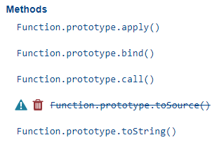
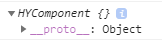
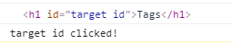
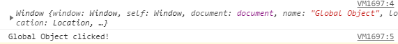

## this?

모든 프로그래밍 언어를 통틀어서 `this` 키워드는 빼놓지 않고 나오는 단골 키워드로 주로 메서드 내부에서 사용되어 메서드를 호출 한 **객체 인스턴스**를 의미한다.

대부분의 언어에서 `this`는 의미와 사용처가 제한적인것에 반해,

**Javascript에서는 `this`는 <u>좀 더 다양하고 다르게</u> 동작한다.**

> javascript의 `this`는 코드상의 어느 곳에서나 쓸 수 있고 의미도 사용하는 곳과 동작 방식에 따라 다르다.

아래 코드를 보자.

```js
function helloThis() {
  console.log('hello', this)
}

helloThis() // Window 객체가 출력된다.
```

이와같이 객체 인스턴스와 아무 상관없는 함수에서도 `this`를 사용할 수 있으며

> 다른 대부분의 언어는 this를 쓸 수 있는 상황이 제한적이다.

```js
const thisObj = {
  useThis: true,
} // thisObj 객체 생성

thisObj.helloThis = helloThis // 앞서 만든 helloThis함수를 속성으로 할당

thisObj.helloThis() // thisObj 객체가 출력 { useThis: true, helloThis: f}
```

위 예제는 아까 만든 `helloThis`를 분명 재활용했음에도 불구하고 `thisObj`객체가 출력된다.

모두 똑같은 함수인 `helloThis`를 사용했는데, 위 코드는 `window`(전역)객체, 아래코드는 `thisObj`객체로 결과가 각각 다르게 나온다.

```js
const cat = {
  sound: 'meow',
  speak: function() {
    console.log(this.sound)
  },
}

const func = cat.speak // speak함수를 func에 할당

cat.speak() // meow
func() // undefined
```

여기에서도 분명 똑같은 `speak()` 함수를 사용했음에도 결과는 다르다.

이처럼 javascript의 `this`는 함수를 호출할 때 마다 어떻게 호출되었느냐에따라 값이 다 다르게 나타난다.

이와 같은 변화무쌍한 점에서 사람들이 javascript의 `this`를 어렵게 생각하게 될 수 있다.

### 알고보면 쉬운 this?

#### ⭐️함수가 실행되는 시점을 보면 알 수 있다.

사실 javascript에서의 `this`가 쓰일 수 있는 곳과 어떤 의미를 가지는지는 굉장히 명확하게 정해져있다.

`this`가 무엇을 나타내고있는지 판단하려면 먼저 `this` 를 쓰는 **함수가 실행되는 시점**을 보면 판단할 수 있다.

그리고 이 함수가 사용될 수 있는 시점은 4가지가 있다.

이 말은 `this`가 나타낼 수 있는 경우의 수도 4가지(대표적)라는 말.

- Regular Function Call
- Dot Notation (Object Method Call)
- Call, Apply, Bind
- `new` keyword

## this 판별 방법

바로 위에서 간략하게 설명했듯이 `this` 판별은 생각보다 엄청 쉽다.
자 그럼 이제 어떻게 this를 판별해 나가는지 알아보자.

### 1. this가 사용되는 함수의 실행되는 시점을 찾아본다.

코드를 보다가 `this` 값에 어떤값이 들어가는 줄 모르겠다면 이 함수가 어떻게 호출되고있는지를 확인해보면 된다.

함수 내부에 `this`가 사용되고 있다면 비록 선언부에서 볼때는 같은 함수이지만, 이 함수가 어떻게 실행되었느냐에 따라 완전히 다른함수로 바꿔버릴 수 있다.

따라서 함수 내부에 `this`가 있고, 이 `this`가 정확하게 무엇을 의미하는지 파악하려면 이 함수가 실행되는 시점들을 찾아가서 하나하나 보면서 파악해야 한다.

> 사실 개발자들이 코딩할 때 함수에서 this를 한정해놓지, 함수를 실행할 때 마다 각각 다르게 동작하게 만들지는 않을 것이다.

함수가 실행되는 시점이란

```js{13-14}
function cry() {
  console.log(this.sound)
}

const cat = {
  sound: 'meow',
}

var sound = 'global-sound'

cat.speak = cry

cat.speak() // meow
cry() // global-sound
```

다음과 같이 첫 라인의 선언부가 아니라 마지막에 표시되어있는 `cat.sound()`와 `cry()` 처럼 ()로 함수를 excution 시킨 부분이다.

`cat.sound()`는 위에서 `cat.speak = cry`로 이미 선언된 `cry`함수의 참조값을 받은 것이므로 `cat.speak()` 함수와 `cry()`함수는 같다.

```js
console.log(cat.speak === cry) // true
```

### 2. 함수가 어떻게 실행되고있는지 파악한다

함수가 실행되고있는 부분을 찾았다면, 이제 어떻게 실행되고있는지를 파악하면 된다.

함수가 실행될 수 있는 경우의 수는 4가지로써 이 4가지 경우의수에 맞게 this도 각각 다르게 작동하게 된다.

#### 1. Regular Function Call

일반적으로 사용되는 함수 호출방법으로 우리가 흔히 `context`에서 함수를 선언하고 사용하는 가장 일반적인 방법이다.

> **Regular Function Call**이라는 표현은 딱히 쓰이지는 않지만 [ken](https://www.linkedin.com/in/kenhuh/?originalSubdomain=kr) 님이 일반함수호출로 사용하시는 표현이다.

```js{5}
function hello() {
  console.log('hello hayoung')
}

hello() // Regular Function Call
```

##### -> this = Global Object

위 `hello()` 처럼 호출되는 함수 내부에서의 `this`값은 **Global Object**가 된다.

> 브라우저 환경에서는 Global Object가 Window 객체이다.

```js{4,6}
var name = 'haong' // var 키워드로 선언된 변수는 자동으로 Global Object의 속성으로 포함된다.

function hello() {
  console.log(`hello ${this.name}!`) // 함수 내부에서 this 키워드 사용
}

hello() // hello haong!
```

이 처럼 일반 함수로 쓰일 때 에는 내부의 `this`가 **Global Object**를 의미한다는 것을 알 수 있다.

만약, 아래와 같이 쓰인다면 어떻게 될까?

```js{10}
var name = 'global-haong'

const hayoung = {
  name: 'hayoung',
  hello: function() {
    console.log(`hello ${this.name}`)
  },
}

const outerHello = hayoung.hello // hayoung.hello 메서드의 참조값을 outerHello에 할당

outerHello() // ?
```

답은 `hello global-haong` 이 출력된다.

이유는 객체 `hayoung`에 들어있는 메서드이지만, 일반 변수로 담겨서 사용될 때는 Regular Function Call이기 때문.

#### 2. Object Method Call (Method Call using Dot Notation)

Object Method Call 방식으로 함수를 호출하는 것은 말 그대로 함수가 객체의 메서드로 사용될 때 이다.

> JavaScript: The Good Parts (더글라스 크락포드)에 따르면 객체 프로퍼티의 값이 함수타입(함수참조값)이면 메서드라하는데,
> You Don't know JS의 카일심슨은 단순히 객체 내부에 있는 프로퍼티의 값이 함수라고해서 무조건 메소드는 아니라고 한다.
> (프로퍼티에 있는 값은 단순 함수 참조값이므로 객체 밖의 변수에서 받아서 사용하면 메서드라고 볼 수 없다는 말.)
>
> 이래저래 종합해보면 객체 내부의 함수가 객체에 종속되어 Object Method Call 방식으로 호출되면 메서드라고 보면 될 것 같다.
> (프로토타입 객체의 메서드도 포함)

```js{8}
const hayoung = {
  name: 'hayoung',
  hello: function() {
    console.log(`hello ${this.name}`)
  },
}

hayoung.hello() // Object Method Call (Method Call)
```

위와 같이 객체 인스턴스의 Property로 사용되고, 객체에 **Dot Notation**을 이용하여 호출하면 **Object Method Call** 이다.

##### -> this = Instance ()

Object Method Call에서의 `this`값은 <u>메서드를 호출한 **객체 인스턴스**</u>가 된다. 즉, Dot Notation을 적용시킨 객체가 된다.

```js
hayoung.hello()
```

위와 같은 표현에서 `hello()` 함수 내부에서 `this`는 `hayoung` 객체가 된다.

```js{9-10}
const hayoung = {
  age: 30,
}

function hi() {
  console.log(`hello ${this.age}`)
}

hayoung.hello = hi // hello 메서드로 hi 함수 할당
hayoung.hello() // hello 30
```

이는 함수가 어디서 선언이 되었건 **호출할 때 어떻게 호출되었는가가 중요하다**는 것을 다시한번 보여준다.

#### 3. Call, Apply, Bind (explicit binding this)

이 함수들은 함수 프로토타입 객체 [`Function.prototype`](https://developer.mozilla.org/en-US/docs/Web/JavaScript/Reference/Global_Objects/Function#instance_properties)의 메서드들이다.
따라서 모든 함수 객체(인스턴스)가 사용 할 수 있다.

> 즉, 모든 함수가 `.call()` `.apply()`, `.bind()`를 사용 할 수 있다.



`apply()` `bind()` `call()` 이 함수들의 역할은 무엇일까?

```js{5}
function hello() {
  console.log('hello')
}

hello.call() // hello
hello.apply() // hello
```

결과는 일반적으로 함수를 호출하는 것과 똑같다.

이처럼 **`.call()`, `apply()` 메소드를 사용하는 것은 `call()`, `apply()` 메소드를 사용하고있는 함수 그 자체를 실행시킨다는 것과 똑같다.**

그럼 `.call()` 메소드는 왜 존재하는 것일까?

#### ⭐️Explicit Binding

Explicit Binding을 해석하면 '명시적으로 묶는다' 라는 뜻이다. 그럼 무엇을 '명시적으로 묶는'것일까?

답은 바로 `this`값이다. 위 3개 `call()` `apply()` `bind()` 함수는 `this`값을 Explicit Binding하여 `this`값을 우리가 원하는 값으로 설정해버릴 수 있다.

##### Function.prototype.call

먼저 `call()` 함수부터 살펴보자.

```js{11}
var name = 'Global'

function hello () {
    console.log(`hello ${name}`);
}

const hayoung = {
    name: 'HaYoung';
}

hello.call(hayoung); // hello HaYoung - hello 함수에 hayoung객체 바인딩
```

이처럼 `call()`에 **첫번째 인자로 객체 인스턴스를 넘겨주면 이 `call()`을 호출한 함수가 실행되면서 함수 내부의 `this`값이 넘겨받은 객체 인스턴스가 된다.**

<br>

그럼 인자값이 있는 함수는 어떻게 처리할 수 있을까?

```js{10}
function argCheck(a, b, c, d) {
  const sum = a + b + c + d
  console.log(`hello ${name}, args sum : ${sum}`)
}

const hayoung = {
  name: 'HaYoung',
}

argCheck.call(hayoung, 1, 2, 3, 4) // hello HaYoung, arg sum : 10
```

이처럼 **2번째 인자부터 순서대로 해당 함수의 인자로 전달되게 된다.**

> `.call()`함수의 인자값은 제한이 없고 호출하려는 함수의 인자값에 맞게 사용해주면 된다.

##### Function.prototype.apply

`apply()`는 `call()`함수와 유사하게 함수를 실행시키지만 인자값의 전달 방식만 다르다.

```js{10}
function argCheck(a, b, c, d) {
  const sum = a + b + c + d
  console.log(`hello ${name}, args sum : ${sum}`)
}

const hayoung = {
  name: 'HaYoung',
}

argCheck.apply(hayoung, [1, 2, 3, 4]) // hello HaYoung, arg sum : 10
```

`apply()`는 인자값을 2개만 받는다.

- 첫번째 인자 : binding 할 객체 (`this`값으로 사용할 객체)
- 두번째 인자 : 함수의 인자값으로 전달 할 배열

즉, `call()`은 인자값이 실행할 함수의 인자값에 따라서 늘어나는 반면 `apply()`는 늘어나는 함수 인자값에 맞게 두번째 인자의 배열에만 추가해주면 된다.

##### Function.prototype.bind

그럼 `bind()`함수는 뭘까?

`bind()`함수는 **인자값으로 받은 객체가 바인딩된 새로운 함수를 반환하는 [고차함수](../../../2020/javascript/하옹의-자바스크립트-식사---Closure/하옹의-자바스크립트-식사---Closure/#1급-함수가-중요한-이유)이다.**

```js{9,11}
function hello () {
    console.log(`hello ${name}`);
}

const hayoung = {
    name: 'HaYoung';
}

const bindedFunc = hello.bind(hayoung);

bindedFunc();
```

`bind()` 함수는 `call()`처럼 인자값을 제한없이 받아 반환시키는 함수의 인자값으로 저장시킬 수 있다.

```js{9, 11}
function argCheck(a, b, c, d) {
  const sum = a + b + c + d
  console.log(`hello ${name}, args sum : ${sum}`)
}

const hayoung = {
  name: 'HaYoung',
}

const bindedFunc = argCheck.bind(hayoung, 1, 2, 3, 4)

bindedFunc() // hello HaYoung, arg sum : 10
```

그와 반대로 바인딩만 시킨 후, 반환된 함수에 다시 인자값을 전달 할 수 있다.

```js{9, 11}
function argCheck(a, b, c, d) {
  const sum = a + b + c + d
  console.log(`hello ${name}, args sum : ${sum}`)
}

const hayoung = {
  name: 'HaYoung',
}

const bindedFunc = argCheck.bind(hayoung)

bindedFunc(1, 2, 3, 4) // hello HaYoung, arg sum : 10
```

#### 4. `new` keyword

[Prototype 글](../../../2020/javascript/하옹의-자바스크립트-간편식---Prototype/하옹의-자바스크립트-식사---Prototype/) 에서 알 수 있듯이, 함수를 `new`키워드로 실행시키면 **생성자함수**로 사용되어진다.
이 생성자 함수로 실행될 때 `new`키워드로 인해 **빈 객체**가 생성되고 이 **빈 객체**는 생성자 함수 내부에서 `this`로 접근 할 수 있었다.

바로 이 상황이 4번째인 `new`키워드로 생성자 함수로 함수를 실행시켜 사용하게되는 `this`이다.

그리고 `new`키워드를 사용한 함수 내부에서 `this`는 **빈 객체**가 된다.

```js
function HYComponent() {
  console.log(this)
}

new HYComponent()
```



이 처럼 빈 객체가 생성된다는 것을 확인 할 수 있다.

하지만, `new`키워드 없이 일반함수로 쓰일 때에는 **Regular Function Call**과 같다.

```js
function HYComponent(name) {
  console.log(this)
}

HYComponent() // Window 객체
```

## 그 외 특수 상황에서의 this

위 `this`판별 방법은 모두 함수 스코프 내부에서 사용되었을 때의 `this`를 판별하는 방법이었다.

거의 모든 `this` 사용처가 함수스코프 내부이기 때문에 위 방법이 가장 대표적이고 그 외 상황에서의 `this`는 다음과 같다.

### 전역에서 쓰일 때

전역에서 쓰이는 `this`는 **[strict mode](#strict-mode)**가 아니라면 **Global Object**이고, **strict mode**라면 undefined이다.

- **not strict mode : global object (전역객체)**
- strict mode : undefined

```js
console.log(this) // Window 객체
```

```js
'use strict'
console.log(this) // undefined
```

### Event Listener에서의 this

Event Listener에서의 this는 무조건 `event.target`이 된다.

> event는 EventListener의 첫번째 인자값

```js{6-9}
function HYComponent($target) {
  this.$target = $target
  this.$target.id = 'target id'
  this.id = 'hyComponent id'

  this.onTargetClickListener = function(event) {
    console.log(this)
    console.log(`${this.id} clicked!`)
  }

  this.$target.addEventListener('click', this.onTargetClickListener)
}

const h1Element = document.querySelector('h1')

const hyComponent = new HYComponent(h1Element, 'First h1 Tag')
```

이후 `h1Element`를 클릭해보면 아래와 같은 결과가 나온다.



이를 통해 **EventListener**내부에서의 `this`값은 `event.target`이라는 것을 알 수 있다.

### 화살표 함수에서의 this

화살표 함수에서의 `this`는 explicit binding되지 않으며, **Lexical Scope**가 적용된다.

> MDN - ES2015는 스스로의 `this` 바인딩을 제공하지 않는 화살표 함수를 추가했습니다. (이는 Lexical Context안의 this값을 유지합니다.)

이전에 우리가 바왔던 this로 사용되는 경우들을 모두 제외가 되고 무조건 **Lexical Scope**가 적용된다.

```js
const arrowFunc = () => {
  console.log(this)
}

arrowFunc() // Window 객체 (Global Object)
```

지금 예제로는 일반함수와 똑같아보이지만, 아래상황을 보자.

```js
var age = 3

const hayoung = {
  age: 30,
  hello: () => {
    console.log(`hello ${this.age}`)
  },
}

hayoung.hello() // 'hello 3'
```

이 상황에서 **Object Method Call** 이기 때문에 'hello 30' 이 나와야 될 것 같지만 나오지 않았다.

그 이유는 앞서 설명했듯이 Lexical Scope가 적용된 this이기 때문에 현재 Context에서는 `this`가 글로벌이기 때문.

```js
function HYComponent($target, name) {
  this.$target = $target
  this.name = name

  this.onTargetClickListener = e => {
    console.log(this)
    console.log(`${this.name} clicked!`)
  }

  this.$target.addEventListener('click', this.onTargetClickListener)
}

const h1Element = document.querySelector('h1')

const hyComponent = new HYComponent(h1Element, 'First h1 Tag')
```

이후 `HYComponent`생성자로 넘겨줬던 `h1Element`를 클릭하면 아래와 같은 결과가 나온다.


원래 우리가 배웠던 대로라면 **EventListener**에 있는 `this`값은 `event.target`을 가리키는 것이지만 **arrow Function** 이기 때문에 적용되지 않고 **Lexical Scope**가 적용되어 `onTargetClickListener` 가 선언된 시점에서의 `this`로 적용되는 것.

> 선언된 시점에서의 `this`는 HYComponent의 `this`

아래 예제를 보면 Lexical Scope가 적용된다는 점을 더 확실히 이해할 수 있다.

```js
var name = 'Global Object'

const onTargetClickListener = e => {
  console.log(this)
  console.log(`${this.name} clicked!`)
}

function HYComponent($target, name) {
  this.$target = $target
  this.name = name

  this.$target.addEventListener('click', onTargetClickListener)
}

const h1Element = document.querySelector('h1')

const hyComponent = new HYComponent(h1Element, 'First h1 Tag')
```



#### 화살표 함수는 메서드로 사용하면 안된다.

화살표 함수는 메서드 함수로 적합하지 않다.

이유는 `this`에 Lexical Scope가 적용되기 때문에 javascript 생성자 함수, 객체인스턴스를 활용하는 메서드 등에서 제대로 작동하지 않을 수 있기 때문.

```js{12}
var name = 'Global Object'

function HYComponent(name) {
  this.name = name
}

HYComponent.prototype.hello = () => {
  console.log(`hello ${this.name}`)
}

const hycomponent = new HYComponent('HYComponent')
hycomponent.hello() // hello Global Object
```

이렇게 화살표 함수를 사용하면 **Object Method Call**을 하더라도 제대로 작동하지 않는다.

따라서 생성자함수, 메서드 등에 화살표함수를 사용하는 것은 특별한 이유가 아니라면 지양해야 한다.

## strict mode

[strict mode](https://developer.mozilla.org/en-US/docs/Web/JavaScript/Reference/Strict_mode) 라는 것이 있는데, 이는 `this`의 값이 **Global Object**라면 `undefined`로 처리되게 해준다.

strict mode를 선언하는 방법은 `'use strict'`라고 적어주기만 하면 **해당 스코프 내에서 적용**이 된다.

```js
'use strict' // strict mode 사용

var name = 'Global Object'

function hello() {
  console.log(this)
}

hello() // undefined
```

이렇게 Global Object로 처리 되어야 될 `this`값이 `undefiend`로 되니 아래와 같은 코드에서는 오류가 난다.

```js
'use strict' // strict mode 사용

var name = 'Global Object'

function hello() {
  console.log(this.name)
}

hello() // undefined에 .name으로 프로퍼티참조를 하려했으므로 오류가 난다.
```

함수 내부에서만 strict mode를 적용시키려면 다음과 같이 하면 된다.

```js
function strictFunc() {
  'use strict'
  //....
}
```

### ⭐️모듈에는 자동적용되는 strict mode

우리가 javascript를 모듈로 사용할 수 있는 CommonJS로 모듈화를 하면 자동적으로 strict mode가 적용된다.
ES2015로 넘어오면서, `import` `export`를 이용해 javascript 모듈관리를 할 수 있게되었는데, 마찬가지로 `export` 사용하면 자동적으로 해당 모듈에 strict mode가 적용이 된다.

따라서 모듈내부에서 최상위레벨의 `this`는 `undefined`로 처리가 된다.

```js
function something() {
  // ..
}

export default something
// 자동적으로 이 something 모듈내부에서는 strict mode가 적용
```

### strict mode를 쓰는 이유

strict mode를 쓰는이유는 간단하다.

`this`를 보통 Global Object로 의도하고 사용하지는 않으므로 `this`가 Global Object로 사용되었다면 문제가 생겼을 확률이 높다.

이럴때에 잘못작동하도록 내버려두는것이 아닌 Error로 캐치해서 사전에 더 큰 문제를 예방할 수 있다.

- 오류 방지
- 오류 미리 발견
- 실수 방지
- 혼란 방지
- 전역객체 접근 방지
- 오류 위치 파악

## 풀어볼만한 좋은 문제

[take this quiz](https://dev.to/liaowow/take-this-quiz-understand-how-this-works-in-javascript-44dj) 를 참조해서 풀어보자.

## 참조

[VanillaCoding - Prep 강의 - this](https://www.vanillacoding.co/)

[MDN - this](https://developer.mozilla.org/ko/docs/Web/JavaScript/Reference/Operators/this)
