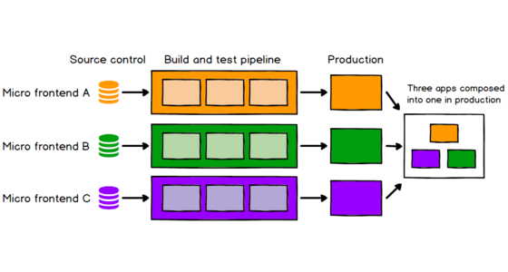
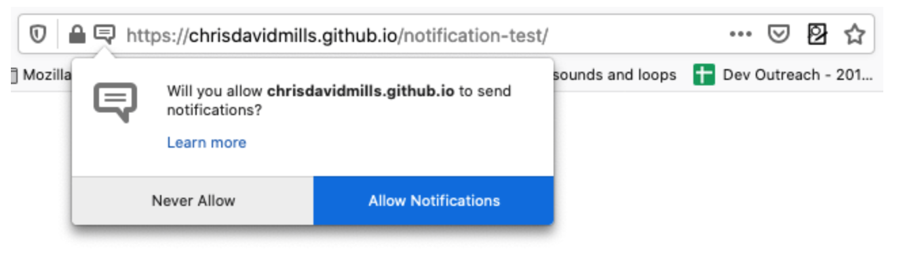

## PWA? 프로그레시브 웹앱?

`PWA`는 **P**rogressive **W**eb **A**pp의 약자로써 어떤 기술이나 앱을 뜻하는 것이 아니라, <u>웹에서 사용할 수 있는 기술만을 사용하여</u> 유연하고 적응 가능한, 보다 <u>네이티브 앱과 같은 웹 앱을 만든다는 개념</u>으로 Google에서 처음 사용하였다.

비슷한 개념으로 **반응형 웹 앱** (Responsive Web App)이 있다. 반응형 웹 앱은 우리가 만든 웹 앱이 디바이스, 화면의 크기에 맞게 화면의 레이아웃과 폰트 사이즈 등이 바뀌어 동작한다는 개념으로 웹 페이지에 대한 모바일, 테블릿 디바이스의 사용자 경험을 증가시키는데 이점과 목적이 있다.

`PWA`는 이 반응형 웹 앱을 베이스로 좀 더 네이티브 앱과 같은 기능이 추가된다. 오프라인 상황 지원, 푸시 알림, 위치 활성화 옵션, 카메라 액세스 및 홈 화면에 모바일 경험을 추가하는 기능 등이 추가되면서 실제로는 웹 앱이지만 네이티브 앱과 같은 느낌을 줄 수 있다.

> PWA는 모바일을 위한 반응형 웹앱 (WebView를 이용) 의 사용이 늘어남에 따라 이를 단순한 반응형 웹 앱이 아닌 그 이상의 기능을 제공하는 웹앱으로, 웹 앱 그 자체로 네이티브적으로 동작 할 수 있게끔 해주는 웹 앱 이라고 생각하면 된다. 
>
> 한마디로 웹 기술로 네이티브 앱과 같은 기능을 제공하는 웹 앱이라는 말.

## 왜 PWA가 생겨났을까?

`PWA` 가 왜 생겨났는지 이야기하기에 앞서, 이전의 역사를 먼저 설명하고 싶다.

### 계속되는 모바일 라이프 스타일과 프론트엔드의 발전

2007년 첫 스마트폰인 iPhone이 시장을 강타한 이후 PC가 아닌 다른 디바이스에서 웹 페이지를 볼 수 있는 다양한 기기의 폭발적인 증가가 이루어졌고, 이는 다양한 디바이스에 맞는 브라우저의 탄생과 반응형 웹 페이지의 등장, 웹의 빠른 발전을 야기시켰다.

> 이제는 심지어 TV, 냉장고와 같은 디바이스에서 웹 페이지를 볼 수 있다.

실은 스마트폰 초기에 사람들의 모바일 라이프 스타일을 위한 다양한 서비스들은 모바일 네이티브 앱 형태로 사람들에게 제공되어져 왔으나, **Android, IOS 등 다양한 OS로 나뉘어진 모바일 환경**의 경우 간단한 서비스의 형태를 각각 네이티브 앱 형태로 개발 유지보수하기에는 비용의 문제가 발생하였다.

이를 해결하기 위해 다양한 방법들이 시도되었고 반사이익으로 더욱더 빠른 프론트엔드의 발전이 이루어지게 되었다. 
첫째로 **반응형 웹**이 등장하여 OS는 다를지라도 같은 브라우저에서만큼은 동일한 화면과 기능을 제공하게되었고, 더 나아가 이를 앱 형태로 패키징 한 **하이브리드앱**이 등장, 또 애초부터 하나의 코드로 작성되지만 빌드시 각 os에 맞는 앱을 만들어주는 **Cross-Platform** 개발 환경이 등장하게 되었다. 

또 다른 형태로 web이 더욱 발전하여 이제는 **웹 앱**이라 불릴만큼 동적 기능과 고도화 된 기능을 가지게 된 **웹 앱**에 반응형을 첨가하여 이를 **모바일 앱의 `WebView`에 올려 서비스를 하는 형태**도 생겨났다.

최근에는 모바일 앱의 `WebView`으로 서비스되는 웹 앱을 각 기능에 맞게 `Micro Frontend Architecture` 형태로 개발하는 등 더욱 발전하고 있다.

> 이 Micro Frontend Architecture은 최근의 [Toss에서 구축한 MonoRepo형태](https://sojin.io/article/%ED%86%A0%EC%8A%A4%EC%9D%98-%EB%A7%88%EC%9D%B4%ED%81%AC%EB%A1%9C%ED%94%84%EB%A1%A0%ED%8A%B8%EC%97%94%EB%93%9C-%EC%95%84%ED%82%A4%ED%85%8D%EC%B2%98-%EA%B7%B8%EB%A6%AC%EA%B3%A0-%EC%9E%90%EB%8F%99%ED%99%94/)가 가장 인상적이라고 생각한다.
>
> MonoRepo는 공통 라이브러리, 각 마이크로 프론트엔드 서비스들을 한 Repository에 저장시키는 것으로 Microfrontend 서비스들을 각 Repository에 파편화 시켜 두지않고 하나의 Repository로 관리하고 공통 부분 또한 관리한다는 것.

하지만 위에서 나타난 방법들은 사용자 입장에서 완성된 앱을 결국 **다운**받아야 사용할 수 있다.

> 그리고 결국 다운받아 사용한다는 건 결국 제공되어지는 형태는 네이티브 앱 형태라는 말.

- 하이브리드 앱 -> 다운 필요
- Cross-Platform 앱 -> 다운 필요
- Microfrontend Web App이 `WebView` 로 올려진 앱 -> 다운 필요

그리고 지금의 프론트엔드에 다다라서 네이티브 앱 급의 성능이 필요하지 않는이상에야 **왠만하면 웹 앱으로 거의 모든 기능을 구현**할 수 있게 되었다.

당연히 웹 앱으로도 충분히 가능한 서비스를 이렇게 앱 형태로 제공 될 경우 다운도 받아야 하지만 **사용자 유입**과 **검색 가능성**의 웹의 **큰 장점을 잃어버리는** 경우가 발생하게 되었다.

**`PWA`는 이런 웹의 장점과 효율성을 잃어버리지 않고 이제는 웹 앱 그 자체를 네이티브 앱과 같이 제공하겠다는 철학**이다.

> 물론 `WebView` 로 제공되어지는 페이지를 독립적으로 반응형으로 제작한다고 하면 웹의 장점을 잃어버리지는 않는다.

즉, `PWA` 는 이제는 웹 앱으로 충분히 가능한 서비스라면 굳이 네이티브 앱으로 제공할 필요가 없고,
오히려 웹의 장점을 그대로 다 살리면서 네이티브 앱 처럼 돌아가게 해주겠다는 말이다.

그래서 `PWA` 로 구축된 앱은 웹 앱 그 자체이기 때문에 네이티브 앱 보다 아래의 큰 장점을 가지게 된다.

### 웹 앱이 네이티브 앱 보다 검색가능성이 높다

당연히 웹 앱으로 랜더링 결과가 웹 페이지이기 때문에 SEO를 잘 고려해서 설계했다면 앱 내부의 각 페이지들 그 자체로 검색이 가능해져 네이티브 앱 보다 검색 가능성이 훨씬 더 높아진다.

### 웹 앱이 네이티브 앱 보다 접근가능성이 높다

네이티브 앱과 달리 앱 다운이 없고 브라우저를 통한 인터넷 웹 서핑 중 접근 가능하고 다양한 디바이스 화면을 지원하기 때문에 네이티브 앱 보다 접근 가능성이 높고, 사용자가 필요시 웹 앱을 홈 화면에 등록하면 앱 처럼 접근 할 수 있다.

그리고 앱의 경우는 앱 업데이트시 사용자가 직접 업데이트를 해야되는 상황이 발생하게 되는데, `PWA` 는 웹 이기 때문에 업데이트 시 서버에 배포만 해주면 되기 때문에 사용자에게 별도 업데이트 안내와 업데이트를 해야되는 상황이 없어진다.

## PWA 이점? 

이제 `PWA` 가 왜 생겨났고 기존 방식보다 어떤 장점이 있는지 알겠다.

그럼 웹 앱을 어떻게 네이티브 앱처럼 돌아가게 해준다는 걸까?
성능적인 면으로는 당연히 네이티브 앱을 따라가기는 힘들 것이다.

그래도 적어도 `PWA` 는 웹 앱의 장점과 네이티브 앱이 가지는 일부 장점을 가지고 있다.

`PWA` 의 모든 이점을 한번 알아보자.

### 1. 훨씬 빠른 페이지 로딩 속도

`Service Worker` 의 [Cache API](https://developer.mozilla.org/en-US/docs/Web/API/Cache)를 사용하여 에 데이터를 캐싱시킬 수 있다.

이를 통해 두번째 방문 부터 캐싱된 데이터를 통해 즉각적인 페이지 로딩을 시킬 수 있다.

이는 정적데이터와 동적데이터에 대한 캐싱 정책을 어떻게 정하느냐에 따라 페이지 로딩 결과가 달라지게 된다.

### 2. 오프라인 지원 (네트워크에 독립적)

`Service Worker` 에 캐싱된 데이터를 가져오게 되면 네트워크가 오프라인 상태라도 서비스를 사용할 수 있게 된다.

따라서 `PWA` 로 웹 앱을 구성하게 되면 오프라인 상태라도 브라우저에 더 이상 오프라인 상태라고 표시되지 않으며 캐싱된 데이터를 그대로 보여 줄 수 있다.

> 우선 Service Worker에 캐싱을 해야되기 때문에 1, 2번은 페이지를 한 번이라도 방문 해야 한다.

### 3. 검색 가능

### 3. 검색 가능

웹 앱의 특성 그대로 검색이 가능하다.

### 4. 설치 가능 (홈 화면에 추가)

`PWA` 는 웹 앱 매니페스트 내부에 설정된 속성과 [웹 앱 설치](https://developer.mozilla.org/en-US/docs/Web/Progressive_web_apps/Developer_guide/Installing) 라는 최신 모바일 브라우저에서 사용할 수 있는 기능을 통해 웹 앱을 현재 모바일 브라우저를 사용하는 디바이스의 홈 화면에 추가 즉, 설치와 같이 등록 할 수 있다.

### 5. 공유 가능 (링크를 통한)

웹 앱 이기 때문에 URL을 통한 공유도 가능하다.

### 6. 푸시알림을 통한 지속적 참여 유도

최신 브라우저에서 Web API인 [Push API](https://developer.mozilla.org/en-US/docs/Web/API/Push_API) 를 사용하여 서버로부터 알림을 push event로 받고,

[Notification API](https://developer.mozilla.org/en-US/docs/Web/API/Notifications_API) 을 이용해 브라우저에 시스템 알림을 보여 줄 수 있다.

이는 사용자의 재참여를 유도할 수 있고 사용자의 재참여를 유도하는 네이티브 앱의 핵심 기능을 웹에서 구현할 수 있게 된 것.

### 7. 반응형 웹 화면

`PWA` 의 가장 기본은 반응형 웹 앱 이기 때문에 웹 브라우저를 사용하는 다양한 디바이스의 화면에 모두 대응할 수 있다.

### 8. 안전

`PWA` 을 구현하기 위한 기술은 HTTPS 에서만 사용이 가능하고 브라우저의 보안정책인 CORS 등을 따르기 때문에 보안적인 이점도 배제할 수 없다.

### 9. 구축이 쉬움

이미 구축된 웹 앱이라고 해서 `PWA`로 사용하지 못하는 것은 아니다.

기존에 구축된 웹 앱에 `Service Worker`와 `Manifest.json ` 파일을 만들어 PWA로 구축하는 것은 매우 쉽다.

또 `Service Worker` 를 쉽게 사용할 수 있게 도와주는 `WorkBox` 가 있다.

## PWA를 구축하기위한 핵심 기술

### Manifest.json

### ServiceWorker

